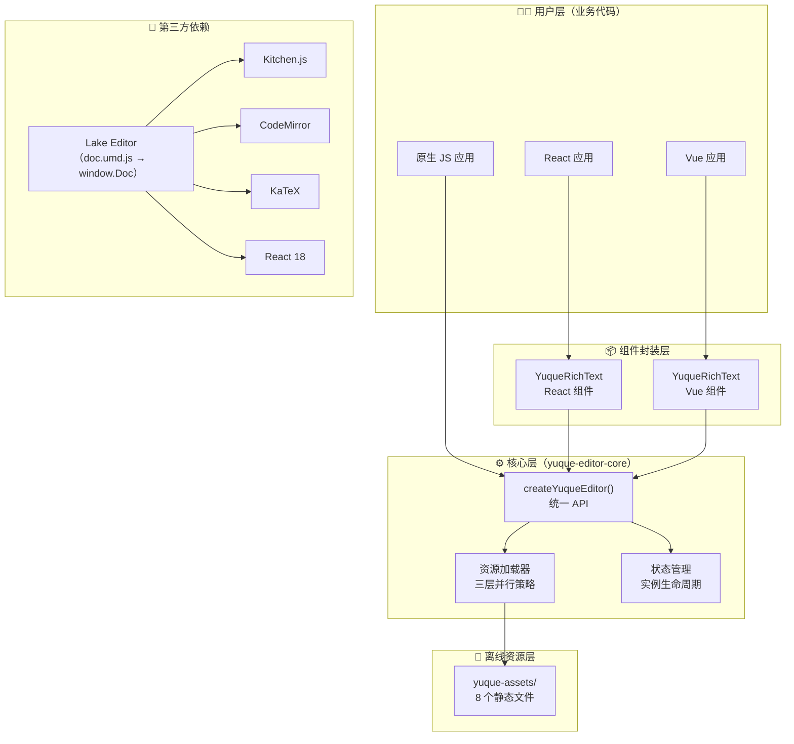
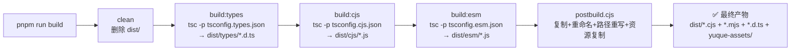
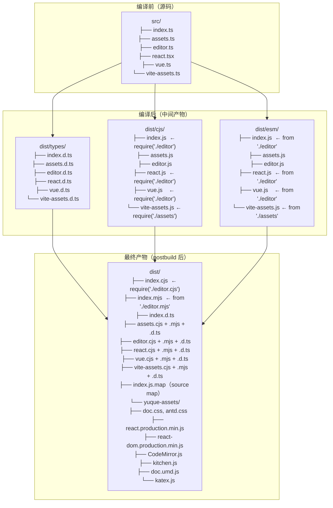
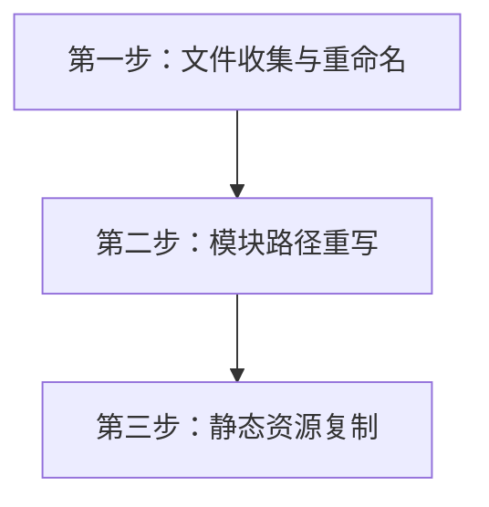

# 01 - 项目架构与工程化

> **导语**：这篇文档是 yuque-editor 项目的开篇。我们不急着写代码，先花点时间搞清楚"项目为什么要这样组织"。好的架构不是一开始就完美的，而是在一次次的取舍中演化出来的。本篇将带你从 30,000 英尺的高空俯瞰整个项目，再逐步降落，深入到每一个配置文件和构建脚本。

> 📌 **文档状态（2026-09）**：第 5 章「Vite 插件」已按重构后的实现（dev 中间件 + build `emitFile`，不再写 `public/`）重写；其余章节的行号/行数为编写时快照，请以仓库源码为准。核心包还新增了 `src/controlled.ts`（受控值同步器），并已在 `package.json` 的 `exports` 中暴露 `./controlled` 子路径。

---

## 1. 项目全景

### 1.1 项目是什么

**yuque-editor** 的核心目标非常明确：把语雀的 Lake Editor 封装成一个独立、可离线使用的 npm 包 —— `yuque-editor-core`。

语雀的 Lake Editor 是一个功能强大的富文本编辑器，支持 HTML/Markdown 双格式、公式、代码块、图片/视频上传等。但它有一些"原生"的问题：

1. **资源依赖外网**：Lake Editor 的 CSS、JS（如 React、Kitchen.js、doc.umd.js）都指向语雀的 CDN，在内网环境根本加载不了
2. **没有统一封装**：使用方需要手动加载一堆脚本、处理加载顺序、自己写初始化代码
3. **框架绑定弱**：虽然 Lake Editor 底层依赖 React，但没有开箱即用的 Vue/React 组件

`yuque-editor-core` 解决这三个问题的思路也很直接：

- 把所有离线资源打包进 npm 包，用户 `npm install` 后就有
- 提供统一的 `createYuqueEditor()` API，资源加载、初始化、销毁全部封装好
- 提供 React 18 + Vue 3 的官方组件封装

### 1.2 为什么做这个项目

> 这个项目的诞生来自一个真实的需求：**内网环境下的富文本编辑**。

在企业的内网环境中，外部 CDN 是不可达的。如果你想在自研产品里嵌入一个类似语雀的编辑体验，你需要：

1. 把语雀编辑器的所有静态资源下载到本地
2. 手动管理这些资源的加载顺序（注意：kitchen.js 必须在 doc.umd.js 之前加载）
3. 自己处理 React 18 / Vue 3 的集成
4. 处理各种边界情况（资源重复加载、编辑器实例销毁、内存泄漏...）

每家公司都要踩一遍这些坑，这显然是一种浪费。所以 `yuque-editor-core` 就是为了把这些通用能力**沉淀成一个包**，让大家能像用 `@tiptap/react` 一样简单地使用语雀编辑器。

### 1.3 整体架构图

用一张 Mermaid 图看清整个项目的分层结构：



**分层设计的原则**：

- **核心层不依赖任何 UI 框架**，它只管编辑器的生命周期和资源加载
- **组件封装层是薄薄一层胶水**，负责把 React/Vue 的响应式系统和编辑器实例桥接起来
- **资源层通过 Vite 插件自动复制到 public 目录**，对用户完全透明
- **第三方层通过 CDN 离线文件加载**，全部打包在 npm 包内

---

## 2. Monorepo 搭建

### 2.1 为什么用 monorepo

先回答一个更基本的问题：**为什么不是一个包，而是三个？**

```
packages/core/     ← 核心库（npm 包）
packages/react/    ← React 示例（不是 npm 包，仅供演示/调试）
packages/vue/      ← Vue 示例（同上）
```

这个项目天然由三个子项目组成，它们之间的关系是：

| 子项目 | 角色 | 是否发布 |
|--------|------|---------|
| `core` | npm 包，编译后的产物发布到 registry | ✅ |
| `react` | React 示例项目，用来演示和测试 React 组件 | ❌ |
| `vue` | Vue 示例项目，用来演示和测试 Vue 组件 | ❌ |

这三者的代码**强关联**：改了 core 的 API，需要立刻在 react 和 vue 示例里验证。如果它们分散在不同的 Git 仓库里，你需要：

1. 改 core → 发个 pre-release 版本
2. 去 react 仓库 `npm update` → 测试
3. 去 vue 仓库 `npm update` → 测试
4. 发现问题 → 回到 core 改 → 再发版本...

Monorepo 让这一切变成：改 core → `pnpm dev:react` / `pnpm dev:vue` → 立刻看到效果。

**`workspace:*` 协议的优势**：

在 monorepo 里，示例项目引用核心库不是写版本号，而是用 `workspace:*`：

```json
// packages/react/package.json
{
  "dependencies": {
    "yuque-editor-core": "workspace:*"
  }
}
```

这个协议告诉 pnpm："直接用本地 workspace 里的版本，别去 registry 下"。发布时 pnpm 会自动把 `workspace:*` 替换成实际版本号。这让你在开发阶段随时修改 core 的代码，示例项目**不需要重新安装**就能拿到最新代码。

**pnpm vs npm vs yarn 对比**：

| 特性 | pnpm | npm | yarn (v1/v3) |
|------|------|-----|---------------|
| 磁盘占用 | 极低（全局硬链接） | 高（每个项目一份） | 中等 |
| 安装速度 | 快 | 中等 | 快 |
| workspace 支持 | 原生、成熟 | v7+ 支持 | 原生支持 |
| 严格的依赖隔离 | ✅（软链接） | ❌（扁平化 node_modules） | v3 支持 |
| monorepo 最佳实践 | 🏆 | ⭐⭐ | ⭐⭐⭐ |

pnpm 最大的优势是**依赖隔离**。核心包的 `node_modules` 里只有核心包自己声明的依赖，不会"看到"示例项目安装的 React 或 Vue。这避免了"幽灵依赖"问题——你不会不小心 import 了一个没在 package.json 里声明的包。

### 2.2 根目录配置详解

#### package.json（根目录）

```json
{
  "name": "yuque-editor",
  "private": true,       // ← 根项目不发布，只是一个"壳"
  "version": "0.0.0",
  "description": "Yuque/Lake editor monorepo",
  "packageManager": "pnpm@9.15.5",   // ← 锁定包管理器版本
  "scripts": {
    "build": "pnpm --filter yuque-editor-core run build",
    "dev:react": "pnpm --filter @yuque-editor/react-example dev",
    "dev:vue": "pnpm --filter @yuque-editor/vue-example dev",
    "clean": "pnpm --filter '*' run clean"
  }
}
```

逐字段解释：

- **`private: true`**：告诉 npm "这个包不要发布"。根目录只是一个 monorepo 的"容器"，没有可发布的代码。这个字段在执行 `npm publish` 时会直接报错，防止误操作。

- **`packageManager: "pnpm@9.15.5"`**：这是 Corepack 的协议字段。有了它，团队里所有人（和 CI/CD）都会使用同一个版本的 pnpm。即使本地安装了 pnpm 8，只要项目里有这个字段，Corepack 会自动切换到 9.15.5。这避免了"在我机器上能跑"的问题。

- **`scripts`**：所有命令都通过 `pnpm --filter` 指定目标包：
  - `--filter yuque-editor-core`：只对 core 包执行
  - `--filter @yuque-editor/react-example`：只对 React 示例执行
  - `--filter '*'`：对所有子包执行（注意用单引号包裹 `*`，防止 shell 通配符展开）
  
  `pnpm --filter` 是 pnpm workspace 的核心能力。它就像是 saying "去 core 那个目录，执行它的 build 脚本"。比起 `cd packages/core && pnpm build` 的写法，`--filter` 更简洁，而且支持通配符、互斥过滤器等高级用法。

#### pnpm-workspace.yaml

```yaml
packages:
  - 'packages/*'
```

这行配置告诉 pnpm："所有 `packages/` 目录下的子目录，都是 workspace 的一员"。pnpm 会自动扫描这些目录，读取各自的 `package.json`，建立依赖关系图。

为什么把 workspace 的 glob 模式写在单独的 YAML 文件里，而不是 package.json？因为 pnpm 团队认为 workspace 配置是**基础设施级别的关注点**，应该和业务代码的 package.json 分离开来。同时，YAML 格式更适合写复杂的 glob 模式（排除目录、多层嵌套等）。

#### 目录结构设计

```
yuque-editor/
├── package.json               # monorepo 根配置
├── pnpm-workspace.yaml        # workspace 定义
├── pnpm-lock.yaml             # 锁文件（pnpm 的"快照"）
├── README.md
├── docs/                      # 文档目录
│   └── 01-architecture.md     # ← 你正在读的文档
└── packages/
    ├── core/                  # 🎯 核心包 yuque-editor-core
    │   ├── package.json
    │   ├── tsconfig.*.json    # 5 个 TypeScript 配置
    │   ├── src/               # 源代码（6 个文件）
    │   ├── assets/            # 离线资源
    │   │   └── yuque-assets/  # 8 个静态文件
    │   ├── scripts/
    │   │   └── postbuild.cjs  # 构建后处理脚本
    │   └── dist/              # 编译产物（构建后生成）
    ├── react/                 # React 示例
    │   ├── package.json
    │   ├── vite.config.ts
    │   └── src/
    └── vue/                   # Vue 示例
        ├── package.json
        ├── vite.config.ts
        └── src/
```

这个结构遵循了 monorepo 的最佳实践：

1. **`packages/` 统一放子包**，避免根目录太杂
2. **core 和示例平级**，通过 `workspace:*` 互相引用
3. **docs/ 放在根目录**，因为文档是面向整个项目的

### 2.3 核心包 package.json 深入解析

这是整个项目最重要的配置文件，值得逐段剖析：

#### 入口文件三件套

```json
{
  "main": "./dist/index.cjs",
  "module": "./dist/index.mjs",
  "types": "./dist/index.d.ts"
}
```

这三个字段告诉不同的工具"这个包的入口在哪"：

| 字段 | 消费者 | 用途 |
|------|--------|------|
| `main` | Node.js (CJS) + 旧版工具 | CommonJS 格式的入口 |
| `module` | Webpack / Rollup / Vite | ESM 格式的入口（优先于 main） |
| `types` | TypeScript 编译器 / IDE | 类型声明文件入口 |

> 💡 **为什么同时需要 `main` 和 `module`？** 因为 Node.js 生态正在从 CommonJS 向 ESM 过渡。`main` 保证老旧的 Node.js 项目也能用，`module` 让现代打包工具可以直接使用 ESM 格式（更好的 tree-shaking）。

#### 6 个子路径导出（exports）

```json
{
  "exports": {
    ".": {
      "types": "./dist/index.d.ts",
      "import": "./dist/index.mjs",
      "require": "./dist/index.cjs"
    },
    "./assets": {
      "types": "./dist/assets.d.ts",
      "import": "./dist/assets.mjs",
      "require": "./dist/assets.cjs"
    },
    "./editor": {
      "types": "./dist/editor.d.ts",
      "import": "./dist/editor.mjs",
      "require": "./dist/editor.cjs"
    },
    "./react": {
      "types": "./dist/react.d.ts",
      "import": "./dist/react.mjs",
      "require": "./dist/react.cjs"
    },
    "./vue": {
      "types": "./dist/vue.d.ts",
      "import": "./dist/vue.mjs",
      "require": "./dist/vue.cjs"
    },
    "./vite-assets": {
      "types": "./dist/vite-assets.d.ts",
      "import": "./dist/vite-assets.mjs",
      "require": "./dist/vite-assets.cjs"
    }
  }
}
```

**为什么需要这么多子路径？**

每个子路径对应源代码的一个文件：

| 子路径 | 源文件 | 用途 |
|--------|--------|------|
| `.` | `index.ts` | 默认导出，re-export assets 和 editor |
| `./assets` | `assets.ts` | 离线资源定义和 URL 生成 |
| `./editor` | `editor.ts` | 核心编辑器 API |
| `./react` | `react.tsx` | React 组件封装 |
| `./vue` | `vue.ts` | Vue 组件封装 |
| `./vite-assets` | `vite-assets.ts` | Vite 插件 |

这样设计的好处是**按需引入**：

```typescript
// ✅ 只要编辑器 API，不会引入 React/Vue 代码
import { createYuqueEditor } from "yuque-editor-core/editor"

// ✅ 只用 React 组件
import { YuqueRichText } from "yuque-editor-core/react"

// ✅ 只用 Vite 插件
import { yuqueAssets } from "yuque-editor-core/vite-assets"

// ❌ 如果只有一个入口，import React 组件时会拉入 Vue 的代码（反之亦然）
import { YuqueRichText } from "yuque-editor-core" // 可能包含不需要的代码
```

每个子路径都有三个条件导出（`types` / `import` / `require`），这是现代 npm 包的**标准三件套**：

- `types`：TypeScript 优先匹配这个，拿到类型声明
- `import`：ESM 环境匹配这个（如 `import` 语法、Vite、Webpack）
- `require`：CJS 环境匹配这个（如 `require()`、Node.js CJS 模式）

> 💡 **条件导出的优先级**：当包同时声明了 `main`/`module` 和 `exports` 时，`exports` 优先级更高。也就是说，现代工具（Node.js 12+、Webpack 5+）会忽略 `main`/`module`，只看 `exports`。保留 `main`/`module` 是为了向后兼容。

#### files 白名单

```json
{
  "files": [
    "dist/**/*.cjs",     // CommonJS 产物
    "dist/**/*.mjs",     // ESM 产物
    "dist/**/*.d.ts",    // 类型声明
    "dist/yuque-assets", // 离线资源目录
    "!dist/**/*.map",    // 排除 source map
    "!dist/esm",         // 排除中间目录
    "!dist/cjs",         // 排除中间目录
    "!dist/types",       // 排除中间目录
    "README.md",
    "LICENSE"
  ]
}
```

`files` 字段是一个**白名单**——只有列在这里的文件/目录会被包含在 npm 包里。没列出的都会被排除。

注意这个关键设计：**`!dist/esm`、`!dist/cjs`、`!dist/types` 被排除了**。

为什么？因为 TypeScript 编译输出到这三个子目录，然后 postbuild 脚本会把它们复制并重命名到 `dist/` 根目录：

```
dist/cjs/editor.js    → dist/editor.cjs   (最终产物)
dist/esm/editor.js    → dist/editor.mjs   (最终产物)
dist/types/editor.d.ts → dist/editor.d.ts (最终产物)
```

所以 `dist/cjs/`、`dist/esm/`、`dist/types/` 只是构建过程中的**中间产物**，不需要发布。我们只需要 `dist/*.cjs`、`dist/*.mjs`、`dist/*.d.ts` 这些最终产物。

> 💡 如果你不排除中间目录，npm 包会多出约 3 倍的体积（同样的代码存了三份）。

#### sideEffects: false

```json
{
  "sideEffects": false
}
```

这个字段告诉打包工具（Webpack、Rollup、Vite）："这个包的所有模块都没有副作用（side effects）"。打包工具可以安全地**删除未被使用的导出**。

什么是副作用？就是 import 一个模块时会执行的、除了导出变量以外的代码。例如：

```typescript
// ❌ 有副作用：import 时会修改全局变量
window.myGlobal = "hello"
export function foo() {}

// ✅ 无副作用：import 时什么都不做，只是定义和导出
export function bar() {}
```

在我们的包里，**顶层代码确实有副作用**（比如 `editor.ts` 里的模块级变量 `assetLoaders`），但这些都在 `createYuqueEditor()` 被调用时才真正使用，不会在 import 阶段就产生可见影响。所以 `sideEffects: false` 是安全的。

#### peerDependencies + peerDependenciesMeta

```json
{
  "peerDependencies": {
    "react": ">=18",
    "react-dom": ">=18",
    "vue": ">=3"
  },
  "peerDependenciesMeta": {
    "react": { "optional": true },
    "react-dom": { "optional": true },
    "vue": { "optional": true }
  }
}
```

这是一个巧妙的组合：

- **`peerDependencies`**：告诉 npm "使用我这个包时，你的项目里应该已经有 React/Vue 了"。这避免了 React 被打包两份（一份在你的项目里，一份在 yuque-editor-core 里）。
- **`peerDependenciesMeta.optional: true`**：告诉 npm "但如果你的项目里没有 React/Vue，也别报错，安静忽略就好"。

这样的设计使得：
- React 项目：安装 yuque-editor-core → 使用 React 组件 → 复用项目里的 React
- Vue 项目：安装 yuque-editor-core → 使用 Vue 组件 → 复用项目里的 Vue
- 纯 JS 项目：安装 yuque-editor-core → 只用 `createYuqueEditor()` → 不需要 React/Vue

> ⚠️ 如果不设 `optional: true`，Vue 项目安装时会报错"缺少 peer dependency react"，反之亦然。这是 peerDependencies 的一个常见"坑"。

#### engines 和 prepack

```json
{
  "engines": {
    "node": ">=18"
  },
  "scripts": {
    "prepack": "pnpm run build"
  }
}
```

- **`engines.node >= 18`**：要求 Node.js 18+，因为我们用了 `fs/promises`（Node 14+ 实验性，18+ 稳定）、顶层 `await` 等 ES2020+ 特性。
- **`prepack`**：`pnpm pack` 和 `npm publish` 前的自动钩子。确保每次发布前都执行了完整的构建流程，不会发布旧的产物。

### 2.4 构建脚本链

核心包的构建命令定义在 `packages/core/package.json` 的 `scripts` 中：

```json
{
  "scripts": {
    "build:types": "tsc -p tsconfig.types.json",
    "build:cjs": "tsc -p tsconfig.cjs.json",
    "build:esm": "tsc -p tsconfig.esm.json",
    "build": "pnpm run clean && pnpm run build:types && pnpm run build:cjs && pnpm run build:esm && node scripts/postbuild.cjs",
    "clean": "node -e \"require('fs').rmSync('dist',{recursive:true,force:true})\"",
    "prepack": "pnpm run build"
  }
}
```

整个构建链可以用流程图表示：



每一步的详细解释：

**1. `clean`**：清空 `dist/` 目录，确保干净的构建环境。

```bash
node -e "require('fs').rmSync('dist',{recursive:true,force:true})"
```

用 Node.js 内置的 `fs.rmSync` 而不是 `rimraf` 之类的第三方包——减少依赖，Node 14.14+ 就支持。

**2. `build:types`**：用 `tsconfig.types.json` 编译，只生成 `.d.ts` 类型声明文件，不生成 JS 代码。

```bash
tsc -p tsconfig.types.json
```

为什么类型声明要单独编译？因为类型声明有自己独立的配置需求（`declaration: true` + `emitDeclarationOnly: true`），和 JS 代码的编译配置不一样。

**3. `build:cjs`**：生成 CommonJS 格式的 JS 代码到 `dist/cjs/`。

**4. `build:esm`**：生成 ESM 格式的 JS 代码到 `dist/esm/`。

**5. `postbuild.cjs`**：这是最关键的一步，TypeScript 编译完之后，产物还不能直接用。需要做四件事：
- 把分散在 `dist/types/`、`dist/cjs/`、`dist/esm/` 的文件复制到 `dist/` 根目录
- 重命名文件（`.js` → `.cjs` / `.mjs`，`.d.ts` 保持不变）
- 重写 `require()` / `import` 路径，加上正确的扩展名
- 复制离线资源到 `dist/yuque-assets/`

我们将在第 4 章深入分析这个脚本。

---

## 3. TypeScript 编译配置

### 3.1 五个 tsconfig 文件的设计

核心包有 5 个 tsconfig 文件，形成一棵继承树：

```
tsconfig.base.json        ← 公共配置（编译选项 + 源文件列表）
├── tsconfig.json         ← IDE 类型检查（继承 base，noEmit: true）
├── tsconfig.cjs.json     ← CJS 输出（继承 base，module: commonjs）
├── tsconfig.esm.json     ← ESM 输出（继承 base，module: ES2020）
└── tsconfig.types.json   ← 类型声明（继承 base，declaration: true）
```

> 💡 **为什么要拆成 5 个文件，而不是用一个？** 因为我们要同时输出三种不同的产物（CJS、ESM、.d.ts），每种产物的编译选项不同。用一个 tsconfig 无法同时输出到三个不同格式的目录。通过 `extends` 继承公共配置，避免重复。

#### tsconfig.base.json（公共基础）

```json
{
  "compilerOptions": {
    "target": "ES2020",         // 编译目标：ES2020
    "lib": ["ES2020", "DOM"],   // 运行时 API：ES2020 + 浏览器 DOM
    "jsx": "react-jsx",         // 新版 JSX Transform
    "moduleResolution": "Node10", // 模块解析策略
    "rootDir": "src",           // 源码根目录
    "strict": true,             // 开启所有严格检查
    "skipLibCheck": true,       // 跳过 .d.ts 的类型检查
    "esModuleInterop": true,    // CJS/ESM 互操作
    "sourceMap": true           // 生成 source map
  },
  "include": [
    "src/index.ts",
    "src/assets.ts",
    "src/vite-assets.ts",
    "src/editor.ts",
    "src/react.tsx",
    "src/vue.ts"
  ]
}
```

逐行解释：

- **`target: "ES2020"`**：把 TypeScript 编译成 ES2020 的 JavaScript。ES2020 已经被 Node.js 14+ 和所有现代浏览器支持。选择 ES2020 而不是 ESNext，是为了**产物稳定性**——同样的源代码，在不同时间的编译结果应该一致。
  
- **`lib: ["ES2020", "DOM"]`**：告诉 TypeScript 编译器"你可以使用 ES2020 的全局 API（如 `Promise.allSettled`）和浏览器 DOM API（如 `document.createElement`）。不写 `"DOM"` 的话，`document`、`window` 这些都会报类型错误。

- **`jsx: "react-jsx"`**：这是 React 17+ 引入的**新 JSX Transform**。旧版（`"react"`）需要每个文件顶部写 `import React from 'react'`，新版会自动注入。这对我们的 Vue 组件文件没有影响（TypeScript 会根据文件扩展名/配置决定是否编译 JSX）。

- **`moduleResolution: "Node10"`**：模块解析策略。`Node10` 是经典的 Node.js 解析方式：先找 `node_modules/包名/package.json` 的 `main` 字段。不选更新的 `Node16` / `Bundler`，是因为我们在构建时需要生成 CJS 和 ESM 两种产物，用 Node10 解析策略更兼容。

- **`rootDir: "src"`**：源代码的根目录。编译出的文件会保持和 `src/` 相同的相对目录结构。如果源代码有 `src/a/b.ts`，输出就是 `dist/a/b.js`。

- **`strict: true`**：开启所有严格检查选项（包括 `strictNullChecks`、`noImplicitAny` 等）。这会让 TypeScript 更"严格"，但能帮你更早发现 bug。

- **`skipLibCheck: true`**：跳过 `.d.ts` 文件的类型检查。**大幅加快编译速度**（尤其是大型项目），因为我们不关心第三方库的类型是否完全正确，只关心自己的代码。

- **`esModuleInterop: true`**：允许 `import` 语法引入 CommonJS 模块（如 `import fs from "fs"`）。没有它，你需要写成 `import * as fs from "fs"`。

- **`sourceMap: true`**：生成 `.js.map` 文件，让调试时能映射回 TypeScript 源码。

#### tsconfig.json（IDE 类型检查）

```json
{
  "extends": "./tsconfig.base.json",
  "compilerOptions": {
    "noEmit": true
  }
}
```

这个文件是给 IDE（VS Code）用的。`noEmit: true` 表示"只做类型检查，不生成任何文件"。VS Code 打开项目时会自动读取根目录的 `tsconfig.json`，用 tsserver 做实时的类型检查。

为什么不直接用 `tsconfig.cjs.json`？因为 IDE 不需要生成代码，只需要类型检查。而且 `tsconfig.cjs.json` 的 `module: "commonjs"` 会影响 IDE 对 ESM import 语法的理解。

#### tsconfig.cjs.json（CJS 输出）

```json
{
  "extends": "./tsconfig.base.json",
  "compilerOptions": {
    "module": "commonjs",      // 输出 CommonJS 格式
    "outDir": "dist/cjs",      // 输出到 dist/cjs/
    "declaration": false       // 不生成 .d.ts（由 types 专门负责）
  }
}
```

`module: "commonjs"` 让 TypeScript 把 `import/export` 编译成 `require/module.exports`。`declaration: false` 因为类型声明由 `tsconfig.types.json` 单独生成，避免重复工作。

#### tsconfig.esm.json（ESM 输出）

```json
{
  "extends": "./tsconfig.base.json",
  "compilerOptions": {
    "module": "ES2020",        // 输出 ES Module 格式
    "outDir": "dist/esm",      // 输出到 dist/esm/
    "declaration": false       // 同上
  }
}
```

和 CJS 版本几乎一样，只是 `module` 从 `"commonjs"` 改成了 `"ES2020"`。这会保留源代码中的 `import/export` 语法不变。

#### tsconfig.types.json（类型声明）

```json
{
  "extends": "./tsconfig.base.json",
  "compilerOptions": {
    "module": "ES2020",
    "outDir": "dist/types",
    "declaration": true,        // 生成 .d.ts 文件
    "emitDeclarationOnly": true, // 只生成 .d.ts，不生成 .js
    "declarationMap": false     // 不生成 .d.ts.map
  }
}
```

关键选项：
- **`declaration: true`**：为每个 `.ts` 文件生成对应的 `.d.ts` 类型声明文件
- **`emitDeclarationOnly: true`**：只生成 `.d.ts`，不生成 `.js`。这个文件的任务就是"出类型"，出代码的事情交给 cjs 和 esm 配置
- **`declarationMap: false`**：不生成 `.d.ts.map`。类型映射文件可以让 IDE 在"跳转到定义"时跳到 `.ts` 源码而不是 `.d.ts`，但会增加构建产物体积。对于 npm 包来说，用户拿到的是编译后的代码，跳到 `.d.ts` 也足够了

### 3.2 构建产物结构

理解三阶段产物变化，是理解整个构建流程的关键：



注意看路径重写的细节：

| 阶段 | index.js 的 import 路径 |
|------|----------------------|
| 编译后 CJS | `require("./editor")` ← ❌ 没有扩展名 |
| 最终 CJS | `require('./editor.cjs')` ← ✅ 正确 |

Node.js 在 CJS 模式下找 `require("./editor")` 时，会依次尝试 `./editor.js`、`./editor.json`、`./editor/index.js`... 但我们的文件叫 `editor.cjs`，不是 `editor.js`。所以**必须**重写路径加上 `.cjs` 扩展名。

ESM 同理——ES Module 要求 import 路径必须有完整的扩展名（`.mjs`）。

---

## 4. 后处理脚本 postbuild.cjs（107 行）

### 4.1 为什么需要后处理

TypeScript 编译有一个"天然缺陷"：它输出的 `import` / `require` 路径**不带扩展名**。

TypeScript 源码：
```typescript
// src/index.ts
export * from "./editor"
```

TypeScript 编译输出（CJS）：
```javascript
// dist/cjs/index.js
const editor_1 = require("./editor");  // ← 没有 .cjs！
```

这在 TypeScript 世界里没问题，因为 tsc 会自动解析 `./editor` → `./editor.ts`。但当我们把产物发布为 npm 包时，`./editor` 需要精确匹配 `./editor.cjs` 或 `./editor.mjs`，否则 Node.js（尤其是 ESM 严格模式）会报错。

所以 postbuild.cjs 的核心使命是：**给编译产物做"整容手术"——重命名文件、重写路径、复制资源**。

### 4.2 三步走流程



#### 第一步：文件收集与重命名

```javascript
const entries = ["index", "assets", "vite-assets", "editor", "react", "vue"]
for (const name of entries) {
  // 每个入口文件有三种"来源 → 目标"的映射
  const requiredPairs = [
    // 类型声明：dist/types/name.d.ts → dist/name.d.ts（保持 .d.ts 后缀）
    [
      path.resolve(dist, "types", `${name}.d.ts`),
      path.resolve(dist, `${name}.d.ts`)
    ],
    // CommonJS：dist/cjs/name.js → dist/name.cjs（改后缀）
    [
      path.resolve(dist, "cjs", `${name}.js`),
      path.resolve(dist, `${name}.cjs`)
    ],
    // ESM：dist/esm/name.js → dist/name.mjs（改后缀）
    [
      path.resolve(dist, "esm", `${name}.js`),
      path.resolve(dist, `${name}.mjs`)
    ]
  ]
  // 逐对复制
  for (const [from, to] of requiredPairs) {
    mustExist(from)  // ← 如果源文件不存在，直接报错（编译出了问题）
    copyFile(from, to)
  }

  // 可选：ESM 的 source map（.js.map → .js.map，文件名保持一致）
  const esmMapFrom = path.resolve(dist, "esm", `${name}.js.map`)
  if (fs.existsSync(esmMapFrom)) {
    copyFile(esmMapFrom, path.resolve(dist, `${name}.js.map`))
  }
}
```

这段代码做的事情很直观：

1. 遍历 6 个入口文件
2. 对每个入口，从三个中间目录（types/cjs/esm）复制到 `dist/` 根目录
3. 复制时做重命名：`.js` → `.cjs`（CommonJS）或 `.mjs`（ESM）
4. 可选地复制 ESM 的 source map

`mustExist(from)` 是一个防御性检查——如果某个中间文件不存在，说明 TypeScript 编译失败了。比起默默跳过，直接报错更能帮你快速定位问题。

#### 第二步：模块路径重写

这是 postbuild.cjs 最核心的部分。我们需要把所有 `require("./editor")` 改成 `require('./editor.cjs')`，把所有 `from "./editor"` 改成 `from './editor.mjs'`。

**依赖关系映射**：

```javascript
const rewriteTasks = createRewriteTasks({
  index: ["assets", "editor"],       // index 依赖 assets 和 editor
  "vite-assets": ["assets"],         // vite-assets 依赖 assets
  editor: ["assets"],                // editor 依赖 assets
  react: ["editor"],                 // react 依赖 editor
  vue: ["editor"]                    // vue 依赖 editor
})
```

这个映射表精确描述了模块间的依赖关系。`createRewriteTasks` 会为每个依赖项生成 CJS 和 ESM 两种重写任务：

```javascript
function createRewriteTasks(entryDeps) {
  const tasks = []
  for (const [entry, deps] of Object.entries(entryDeps)) {
    if (!deps.length) continue      // 没有依赖的模块（如 assets）跳过
    tasks.push(
      // CJS 版本：重写 require("./dep") → require('./dep.cjs')
      { file: `${entry}.cjs`, replacers: createCjsReplacers(deps) },
      // ESM 版本：重写 from "./dep" → from './dep.mjs'
      { file: `${entry}.mjs`, replacers: createEsmReplacers(deps) }
    )
  }
  return tasks
}
```

**正则替换函数**：

```javascript
// CJS 版本：require("./editor") → require('./editor.cjs')
function createCjsReplacers(deps) {
  const replacers = []
  for (const dep of deps) {
    replacers.push(
      // 匹配双引号版本：require("./editor")
      [
        new RegExp(`require\\("\\./${dep}"\\)`, "g"),  // 正则：require("./dep")
        `require('./${dep}.cjs')`                       // 替换为：require('./dep.cjs')
      ],
      // 匹配单引号版本：require('./editor')
      [
        new RegExp(`require\\('\\./${dep}'\\)`, "g"),  // 正则：require('./dep')
        `require('./${dep}.cjs')`                       // 替换为：require('./dep.cjs')
      ]
    )
  }
  return replacers
}

// ESM 版本：from "./editor" → from './editor.mjs'
function createEsmReplacers(deps) {
  const replacers = []
  for (const dep of deps) {
    replacers.push(
      // 匹配双引号版本：from "./editor"
      [
        new RegExp(`from\\s+"\\.\/${dep}"`, "g"),  // 正则：from "./dep"（\s+ 匹配可能的空格）
        `from './${dep}.mjs'`                       // 替换为：from './dep.mjs'
      ],
      // 匹配单引号版本：from './editor'
      [
        new RegExp(`from\\s+'\\.\/${dep}'`, "g"),  // 正则：from './dep'
        `from './${dep}.mjs'`                       // 替换为：from './dep.mjs'
      ]
    )
  }
  return replacers
}
```

注意几个细节：

1. **双引号和单引号都要处理**：TypeScript 编译 CJS 时默认用双引号，但某些情况下可能用单引号。两种都覆盖，确保不遗漏。
2. **`/g` 全局匹配**：一个文件可能多次 `require` 同一个依赖，需要全部替换。
3. **CJS 统一替换成单引号**：`require('./editor.cjs')`。这不影响功能，只是风格统一。
4. **ESM 的 `\s+`**：`from` 和路径之间可能有空格（TypeScript 格式化时会加空格），用 `\s+` 更鲁棒。

**执行重写**：

```javascript
for (const t of rewriteTasks) {
  rewriteFile(path.resolve(dist, t.file), t.replacers)
}
```

`rewriteFile` 是一个幂等操作：

```javascript
function rewriteFile(filePath, replacers) {
  const content = fs.readFileSync(filePath, "utf8") // 读取文件
  let next = content
  for (const [from, to] of replacers) {
    next = next.replace(from, to)  // 逐个正则替换
  }
  // 只有内容真正变化了才写入，避免不必要的磁盘 IO
  if (next !== content) {
    fs.writeFileSync(filePath, next, "utf8")
  }
}
```

> 💡 **什么是"幂等"？** 意思是执行多次和执行一次的效果相同。如果路径已经是 `.cjs`/`.mjs`，正则匹配不上，就不会修改文件。

#### 第三步：静态资源复制

```javascript
copyDir(
  path.resolve(root, "assets", "yuque-assets"),   // 源：packages/core/assets/yuque-assets/
  path.resolve(dist, "yuque-assets")              // 目标：packages/core/dist/yuque-assets/
)
```

`copyDir` 是一个递归的目录复制函数：

```javascript
function copyDir(fromDir, toDir) {
  if (!fs.existsSync(fromDir)) return     // 源目录不存在则跳过（防御性检查）
  fs.mkdirSync(toDir, { recursive: true }) // 确保目标目录存在
  for (const ent of fs.readdirSync(fromDir, { withFileTypes: true })) {
    const from = path.resolve(fromDir, ent.name)
    const to = path.resolve(toDir, ent.name)
    if (ent.isDirectory()) {
      copyDir(from, to)   // 递归复制子目录
    } else if (ent.isFile()) {
      copyFile(from, to)   // 复制文件
    }
  }
}
```

`{ withFileTypes: true }` 让 `readdirSync` 返回的是 `Dirent` 对象而不是纯字符串，这样可以直接用 `ent.isDirectory()` / `ent.isFile()` 判断类型，避免额外的 `fs.statSync` 调用。

### 4.3 关键函数逐个解析

#### copyFile

```javascript
function copyFile(from, to) {
  // 先确保目标文件的父目录存在
  // 例如：dist/editor.cjs → 确保 dist/ 存在
  fs.mkdirSync(path.dirname(to), { recursive: true })
  // 同步复制文件内容
  fs.copyFileSync(from, to)
}
```

`{ recursive: true }` 让 `mkdirSync` 像 `mkdir -p` 一样，一次性创建所有缺失的父目录。如果目录已存在也不会报错。

#### mustExist

```javascript
function mustExist(p) {
  if (!fs.existsSync(p)) {
    throw new Error(`Missing build output: ${p}`)
  }
}
```

简洁但关键。在复制文件前检查源文件是否存在，如果 TypeScript 编译出了问题（某个文件没生成），这里会立刻报错，而不是默默跳过后在用户侧出现奇怪的运行时错误。

---

## 5. Vite 插件：按需提供离线资源（vite-assets.ts, 199 行）

### 5.1 为什么需要这个插件

核心包的离线资源存放在 `packages/core/assets/yuque-assets/`，浏览器需要通过 HTTP URL 访问它们（如 `/yuque-assets/doc.css`）。

> 📌 **实现已重构（2026-09）**：旧版把资源复制进源码 `public/yuque-assets`，会污染源码树（8MB × N 个项目，曾造成 ~18MB 重复入库 + 每次构建改写源码）。新版改为 **dev 用中间件实时提供、build 用 `emitFile` 打进产物目录**，两者 URL 完全一致，源码目录不再产生任何构建产物。

### 5.2 插件 API 设计

```typescript
// 用户可配置的选项
export interface YuqueAssetsVitePluginOptions {
  /** 浏览器访问前缀，默认 "/yuque-assets"（build 产物输出到 dist/<前缀去首斜杠>/） */
  baseUrl?: string
  /**
   * 显式指定本地资源目录路径。
   * 设置后跳过自动搜索，优先级最高；也可用环境变量 YUQUE_ASSETS_DIR 指定。
   */
  assetsDir?: string
}

// 简化版的 Vite 插件接口（核心包不依赖 Vite，只声明用到的最小形状）
export interface SimpleVitePlugin {
  name: string
  enforce?: "pre" | "post"
  configResolved?: (config: { root: string }) => void  // 配置解析完成
  buildStart?: () => void | Promise<void>             // 构建开始（校验资源齐全）
  generateBundle?: () => void | Promise<void>          // 构建产物阶段：emitFile 打包资源
  configureServer?: (server: {                         // dev：挂载静态中间件
    middlewares: { use: (path: string, handler: unknown) => void }
  }) => void | Promise<void>
}
```

为什么定义自己的 `SimpleVitePlugin` 接口，而不是直接用 Vite 官方的 `Plugin` 类型？

因为核心包的 `devDependencies` 里**没有 Vite**。核心包不应该依赖 Vite（它只是一个可选的辅助工具）。通过定义一个最小的接口，我们可以使用 Vite 插件的钩子，而不需要在 `package.json` 里声明 Vite 为 dependency。

> 💡 这是一种**鸭子类型**的做法：只要对象有 `name`、`configResolved` 等属性，Vite 就会把它当作插件使用，不管它是不是用官方类型定义的。

### 5.3 资源目录搜索策略（精简候选 + 环境变量）

```typescript
async function findLocalAssetsDir(searchRoot: string): Promise<string> {
  const envDir = process.env.YUQUE_ASSETS_DIR
  const cwd = process.cwd()
  const candidates = uniquePaths([
    envDir ?? "",
    // 包自带的资源目录（monorepo 内开发 / 源码运行）
    path.resolve(searchRoot, "assets/yuque-assets"),
    // 使用方 node_modules 里的安装产物
    path.resolve(searchRoot, "node_modules/yuque-editor-core/dist/yuque-assets"),
    path.resolve(searchRoot, "node_modules/yuque-editor-core/assets/yuque-assets"),
    path.resolve(cwd, "node_modules/yuque-editor-core/dist/yuque-assets"),
    path.resolve(cwd, "node_modules/yuque-editor-core/assets/yuque-assets"),
    path.resolve(cwd, "assets/yuque-assets")
  ].filter(Boolean))
  for (const dir of candidates) {
    if (await pathExists(dir)) return dir
  }
  throw new Error(
    `Missing local yuque assets dir. Checked ${candidates.length} candidates including: ` +
      `${candidates.slice(0, 3).join(", ")}… ` +
      `(set YUQUE_ASSETS_DIR to point at the directory containing ${Object.values(LOCAL_ASSET_FILES).join(", ")})`
  )
}
```

**搜索顺序**（取第一个存在者）：

1. `YUQUE_ASSETS_DIR` 环境变量 —— 最明确，CI / 特殊目录布局直接指定
2. 包内自带的 `assets/yuque-assets` —— monorepo 开发时的首选
3. 使用方 `node_modules` 里安装产物的 `dist/` 与 `assets/` —— npm 安装后场景

相比旧版 12 条硬编码候选，这里精简到 7 条有效候选并支持环境变量覆盖，结构变更时无需改代码。

**`uniquePaths` 去重逻辑**（保持不变）：不同候选可能解析到同一绝对路径，去重后减少不必要的 `fs.access`。

**显式指定 `assetsDir` 优先级最高**：示例项目的 `vite.config.ts` 中显式传入了 monorepo 路径：

```typescript
yuqueAssets({
  assetsDir: resolve(rootDir, '../core/assets/yuque-assets'),
})
```

> 💡 在 monorepo 内开发时，显式指定路径比自动搜索更可靠。自动搜索可能在某些边缘情况下找到错误的目录。

### 5.4 dev：静态中间件实时提供（不再写 public/）

```typescript
function createAssetMiddleware(assetsDir: string): MiddlewareHandler {
  return (req, res, next) => {
    void (async () => {
      try {
        const name = decodeURIComponent((req.url ?? "/").split("?")[0]).replace(/\\/g, "/")
        const fileName = path.posix.basename(name)
        // 白名单：只提供 LOCAL_ASSET_FILES 里的文件，其余交给 Vite 后续中间件
        if (!LOCAL_FILE_SET.has(fileName)) { next(); return }
        const full = path.resolve(assetsDir, fileName)
        if (!full.startsWith(path.resolve(assetsDir))) { next(); return }  // 防目录穿越
        const data = await fs.readFile(full)
        res.statusCode = 200
        res.setHeader("Content-Type", MIME_TYPES[path.extname(fileName)] ?? "application/octet-stream")
        res.setHeader("Cache-Control", "no-cache")
        res.end(data)
      } catch (err) {
        next(err)
      }
    })()
  }
}
```

要点：

- **白名单**：仅放行 `LOCAL_ASSET_FILES`（8 个已知文件名），配合 `path.basename` + `startsWith` 双重防目录穿越，不会把资源目录里的其他文件暴露出去
- **URL 对齐**：中间件挂在 `baseUrl`（默认 `/yuque-assets`），与 core 默认的 `localAssets("/yuque-assets")` 完全一致
- **实时性**：读的是资源目录当前内容，更新 `core/assets/yuque-assets` 后无需重启 dev 即生效（仅命中文件被缓存于 HTTP 层，带 `Cache-Control: no-cache`）

### 5.5 build：用 `emitFile` 打进产物

```typescript
async generateBundle() {
  const assetsDir = await resolveAssetsDir()
  const ctx = this as unknown as { emitFile: (opts: { type: "asset"; fileName: string; source: string | Uint8Array }) => void }
  for (const file of Object.values(LOCAL_ASSET_FILES)) {
    const source = await fs.readFile(path.resolve(assetsDir, file))
    ctx.emitFile({ type: "asset", fileName: `${outRelPath}/${file}`, source })
  }
}
```

`outRelPath` 由 `baseUrl` 去掉首斜杠得到（`/yuque-assets` → `yuque-assets/`）。因此产物落在 `dist/yuque-assets/doc.css`，与 dev URL `/yuque-assets/doc.css` 一一对应，**无需在宿主代码里区分环境**。

### 5.6 旧实现为什么被放弃

| 问题 | 旧实现 | 新实现 |
|------|--------|--------|
| 污染源码 | 把构建产物写进用户 `public/yuque-assets` | 源码零写入 |
| 重复入库 | monorepo 内 core + react + vue 三份 ~26MB 全进 git | 只有 core 一份 8MB 源文件 |
| 每次构建 | dev/build 全量复制 8 个文件 | dev 按请求读取；build 由 Vite 打包 |
| 目录穿越 | 无（复制语义天然安全） | 白名单 + basename + startsWith 双重校验 |
| 配置项 | `publicSubDir`（输出到 public 子目录） | `baseUrl`（URL 前缀，build/dev 同一语义） |

---

## 6. 离线资源管理（assets.ts, 45 行）

### 6.1 资源清单

`yuque-editor-core` 打包了 8 个离线资源文件，它们是语雀 Lake Editor 运行所必需的：

| 文件名 | 类型 | 作用 | 加载顺序 |
|--------|------|------|---------|
| `doc.css` | CSS | Lake Editor 核心样式 | 第一层 |
| `antd.css` | CSS | Ant Design 组件样式（工具栏等） | 第一层 |
| `react.production.min.js` | JS | React 18 生产版 | 第二层 |
| `react-dom.production.min.js` | JS | React DOM 18 生产版 | 第二层 |
| `CodeMirror.js` | JS | CodeMirror 编辑器（代码块） | 第二层 |
| `katex.js` | JS | KaTeX 公式渲染（可选） | 第二层 |
| `kitchen.js` | JS | Kitchen.js（Lake 的基础设施层） | 第三层 |
| `doc.umd.js` | JS | Lake Editor 主入口 → `window.Doc` | 第三层 |

加载顺序非常重要！**kitchen.js 必须在 doc.umd.js 之前加载**，因为 doc.umd.js 依赖 kitchen.js 提供的全局变量。React 和 CodeMirror 没有严格的先后关系，可以并行加载。

### 6.2 LOCAL_ASSET_FILES 的 as const 设计

```typescript
export const LOCAL_ASSET_FILES = {
  docCss: "doc.css",
  antdCss: "antd.css",
  react: "react.production.min.js",
  reactDom: "react-dom.production.min.js",
  codeMirror: "CodeMirror.js",
  kitchenScript: "kitchen.js",
  docUmd: "doc.umd.js",
  katex: "katex.js"
} as const  // ← 关键！
```

**为什么用 `as const`？**

没有 `as const` 时，TypeScript 会把值推断为宽泛的类型：

```typescript
// 没有 as const：
const files = { docCss: "doc.css" }
// 类型推断：{ docCss: string }  ← 太宽泛了

// 有 as const：
const files = { docCss: "doc.css" } as const
// 类型推断：{ readonly docCss: "doc.css" }  ← 字面量类型，精确！
```

`as const` 做了两件事：
1. 把所有值推断为**字面量类型**（`"doc.css"` 而不是 `string`）
2. 把对象变成**只读**（`readonly`）

这允许我们从对象中**派生**出精确的类型：

```typescript
// LocalAssetKey = "docCss" | "antdCss" | "react" | ...（联合类型）
export type LocalAssetKey = keyof typeof LOCAL_ASSET_FILES

// LocalAssetFileName = "doc.css" | "antd.css" | "react.production.min.js" | ...（联合类型）
export type LocalAssetFileName = (typeof LOCAL_ASSET_FILES)[LocalAssetKey]
```

这样当我们写函数参数时，可以获得**精确的自动补全和类型检查**：

```typescript
// ✅ 编译通过：key 是有效的
function getKey(k: LocalAssetKey) { ... }
getKey("docCss")

// ❌ 类型错误：key 不存在
getKey("nonexistent")  // Argument of type '"nonexistent"' is not assignable to type 'LocalAssetKey'
```

> 💡 `as const` 是 TypeScript 中一种常见的**类型推导增强**技巧。当你的常量对象需要作为"类型源"时，`as const` 能让类型系统提取出最精确的信息。

### 6.3 两个资源 URL 生成函数

#### localAssets — 简单拼接

```typescript
export function localAssets(baseUrl = "/yuque-assets"): YuqueEditorAssets {
  // 规范化 baseUrl：去掉末尾的斜杠（如果有）
  // 例如 "/yuque-assets/" → "/yuque-assets"
  const base = baseUrl.endsWith("/") ? baseUrl.slice(0, -1) : baseUrl
  return {
    docCss: `${base}/${LOCAL_ASSET_FILES.docCss}`,
    antdCss: `${base}/${LOCAL_ASSET_FILES.antdCss}`,
    react: `${base}/${LOCAL_ASSET_FILES.react}`,
    reactDom: `${base}/${LOCAL_ASSET_FILES.reactDom}`,
    codeMirror: `${base}/${LOCAL_ASSET_FILES.codeMirror}`,
    kitchenScript: `${base}/${LOCAL_ASSET_FILES.kitchenScript}`,
    docUmd: `${base}/${LOCAL_ASSET_FILES.docUmd}`,
    katex: `${base}/${LOCAL_ASSET_FILES.katex}`
  }
}
```

这是最简单的使用方式——传入一个 base URL，函数帮你拼接出所有资源的完整 URL。

```typescript
// 使用示例
const assets = localAssets("/yuque-assets")
// 结果：
// {
//   docCss: "/yuque-assets/doc.css",
//   antdCss: "/yuque-assets/antd.css",
//   react: "/yuque-assets/react.production.min.js",
//   ...
// }
```

#### resolveLocalAssets — 自定义解析

```typescript
export function resolveLocalAssets(
  resolve: (file: LocalAssetFileName, key: LocalAssetKey) => string
): YuqueEditorAssets {
  return {
    docCss: resolve(LOCAL_ASSET_FILES.docCss, "docCss"),
    antdCss: resolve(LOCAL_ASSET_FILES.antdCss, "antdCss"),
    react: resolve(LOCAL_ASSET_FILES.react, "react"),
    reactDom: resolve(LOCAL_ASSET_FILES.reactDom, "reactDom"),
    codeMirror: resolve(LOCAL_ASSET_FILES.codeMirror, "codeMirror"),
    kitchenScript: resolve(LOCAL_ASSET_FILES.kitchenScript, "kitchenScript"),
    docUmd: resolve(LOCAL_ASSET_FILES.docUmd, "docUmd"),
    katex: resolve(LOCAL_ASSET_FILES.katex, "katex")
  }
}
```

这个函数更灵活：用户传入一个自定义的 `resolve` 函数，可以为每个资源生成不同的 URL。这在以下场景很有用：

```typescript
// 场景 1：Vite 构建时，使用 import.meta.url 获取资源路径
resolveLocalAssets((file) => new URL(`./assets/${file}`, import.meta.url).href)

// 场景 2：CDN 加速，不同文件走不同域名
resolveLocalAssets((file, key) => {
  if (key === "katex") return "https://cdn.example.com/katex.js"
  return `/local-assets/${file}`
})

// 场景 3：动态 Base URL
resolveLocalAssets((file) => `${window.__ASSET_BASE__}/${file}`)
```

> 💡 `resolveLocalAssets` 的参数类型是 `(file: LocalAssetFileName, key: LocalAssetKey) => string`。`file` 是实际的文件名（`"doc.css"`），`key` 是逻辑名称（`"docCss"`）。两个参数让用户可以同时基于"文件名"和"逻辑名"做决策。

---

## 7. 示例项目

### 7.1 React 示例

React 示例项目位于 `packages/react/`，是一个标准的 Vite + React + TypeScript 项目。

#### package.json

```json
{
  "name": "@yuque-editor/react-example",
  "private": true,         // 不发布，仅供开发调试
  "version": "0.0.0",
  "type": "module",        // ESM 模式（Vite 推荐）
  "scripts": {
    "dev": "vite",
    "build": "tsc -b && vite build",
    "preview": "vite preview"
  },
  "dependencies": {
    "react": "^18.2.0",
    "react-dom": "^18.2.0",
    "yuque-editor-core": "workspace:*"   // ← monorepo 引用核心包
  },
  "devDependencies": {
    "@types/react": "^18.2.79",
    "@types/react-dom": "^18.2.25",
    "@vitejs/plugin-react": "^4.3.4",
    "typescript": "^5.5.0",
    "vite": "^6.0.0"
  }
}
```

关键点：
- `yuque-editor-core: "workspace:*"` — 使用本地 workspace 版本，改了 core 的代码立刻生效
- React 18 是作为**直接依赖**安装的（因为它在 core 的 `peerDependencies` 里是 optional 的）

#### vite.config.ts

```typescript
import { defineConfig } from 'vite'
import react from '@vitejs/plugin-react'
import { resolve } from 'path'
import { yuqueAssets } from 'yuque-editor-core/vite-assets'

const rootDir = import.meta.dirname  // 当前配置文件所在目录

export default defineConfig({
  plugins: [
    react(),
    yuqueAssets({
      // 在 monorepo 中显式指定 core 的资源目录
      // 因为自动搜索可能找到错误的路径
      assetsDir: resolve(rootDir, '../core/assets/yuque-assets'),
    }),
  ],
  resolve: {
    alias: {
      '@': resolve(rootDir, 'src'),  // 路径别名：@ → src/
    },
  },
})
```

注意 `yuqueAssets` 插件放在 `react()` 之后——`enforce: "pre"` 已经确保了它在其他插件之前执行，这里的位置不影响顺序。

#### main.tsx 关键代码

```typescript
import React from 'react'
import ReactDOM from 'react-dom/client'
import { YuqueRichText } from 'yuque-editor-core/react'  // ← 子路径引入
import type { YuqueEditorRef } from 'yuque-editor-core/editor'  // ← 类型引入

function App() {
  const editorRef = React.useRef<YuqueEditorRef>(null)
  const [content, setContent] = React.useState(INITIAL_VALUE)

  return (
    <div>
      <YuqueRichText
        ref={editorRef}               // 通过 ref 访问编辑器 API
        value={content}                // 受控模式：内容和编辑器双向绑定
        onChange={(v) => setContent(v)} // 内容变化回调
        onLoad={() => console.log('Editor loaded!')}
        onError={(err) => console.error('Editor error:', err)}
        showToolbar                    // 显示工具栏
        showToc={false}               // 不显示目录
      />
    </div>
  )
}
```

使用方式非常简洁：像用普通 React 组件一样用 `YuqueRichText`。`ref` 暴露了完整的编辑器 API（如 `getContent()`、`wordCount()` 等），`value` + `onChange` 实现了受控模式。

### 7.2 Vue 示例

Vue 示例项目位于 `packages/vue/`，结构和 React 示例几乎对称。

#### package.json

```json
{
  "name": "@yuque-editor/vue-example",
  "private": true,
  "version": "0.0.0",
  "type": "module",
  "scripts": {
    "dev": "vite",
    "build": "vue-tsc -b && vite build",  // ← 用 vue-tsc 做类型检查
    "preview": "vite preview"
  },
  "dependencies": {
    "vue": "^3.5.13",
    "yuque-editor-core": "workspace:*"
  },
  "devDependencies": {
    "@vitejs/plugin-vue": "^5.2.1",
    "typescript": "^5.5.0",
    "vite": "^6.0.0",
    "vue-tsc": "^2.2.0"
  }
}
```

和 React 示例的区别：用 `vue` 替代了 `react`，用 `vue-tsc` 替代了 `tsc` 做类型检查（因为 `.vue` 单文件组件需要 vue-tsc 处理）。

#### vite.config.ts

```typescript
import { defineConfig } from 'vite'
import vue from '@vitejs/plugin-vue'
import { resolve } from 'path'
import { yuqueAssets } from 'yuque-editor-core/vite-assets'

const rootDir = import.meta.dirname

export default defineConfig({
  plugins: [
    vue(),
    yuqueAssets({
      assetsDir: resolve(rootDir, '../core/assets/yuque-assets'),
    }),
  ],
  resolve: {
    alias: {
      '@': resolve(rootDir, 'src'),
    },
  },
})
```

结构和 React 版本完全一致——这也体现了核心层的设计目标：**框架无关**。切换框架只需要换组件和插件，Vite 配置和资源管理完全一样。

---

## 8. 本章学到的知识点

### 工程化

| 知识点 | 关键词 | 在项目中的应用 |
|--------|--------|---------------|
| Monorepo 管理 | pnpm workspace, workspace:* | 三个子包统一管理，开发阶段实时联动 |
| 包管理器锁定 | packageManager 字段, Corepack | 确保团队使用相同的 pnpm 版本 |
| npm 包发布 | files 白名单, prepack 钩子 | 精确控制发布内容，发布前自动构建 |
| 依赖关系设计 | peerDependencies + optional | React/Vue 可选，一个包支持三种使用方式 |
| 条件导出 | exports, types/import/require | 一个入口支持 CJS + ESM + TypeScript |

### TypeScript

| 知识点 | 关键词 | 在项目中的应用 |
|--------|--------|---------------|
| 多配置继承 | extends, tsconfig 分层 | 一份基础配置，派生出 4 种编译目标 |
| 双格式输出 | module: commonjs / ES2020 | 同时生成 CJS 和 ESM 产物 |
| 类型声明分离 | declaration, emitDeclarationOnly | 类型声明独立编译，避免和 JS 编译耦合 |
| const 断言 | as const, 字面量类型推断 | 从常量对象派生精确的联合类型 |
| 新 JSX Transform | jsx: "react-jsx" | 不需要手动 import React |

### 构建工具

| 知识点 | 关键词 | 在项目中的应用 |
|--------|--------|---------------|
| Vite 插件开发 | enforce, configResolved, buildStart, configureServer | 自动复制离线资源 |
| 构建后处理 | postbuild 脚本, 正则路径重写 | 给 TypeScript 产物加上正确的扩展名 |
| 并行 IO | Promise.all, fs/promises | 并行复制 8 个资源文件 |
| 防御性编程 | mustExist, 幂等 rewriteFile | 构建错误尽早暴露 |

### npm 包设计

| 知识点 | 关键词 | 在项目中的应用 |
|--------|--------|---------------|
| 子路径导出 | exports, 按需引入 | 用户只引入需要的模块，优化 tree-shaking |
| sideEffects | false | 打包工具可安全删除未使用导出 |
| 产物命名 | .cjs / .mjs / .d.ts 约定 | 明确区分模块格式 |
| 中间产物清理 | !dist/esm, !dist/cjs | files 白名单排除中间产物 |

---

> **下一篇预告**：02 将深入分析核心编辑器 API 的设计——`createYuqueEditor()` 是如何管理资源加载、实例生命周期、和第三方编辑器的。我们将看到如何用 TypeScript 类型系统精确建模语雀编辑器的 API，以及 React/Vue 组件封装的那些"踩坑"细节。
