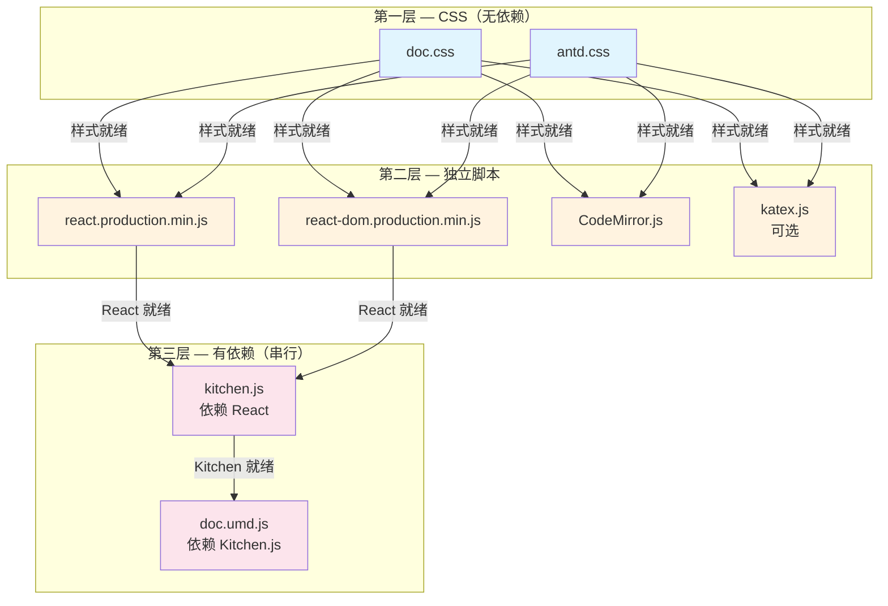
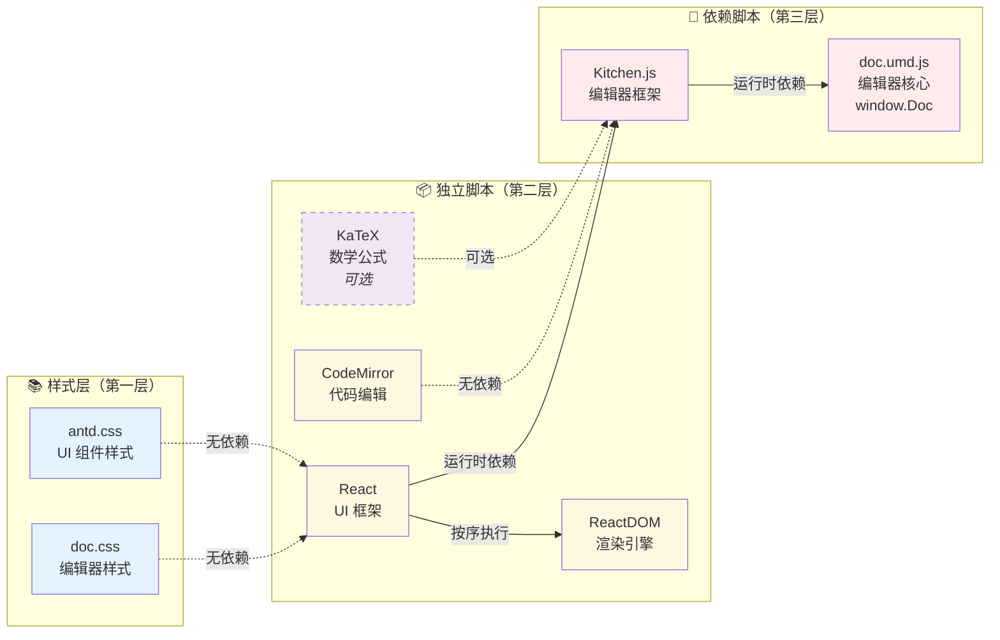
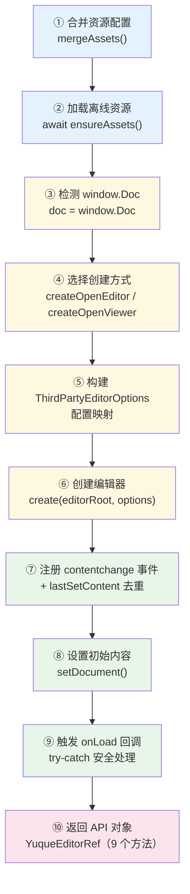
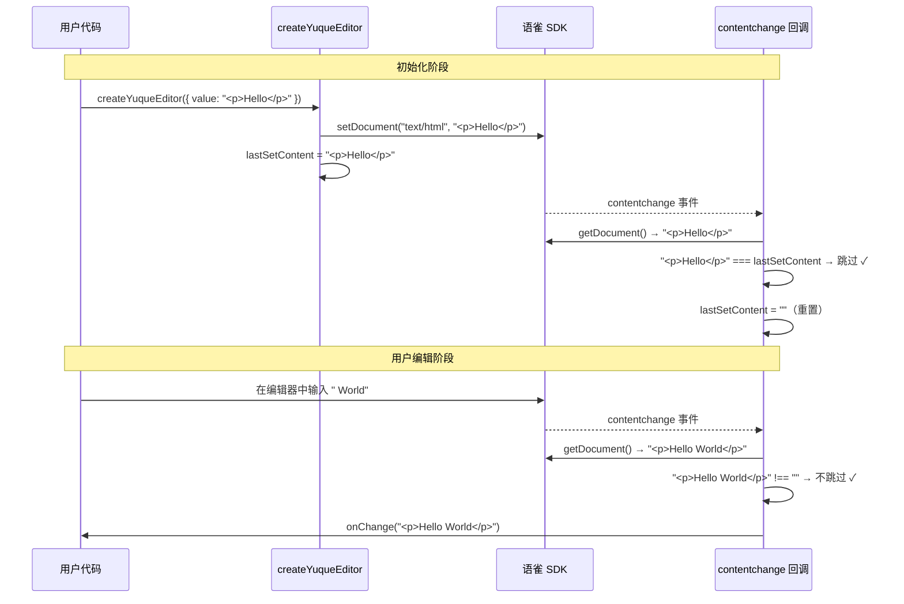

# 02 - 核心引擎

> 本篇深入分析 `packages/core/src/editor.ts`（现约 760 行），这是整个 yuque-editor-core 包最核心的文件。它负责完成三件事：**加载第三方离线资源 → 初始化语雀 Lake Editor → 暴露简洁的实例 API**。

> 📌 **文档状态（2026-09 代码已演进）**：文中行号是编写时的快照，以下改动未逐处回填，请以源码为准：
> - `stripHtml` 改用 `DOMParser` 解析（旧版 `innerHTML` 在游离节点上也会触发 `` 等副作用，属 XSS 隐患），并在块级元素间补空格避免英文单词粘连
> - `wordCount` 口径扩展：CJK 逐字（含假名/韩文）+ 拉丁字母与数字按词，词内连字符/撇号视为一词
> - `destroy()` 先把 `disposed` 置位再调用 `onBeforeDestroy`（宿主回调抛异常不再导致资源泄漏）
> - 新增 `DEFAULT_TOOLBAR_ITEMS` 快照与 `buildToolbarConfig()`：`disabledToolbarItems` 现在从默认列表**剔除**（旧版误把禁用项当白名单传入）；同时支持 `toolbarItems` 白名单
> - 资源节点查找改为按 `data-yuque-asset` 遍历比对，URL 含引号等特殊字符不再破坏 CSS 选择器

---

## 1. 概述

### 1.1 editor.ts 在项目中的位置

在整个 yuque-editor monorepo 中，`editor.ts` 是承上启下的枢纽：

```
用户代码（React/Vue 组件）
       │
       ▼
   react.tsx / vue.ts    ← 框架封装层：生命周期、ref 转发
       │
       ▼
   editor.ts             ← ★ 核心：资源加载 + 编辑器创建 + API 暴露
       │
       ├── assets.ts     ← 离线资源路径定义
       └── [第三方 SDK]   ← window.Doc（语雀 Lake Editor）
```

- `react.tsx`（337 行）和 `vue.ts`（298 行）都是对 `createYuqueEditor()` 的封装（另有新增的 `controlled.ts` 承载受控值同步逻辑）
- `assets.ts`（44 行）只定义资源文件名和路径拼接逻辑
- 真正的"脏活累活"——资源加载、编辑器初始化、事件管理、API 设计——全部在 `editor.ts` 中完成

### 1.2 这个文件要解决什么问题

语雀 Lake Editor 是一个重量级的富文本编辑器，它的运行需要 8 个离线资源文件（2 个 CSS + 6 个 JS），并且通过 `window.Doc` 全局对象暴露 API。直接使用它面临几个挑战：

| 挑战 | 解决方案 |
|------|----------|
| 8 个资源有依赖顺序，手动加载易出错 | `ensureAssets()` 三层并行策略 |
| 多实例场景下资源可能重复加载 | `assetLoaders` Map 全局去重 |
| `window.Doc` API 不友好，需要大量配置 | `createYuqueEditor()` 封装 |
| `setDocument` 会触发 `contentchange` 事件 | `lastSetContent` 去重机制 |
| 销毁后调用 API 会报错 | `disposed` 守卫 + `safeCall` 兜底 |
| SSR / 测试环境下没有 DOM | `globalThis` 检查 + `resetAssetLoaders()` |

`editor.ts` 的设计哲学是：**把语雀 SDK 的复杂性封装在内部，对外只暴露一个 `createYuqueEditor()` 函数和一个包含 9 个方法的 API 对象**。

---

## 2. 类型系统设计

### 2.1 完整类型清单

#### YuqueDocScheme — 文档格式类型

```typescript
/**
 * 语雀编辑器支持的文档格式类型
 * - text/html: 标准 HTML 格式
 * - text/markdown: Markdown 格式
 */
export type YuqueDocScheme = "text/html" | "text/markdown"
```

这是一个简单的字符串联合类型（String Union）。只允许 `"text/html"` 和 `"text/markdown"` 两个值，其他任何字符串都会在编译时报错。

设计意图：语雀编辑器支持 HTML 和 Markdown 两种格式互转，所有涉及内容读写的 API 都需要指定格式类型。用联合类型而非 `string`，可以在编译阶段就拦截拼写错误。

#### UploadResult — 上传结果

```typescript
export interface UploadResult {
  url: string    // 上传后的文件访问地址
  size: number   // 文件大小（字节）
  /** 上传后的文件名（服务端返回） */
  filename?: string  // 可选：服务端可能返回新的文件名
}
```

这是图片/视频上传完成后的返回值。`url` 和 `size` 是必填项，`filename` 是可选的——因为不是所有上传接口都会返回重命名后的文件名。

#### EditorUploadHandler — 上传处理函数

```typescript
export interface EditorUploadHandler {
  (params: { data: string | File }): Promise<UploadResult>
}
```

这是一个函数签名接口（Callable Interface）。用户需要实现这个函数来处理图片/视频上传：

- `data` 可能是 base64 字符串（粘贴图片时）或 `File` 对象（选择文件时）
- 返回 `Promise<UploadResult>`，支持异步上传

使用接口而非类型别名的好处：可以方便地扩展属性（比如将来要加 `abort` 方法）。

#### YuqueEditorAssets — 8 个资源 URL

```typescript
export interface YuqueEditorAssets {
  docCss: string         // 编辑器核心样式
  antdCss: string        // Ant Design 样式（UI 组件依赖）
  react: string          // React 运行时
  reactDom: string       // ReactDOM 运行时
  codeMirror: string     // CodeMirror 代码编辑器（代码块功能）
  kitchenScript: string  // Kitchen.js（语雀编辑器框架层）
  docUmd: string         // doc.umd.js（语雀编辑器核心，暴露 window.Doc）
  katex?: string         // KaTeX 数学公式渲染（可选）
}
```

8 个资源文件中，前 7 个是必须的，`katex` 是可选的（`?` 修饰符）。为什么？因为数学公式不是所有文档都需要，加载 KaTeX 会增加约 300KB 的体积，给用户选择权更合理。

#### YuqueEditorOptions — 创建编辑器的完整配置

```typescript
export interface YuqueEditorOptions {
  container: HTMLElement          // 必填：编辑器的挂载容器
  value?: string                  // 初始内容
  scheme?: YuqueDocScheme         // 内容格式，默认 "text/html"
  readOnly?: boolean              // 只读模式
  assets?: Partial<YuqueEditorAssets>  // 自定义资源路径（部分覆盖）
  onChange?: (value: string) => void   // 内容变化回调
  onLoad?: () => void             // 编辑器加载完成回调
  onError?: (error: Error) => void     // 错误回调
  uploadImage?: EditorUploadHandler    // 图片上传处理
  uploadVideo?: EditorUploadHandler    // 视频上传处理
  showToolbar?: boolean           // 是否显示工具栏，默认 true
  showToc?: boolean               // 是否显示目录，默认 false
  paragraphSpacing?: boolean      // 是否启用段落间距，默认 false
  defaultFontSize?: number        // 默认字号，默认 15
  darkMode?: boolean              // 暗色模式
}
```

注意几个设计细节：

1. **`assets` 是 `Partial<YuqueEditorAssets>`**——用户只需要覆盖想自定义的路径，其余使用默认值。这是一个很友好的 API 设计
2. **只有 `container` 是必填的**——其他都有合理默认值，最小化使用成本
3. **`scheme` 默认 `"text/html"`**——语雀编辑器的原生格式，兼容性最好

#### YuqueEditorRef — 编辑器实例 API

```typescript
export interface YuqueEditorRef {
  appendContent: (html: string, breakLine?: boolean) => void  // 追加内容
  setContent: (content: string, type?: YuqueDocScheme) => void // 设置内容
  getContent: (type?: YuqueDocScheme) => string               // 获取内容
  isEmpty: () => boolean                                       // 是否为空
  getSummaryContent: () => string                              // 获取纯文本摘要
  wordCount: () => number                                      // 字数统计
  focusToStart: (offset?: number) => void                      // 聚焦到开头
  insertBreakLine: () => void                                  // 插入空行
  destroy: () => void                                          // 销毁编辑器
}
```

9 个方法，涵盖了编辑器最常用的操作。设计原则：

- **读/写对称**：`getContent` / `setContent`
- **安全优先**：每个方法都有 `disposed` 守卫
- **兜底完善**：所有调用都通过 `safeCall` 包裹
- **生命周期明确**：`destroy()` 清理一切

#### ThirdPartyUploadRequest — 语雀 SDK 上传请求

```typescript
interface ThirdPartyUploadRequest {
  type?: string          // "base64" | undefined
  data: string | File    // 上传数据
}
```

这是语雀 SDK 内部使用的上传请求格式。`type` 为 `"base64"` 时表示粘贴的图片，`undefined` 时表示文件对象。

**为什么单独定义？** 因为这个类型是语雀 SDK 的内部约定，和用户侧的 `EditorUploadHandler` 参数格式不同。单独定义可以隔离对 SDK 的依赖——将来如果语雀修改了这个接口，只需改这里。

#### ThirdPartyEditorOptions — 语雀编辑器配置

```typescript
interface ThirdPartyEditorOptions {
  disabledPlugins: string[]           // 禁用的插件列表
  defaultFontsize: number             // 默认字号
  darkMode: boolean                   // 暗色模式
  typography: {
    typography: "classic"             // 排版风格
    paragraphSpacing: "relax" | "default"  // 段落间距
  }
  toc: { enable: boolean }            // 目录配置
  codeblock: {
    codemirrorURL: string             // CodeMirror URL
    supportCustomStyle: boolean       // 自定义代码样式
  }
  math?: { KaTexURL: string }         // 数学公式配置（可选）
  image?: {
    createUploadPromise: (request: ThirdPartyUploadRequest) => Promise<UploadResult>
  }
  video?: {
    createUploadPromise: (request: ThirdPartyUploadRequest) => Promise<UploadResult>
  }
}
```

这是传给 `window.Doc.createOpenEditor()` 的原始配置。注意它和 `YuqueEditorOptions` 的区别：

| YuqueEditorOptions | ThirdPartyEditorOptions |
|---|---|
| `showToolbar?: boolean` | `disabledPlugins: string[]` |
| `uploadImage?: EditorUploadHandler` | `image?.createUploadPromise: (req) => Promise` |
| `paragraphSpacing?: boolean` | `typography.paragraphSpacing: "relax" \| "default"` |
| `showToc?: boolean` | `toc: { enable: boolean }` |

`createYuqueEditor()` 负责把用户友好的 `YuqueEditorOptions` 映射为 SDK 要求的 `ThirdPartyEditorOptions`。

#### ThirdPartyEditor / ThirdPartyDoc — SDK 实例类型

```typescript
interface ThirdPartyEditor {
  on?: (event: string, handler: () => void) => void | (() => void)
  setDocument: (type: YuqueDocScheme, content: string) => void
  getDocument: (type: YuqueDocScheme, options?: { includeMeta?: boolean }) => string
  execCommand?: (command: string, ...args: unknown[]) => void
  destroy?: () => void
}

interface ThirdPartyDoc {
  createOpenEditor?: (container: HTMLElement, options: ThirdPartyEditorOptions) => ThirdPartyEditor
  createOpenViewer?: (container: HTMLElement, options: ThirdPartyEditorOptions) => ThirdPartyEditor
}
```

关键点：

1. **大量 `?` 可选属性**——语雀 SDK 的不同版本可能暴露不同的方法，用可选属性做兼容
2. **`on` 的返回值**——可能是 `void`（旧版本）或 `() => void`（新版本返回取消监听函数）
3. **`execCommand` 和 `destroy` 可选**——只读模式下某些方法可能不存在

#### ManagedLinkElement / ManagedScriptElement — 带状态标记的 DOM 元素

```typescript
type ManagedLinkElement = HTMLLinkElement & {
  _yuqueLoaded?: boolean
  _yuqueFailed?: boolean
}

type ManagedScriptElement = HTMLScriptElement & {
  _yuqueLoaded?: boolean
  _yuqueFailed?: boolean
}
```

这两个类型通过 TypeScript 的**交叉类型（Intersection Type）** 扩展了原生 DOM 元素：

- `_yuqueLoaded`：资源加载成功标记
- `_yuqueFailed`：资源加载失败标记

为什么不直接用 `any`？因为原生 DOM 元素上没有自定义属性，TypeScript 默认会报错。通过交叉类型扩展，既保持了类型安全，又能标记自定义状态。

### 2.2 类型设计思路

#### 为什么 ThirdParty* 类型要单独定义？

```typescript
// ❌ 如果直接依赖语雀 SDK 类型
import type { Doc, Editor } from 'yuque-lake-sdk'  // 不存在这样的包！
```

语雀 SDK 是通过 `<script>` 标签加载的全局变量，没有 npm 包和类型声明。我们必须自己定义类型。

单独定义 `ThirdParty*` 类型的好处：

1. **隔离层**——将来如果要替换语雀 SDK，只需修改 `ThirdParty*` 类型和对应的使用处
2. **文档化**——通过类型定义就知道 SDK 提供了哪些方法
3. **编译时检查**——调用 SDK 方法时有类型提示和错误检查

#### 为什么 Managed* 要扩展 HTML 元素类型？

```
原生 HTMLLinkElement          ManagedLinkElement
┌──────────────────┐         ┌──────────────────┐
│ rel: string      │         │ rel: string      │
│ href: string     │    +    │ href: string     │
│ onload: function │    ──►  │ _yuqueLoaded?: bool │  ← 新增
│ onerror: function│         │ _yuqueFailed?: bool │  ← 新增
└──────────────────┘         └──────────────────┘
```

资源加载器需要在 DOM 元素上标记加载状态，但原生类型没有这些属性。通过交叉类型扩展，既不破坏原生 API 的类型安全，又能添加自定义状态。

#### YuqueEditorOptions vs ThirdPartyEditorOptions 的映射关系

用户不应该直接面对 `ThirdPartyEditorOptions`——它的 API 设计是面向语雀内部使用场景的，对外部用户不够友好。`createYuqueEditor()` 负责做映射转换：

```
用户传入 YuqueEditorOptions          →    转换为 ThirdPartyEditorOptions
─────────────────────────────────────────────────────────────────
showToolbar: false                   →    disabledPlugins: ["toolbar"]
readOnly: true                       →    disabledPlugins: ["save"]
uploadImage: handler                 →    image: { createUploadPromise: wrapper }
paragraphSpacing: true               →    typography: { paragraphSpacing: "relax" }
showToc: true                        →    toc: { enable: true }
defaultFontSize: 16                  →    defaultFontsize: 16
darkMode: true                       →    darkMode: true
```

---

## 3. 模块级状态管理

### 3.1 assetLoaders Map

```typescript
/**
 * 资源加载器注册表（模块级）。
 *
 * ⚠️ 仅供浏览器环境使用。SSR / 测试场景可通过 `resetAssetLoaders()` 重置。
 */
const assetLoaders = new Map<string, Promise<void>>()
```

这是一个模块级的（Module-level）Map，存储每个资源的加载 Promise。

**为什么是模块级？**

1. **跨实例共享**——如果用户创建了多个编辑器实例，资源只需要加载一次
2. **全局单例语义**——一个 URL 对应一个资源，天然适合全局去重
3. **Map 的 O(1) 查找**——比数组的 `find()` 高效得多

```typescript
// 第一次调用 loadStyleOnce("/yuque-assets/doc.css")
// → 创建新的 Promise，放入 Map
assetLoaders.set("/yuque-assets/doc.css", Promise<void>)

// 第二次调用（同一 URL）
// → 直接返回已有的 Promise，不会重复加载
assetLoaders.get("/yuque-assets/doc.css")  // 同一个 Promise
```

**resetAssetLoaders 的使用场景**

```typescript
/**
 * 重置资源加载器注册表。
 * 适用于 SSR 多请求隔离、单元测试清理、HMR 等场景。
 */
export function resetAssetLoaders(): void {
  assetLoaders.clear()
}
```

三个典型场景：

| 场景 | 为什么需要重置 |
|------|---------------|
| **SSR** | 多个请求共享同一模块，上一次请求的缓存会污染下一次 |
| **单元测试** | 每个测试用例需要干净的状态，缓存会导致测试之间耦合 |
| **HMR** | 热更新时模块可能被重新执行，但 Map 还残留旧数据 |

### 3.2 DEFAULT_ASSETS

```typescript
const DEFAULT_ASSETS: YuqueEditorAssets = localAssets("/yuque-assets")
```

这行代码调用 `assets.ts` 中的 `localAssets()` 函数，生成基于 `/yuque-assets` 路径的默认资源配置：

```typescript
// assets.ts 中的 localAssets 函数
export function localAssets(baseUrl = "/yuque-assets"): YuqueEditorAssets {
  const base = baseUrl.endsWith("/") ? baseUrl.slice(0, -1) : baseUrl
  return {
    docCss: `${base}/doc.css`,            // → /yuque-assets/doc.css
    antdCss: `${base}/antd.css`,           // → /yuque-assets/antd.css
    react: `${base}/react.production.min.js`,
    reactDom: `${base}/react-dom.production.min.js`,
    codeMirror: `${base}/CodeMirror.js`,
    kitchenScript: `${base}/kitchen.js`,
    docUmd: `${base}/doc.umd.js`,
    katex: `${base}/katex.js`
  }
}
```

注意 `base` 的末尾斜杠处理——无论用户传入 `/yuque-assets` 还是 `/yuque-assets/`，最终路径都是正确的。这是一个防御性编程的好习惯。

### 3.3 DEBUG 标志

```typescript
/** 是否开启调试日志，设置环境变量 YUQUE_EDITOR_DEBUG=1 启用 */
const DEBUG =
  typeof globalThis !== "undefined" &&
  !!(globalThis as Record<string, unknown>).YUQUE_EDITOR_DEBUG
```

这段代码做了两件事：

1. **`typeof globalThis !== "undefined"`**——检查 `globalThis` 是否存在。为什么？因为在某些极端的 SSR 环境中，可能连 `globalThis` 都没有。用 `typeof` 检查不会抛出 `ReferenceError`（这是 JavaScript 的一个特殊规则：`typeof` 对未声明的变量不会报错）。

2. **`globalThis as Record<string, unknown>`**——类型断言。`globalThis` 的标准类型上没有 `YUQUE_EDITOR_DEBUG` 属性，直接访问会编译报错。断言为 `Record<string, unknown>` 表示"这是一个字符串键的对象，值类型未知"。为什么不用 `any`？

```typescript
// ❌ 使用 any——关闭了类型检查
const DEBUG = !!(globalThis as any).YUQUE_EDITOR_DEBUG

// ✅ 使用 Record<string, unknown>——类型更安全
const DEBUG = !!(globalThis as Record<string, unknown>).YUQUE_EDITOR_DEBUG
```

`Record<string, unknown>` 至少保证了访问的是字符串键，且返回值是 `unknown` 而非 `any`。`unknown` 类型需要显式处理（这里的 `!!` 双重否定就是将 `unknown` 转为 `boolean`），比 `any` 更安全。

使用方式：在浏览器控制台执行 `window.YUQUE_EDITOR_DEBUG = 1` 或者在 HTML 中添加 `<script>window.YUQUE_EDITOR_DEBUG = 1</script>`，然后所有被 `safeCall` 吞掉的错误都会打印到控制台。

---

## 4. 工具函数详解

### 4.1 registerLoader(url, loader) — 注册资源加载器

```typescript
function registerLoader(url: string, loader: Promise<void>): Promise<void> {
  // 1. 将 Promise 存入全局 Map
  assetLoaders.set(url, loader)
  // 2. 失败时自动清理
  void loader.catch(() => {
    // 3. 竞态检查：只有当前 loader 仍然注册时才删除
    if (assetLoaders.get(url) === loader) {
      assetLoaders.delete(url)
    }
  })
  return loader
}
```

逐步分析：

**第 1 步**：`assetLoaders.set(url, loader)`——把加载 Promise 存入 Map，后续同 URL 的请求直接返回这个 Promise。

**第 2 步**：`void loader.catch(...)`——`void` 操作符显式丢弃 Promise 结果（表明"我知道这是 Promise，但我不需要它的值"）。`.catch()` 空操作是关键——如果不 catch，Promise 的 rejection 会在控制台打印 `UnhandledPromiseRejection` 警告。

**第 3 步**：`if (assetLoaders.get(url) === loader)`——**竞态检查**。为什么需要？

考虑这个时序：

```
时间 →
t1: registerLoader("a.js", loader1)   → Map: { "a.js": loader1 }
t2: loader1 reject（加载失败）         → 进入 catch
t3: 重试：registerLoader("a.js", loader2) → Map: { "a.js": loader2 }
t4: loader1 的 catch 继续执行          → assetLoaders.get("a.js") === loader2 ≠ loader1 → 不删除 ✓
```

如果不检查，t4 时刻 loader1 的 catch 会把新注册的 loader2 也删掉！这个 `=== loader` 检查确保只有当前正在注册的 loader 失败时才清理。

### 4.2 shallowEqual(a, b) — 浅比较

```typescript
/**
 * 浅比较两个值是否"语义相等"。
 * 用于判断 props 中的对象/函数是否真正发生了变化。
 */
export function shallowEqual(a: unknown, b: unknown): boolean {
  if (a === b) return true                        // 1. 引用相等，直接返回
  if (a == null || b == null) return false         // 2. null/undefined 比较规则
  if (typeof a !== typeof b) return false          // 3. 类型不同，肯定不等
  if (typeof a === "function") return true         // 4. ★ 函数类型直接返回 true
  if (typeof a === "object") {                     // 5. 对象逐属性比较
    const ka = Object.keys(a as object)            //    获取 a 的所有键
    const kb = Object.keys(b as object)            //    获取 b 的所有键
    if (ka.length !== kb.length) return false      //    键数量不同，不等
    return ka.every((k) =>                         //    逐个比较值
      (a as Record<string, unknown>)[k] === (b as Record<string, unknown>)[k]
    )
  }
  return false                                     // 6. 其他类型（string, number...）在 === 已处理
}
```

**核心设计决策：函数类型直接返回 `true`**

```typescript
if (typeof a === "function") return true  // ★ 这一行是关键设计
```

为什么？考虑 React 的典型场景：

```tsx
function App() {
  // 每次渲染都创建新的函数引用
  const handleChange = (value: string) => console.log(value)

  return <YuqueEditor onChange={handleChange} />
}
```

每次 `App` 重新渲染时，`handleChange` 都是一个新的函数对象，引用地址不同。如果用 `===` 比较，永远返回 `false`，导致编辑器被销毁重建。

这个设计遵循了 React 的约定：**函数只比较引用，不比较内容**。React 本身在 `React.memo` 和 `useMemo` 的比较中也是这样处理的。

**时间复杂度 O(n)**，其中 n 是对象的键数量。对于编辑器配置对象（通常不超过 15 个键），性能完全可以接受。

### 4.3 normalizeError(error) — 统一错误类型

```typescript
/** 将任意类型的错误统一转为 Error 实例 */
export function normalizeError(error: unknown): Error {
  if (error instanceof Error) return error  // 已经是 Error，直接返回
  return new Error(String(error))           // 非 Error 类型，包装为 Error
}
```

为什么需要？因为 JavaScript 的 `catch` 可以捕获任何类型的值：

```typescript
try {
  throw "字符串错误"     // 不是 Error！
  throw 42              // 也不是 Error！
  throw { code: 500 }   // 也不是 Error！
} catch (e) {
  // e 可能是任意类型
}
```

`normalizeError` 确保下游代码始终处理 `Error` 实例，有 `message`、`stack` 等标准属性。

### 4.4 mergeAssets(assets?) — 资源配置合并

```typescript
function mergeAssets(assets?: Partial<YuqueEditorAssets>): YuqueEditorAssets {
  return { ...DEFAULT_ASSETS, ...(assets ?? {}) }
}
```

展开运算符（Spread Operator）的合并顺序是**后面的覆盖前面的**：

```typescript
const merged = {
  // 第 1 步：展开默认配置（8 个字段全部有值）
  docCss: "/yuque-assets/doc.css",
  antdCss: "/yuque-assets/antd.css",
  react: "/yuque-assets/react.production.min.js",
  // ... 其他 5 个
  katex: "/yuque-assets/katex.js",

  // 第 2 步：展开用户配置，覆盖同名字段
  docCss: "/cdn/custom/doc.css",  // 用户自定义，覆盖默认值
}
```

`assets ?? {}`——`??` 是空值合并运算符（Nullish Coalescing），只在 `null` 或 `undefined` 时使用默认值 `{}`。注意它和 `||` 的区别：

```typescript
assets = { docCss: "" }  // 空字符串是 falsy 值
assets ?? {}   // → { docCss: "" }   ✓ 正确
assets || {}   // → {}                  ✗ 错误！空配置被丢弃了
```

### 4.5 safeCall(fn, fallback) — 第三方 SDK 异常兜底

```typescript
/**
 * 在销毁流程/竞态场景下，第三方编辑器内部可能会抛出各种 TypeError。
 * 为避免把这些"已知无害"的错误冒泡到宿主应用，这里统一做一层兜底。
 * 开启 YUQUE_EDITOR_DEBUG=1 可在控制台查看被吞掉的错误。
 */
function safeCall<T>(fn: () => T, fallback: T): T {
  try {
    return fn()                          // 尝试执行
  } catch (e) {
    if (DEBUG) console.warn("[yuque-editor-core] safeCall suppressed:", e)
    return fallback                      // 失败时返回安全默认值
  }
}
```

泛型设计 `<T>`——返回值类型 `T` 由调用时自动推断：

```typescript
safeCall(() => editor.getDocument("text/html"), "")   // T 推断为 string
safeCall(() => editor.destroy!(), undefined)           // T 推断为 undefined
safeCall(() => editor.execCommand!("focus"), void 0)   // T 推断为 void
```

这个函数在文件中被调用了 **11 次**，包裹了所有对语雀 SDK 的调用。为什么？因为：

1. **销毁时的竞态**——`destroy()` 可能和 `contentchange` 事件同时发生，SDK 内部可能已经在清理 DOM
2. **SDK 内部 Bug**——语雀 SDK 可能抛出非预期的 TypeError
3. **保护宿主应用**——编辑器内部错误不应导致用户的 React/Vue 应用崩溃

---

## 5. 资源加载系统

资源加载是 `editor.ts` 中最复杂的子系统，包含两个底层加载器和一层并行调度策略。

### 5.1 loadStyleOnce(url) — CSS 加载器

```typescript
function loadStyleOnce(url: string): Promise<void> {
  // ① 检查内存缓存：如果已有正在加载/已完成的 Promise，直接返回
  if (assetLoaders.has(url)) return assetLoaders.get(url)!

  const p = new Promise<void>((resolve, reject) => {
    // ② 检查 DOM 缓存：通过 data-yuque-asset 属性查找已有的 link 元素
    const existing = document.querySelector(
      `link[data-yuque-asset="${url}"]`
    ) as ManagedLinkElement | null

    if (existing) {
      // ③ 已存在且之前失败过：移除旧的，重新创建
      if (existing._yuqueFailed) {
        existing.remove()
      } else {
        // ④ 已存在且成功/正在加载：直接 resolve（因为样式已生效或即将生效）
        resolve()
        return
      }
    }

    // ⑤ 创建新的 link 元素
    const link = document.createElement("link") as ManagedLinkElement
    link.rel = "stylesheet"
    link.type = "text/css"
    link.href = url
    link.dataset.yuqueAsset = url  // 标记为语雀资源，方便后续查找

    // ⑥ 加载成功回调
    link.onload = () => {
      link._yuqueLoaded = true     // 标记成功状态
      link._yuqueFailed = false    // 清除失败状态
      resolve()
    }

    // ⑦ 加载失败回调
    link.onerror = () => {
      link._yuqueFailed = true     // 标记失败状态
      reject(new Error(`Failed to load style: ${url}`))
    }

    // ⑧ CSS 放在 <head> 中（浏览器推荐做法）
    document.head.appendChild(link)
  })

  // ⑨ 注册到全局 Map，并处理失败自动清理
  return registerLoader(url, p)
}
```

**关键设计点详解：**

**data-yuque-asset 属性选择器**

```typescript
document.querySelector(`link[data-yuque-asset="${url}"]`)
```

为什么用 `data-*` 属性而不是 `id` 或 `class`？

1. **避免 ID 冲突**——`id` 在整个文档中必须唯一，用户可能已经使用了
2. **精确匹配**——`class` 可能和其他样式冲突，`data-*` 属性是专门为此设计的
3. **快速查找**——属性选择器的查找速度足够快（现代浏览器的 CSS 选择器引擎高度优化）

**_yuqueLoaded / _yuqueFailed 状态标记**

```
                    ┌─ onload → _yuqueLoaded = true
创建 link 元素 ─────┤
                    └─ onerror → _yuqueFailed = true

后续请求检查：
                    ┌─ _yuqueFailed? → 移除 + 重建（重试机制）
检查已有 link ──────┤
                    └─ 其他情况 → resolve（复用）
```

这种双重标记（而不只是依赖 Promise 状态）的原因：Promise resolve 之后无法再改变状态，但 DOM 元素可能被外部代码移除或修改。状态标记提供了 DOM 层面的真实状态。

**为什么 CSS 放 `<head>`、JS 放 `<body>`？**

```typescript
// CSS 加载器
document.head.appendChild(link)    // ← head

// JS 加载器（下一节）
document.body.appendChild(script)  // ← body
```

这是 HTML5 规范的推荐做法：
- CSS 放 `<head>`：浏览器在渲染前就会加载样式，避免 FOUC（Flash of Unstyled Content，无样式内容闪烁）
- JS 放 `<body>` 末尾：不阻塞 HTML 解析，页面内容先显示出来

### 5.2 loadScriptOnce(url) — JS 加载器

```typescript
function loadScriptOnce(url: string): Promise<void> {
  // ① 检查内存缓存
  if (assetLoaders.has(url)) return assetLoaders.get(url)!

  const p = new Promise<void>((resolve, reject) => {
    // ② 检查 DOM 缓存
    const existing = document.querySelector(
      `script[data-yuque-asset="${url}"]`
    ) as ManagedScriptElement | null

    if (existing) {
      // ③ readyState 兼容处理（IE / 旧浏览器）
      const readyState = (existing as any).readyState

      if (existing._yuqueFailed) {
        // ④ 失败的：移除重建
        existing.remove()
      } else if (
        existing._yuqueLoaded ||        // 已加载完成
        readyState === "loaded" ||      // IE 的加载完成状态
        readyState === "complete"       // IE 的缓存命中状态
      ) {
        // ⑤ 已成功：直接 resolve
        resolve()
      } else {
        // ⑥ 正在加载中：追加事件监听（不替换，因为元素已经在 DOM 中了）
        existing.addEventListener("load", () => resolve(), { once: true })
        existing.addEventListener(
          "error",
          () => reject(new Error(`Failed to load script: ${url}`)),
          { once: true }               // once: true 确保只触发一次
        )
      }
      return  // 注意：这里 return 了，不会执行后面的创建逻辑
    }

    // ⑦ 创建新的 script 元素
    const script = document.createElement("script") as ManagedScriptElement
    script.src = url
    script.async = false              // ★ 确保顺序执行
    script.dataset.yuqueAsset = url

    script.onload = () => {
      script._yuqueLoaded = true
      script._yuqueFailed = false
      resolve()
    }

    script.onerror = () => {
      script._yuqueFailed = true
      reject(new Error(`Failed to load script: ${url}`))
    }

    // ⑧ JS 放在 <body> 末尾
    document.body.appendChild(script)
  })

  return registerLoader(url, p)
}
```

**与 CSS 加载器的关键差异：**

| 特性 | CSS 加载器 | JS 加载器 |
|------|-----------|----------|
| 插入位置 | `document.head` | `document.body` |
| readyState 兼容 | 不需要 | 需要（IE/旧浏览器） |
| 加载中处理 | 不存在（CSS 同步应用） | `addEventListener` 追加 |
| async 属性 | 不适用 | `async = false`（保证顺序） |
| 事件监听 | `onload/onerror` 属性 | 属性 + `addEventListener` |

**script.async = false 的意义**

```typescript
script.async = false  // ★ 关键行
```

在现代浏览器中，通过 `document.createElement("script")` 创建的脚本默认 `async = true`。这意味着多个脚本的加载顺序不确定。但语雀 SDK 的脚本有严格的依赖顺序（比如 `kitchen.js` 必须在 `doc.umd.js` 之前），设置 `async = false` 确保按 DOM 插入顺序执行。

**readyState 兼容处理**

```typescript
const readyState = (existing as any).readyState
```

IE 和一些旧版浏览器中，`<script>` 元素有 `readyState` 属性：
- `"loaded"`：脚本已加载完成
- `"complete"`：脚本来自缓存，已就绪
- `"loading"`：正在加载

现代浏览器没有这个属性（值为 `undefined`），但检查它不会出错，是经典的渐进增强策略。

### 5.3 ensureAssets(assets) — 分层并行加载

```typescript
/**
 * 分层并行加载编辑器离线资源，减少 RTT 等待：
 * - 第一层：CSS 全部并行
 * - 第二层：React 相关 + 无依赖脚本并行
 * - 第三层：有依赖的脚本串行（kitchen → docUmd）
 */
async function ensureAssets(assets: YuqueEditorAssets) {
  // 第一层：CSS 并行加载
  await Promise.all([
    loadStyleOnce(assets.docCss),     // 编辑器核心样式
    loadStyleOnce(assets.antdCss)     // Ant Design 样式
  ])
  // 第二层：React 依赖链 + 无依赖脚本并行
  await Promise.all([
    loadScriptOnce(assets.react),         // React 运行时
    loadScriptOnce(assets.reactDom),      // ReactDOM 运行时
    loadScriptOnce(assets.codeMirror),    // CodeMirror（独立，无依赖）
    assets.katex
      ? loadScriptOnce(assets.katex)      // KaTeX（可选）
      : Promise.resolve()                 // 不需要时直接跳过
  ])
  // 第三层：有严格顺序依赖的脚本串行
  await loadScriptOnce(assets.kitchenScript)  // Kitchen.js（依赖 React）
  await loadScriptOnce(assets.docUmd)         // doc.umd.js（依赖 Kitchen.js）
}
```

**为什么这样分层？**

这是基于资源之间的真实依赖关系设计的：



**依赖关系分析：**

| 资源 | 依赖 | 原因 |
|------|------|------|
| doc.css | 无 | 纯样式 |
| antd.css | 无 | 纯样式 |
| react.js | 无 | React 是基础运行时 |
| react-dom.js | react.js（概念上） | 但因为第二层都是 `async=false`，按插入顺序执行 |
| CodeMirror.js | 无 | 独立的代码编辑器 |
| katex.js | 无 | 独立的数学公式渲染 |
| kitchen.js | react.js | 语雀编辑器框架层，基于 React 构建 |
| doc.umd.js | kitchen.js | 语雀编辑器核心，依赖 Kitchen.js 框架 |

**性能优化：从理论 7 次 RTT 降到 3 轮**

```
假设每个 RTT = 100ms

全部串行（最差情况）：
  CSS × 2 = 200ms → React × 2 = 200ms → CM + KaTeX = 200ms → Kitchen → Doc
  总计：约 600ms+

三层并行（当前方案）：
  第 1 轮（CSS 并行）：max(100, 100) = 100ms
  第 2 轮（脚本并行）：max(100, 100, 100, 100) = 100ms
  第 3 轮（串行）：100 + 100 = 200ms
  总计：约 400ms

节省：约 33%
```

**katex 为什么可选？**

```typescript
assets.katex
  ? loadScriptOnce(assets.katex)
  : Promise.resolve()  // 不需要时返回已 resolved 的 Promise
```

1. **体积考虑**——KaTeX 压缩后约 300KB，不是每个文档都需要数学公式
2. **懒加载友好**——`Promise.resolve()` 不阻塞其他资源
3. **优雅降级**——没有 KaTeX 时，数学公式不渲染，但编辑器其他功能正常

**如果全部并行会怎样？**

```typescript
// ❌ 危险：全部并行
await Promise.all([
  loadStyleOnce(assets.docCss),
  loadScriptOnce(assets.kitchenScript),  // 可能先于 React 加载完成！
  loadScriptOnce(assets.react),
  loadScriptOnce(assets.docUmd),         // 可能先于 Kitchen 加载完成！
  // ...
])
```

问题在于 `Promise.all` 只保证"全部完成"，不保证"按顺序完成"。`doc.umd.js` 可能在 `kitchen.js` 之前加载完成并执行，导致运行时错误：`Kitchen is not defined`。

### 5.4 依赖关系图



虚线表示无依赖关系，实线表示有依赖关系。注意 `katex` 的虚线边框表示它是可选的。

---

## 6. 文本处理函数

### 6.1 stripHtml(html) — HTML 转纯文本

```typescript
function stripHtml(html: string): string {
  // ⚠️ 依赖 DOM API（document.createElement），仅限浏览器环境调用
  const tmp = document.createElement("div")   // 创建临时 div
  tmp.innerHTML = html                         // 将 HTML 字符串设为 innerHTML
  return (tmp.textContent ?? "").trim()        // 读取纯文本并去除首尾空白
}
```

**为什么不直接用正则？**

```typescript
// ❌ 正则方案的问题
function stripHtmlRegex(html: string): string {
  return html.replace(/<[^>]+>/g, "")  // 移除所有标签
}

// 这个正则对以下 HTML 会出错：
stripHtmlRegex("<div>Hello <b>World</b></div>")
// → "Hello World"  ✓ 正确

stripHtmlRegex("<div title='a>b'>Text</div>")
// → " title='a>b'>Text</div"  ✗ 错误！> 在属性值中被误匹配

stripHtmlRegex("<script>alert('xss')</script>Hello")
// → "alert('xss')Hello"  ✗ 脚本内容泄露
```

HTML 的嵌套结构、属性值中的特殊字符、`<script>` 标签等边界情况，正则表达式几乎无法正确处理。浏览器内置的 DOM 解析器是最可靠的 HTML 解析器。

**`textContent` vs `innerText`**

```typescript
tmp.textContent ?? ""  // 使用 textContent
// 不用 tmp.innerText
```

`textContent` 返回所有文本节点的内容，不考虑 CSS 样式（如 `display: none`）。`innerText` 会触发重排（reflow）来计算可见文本，性能差很多。对于"提取纯文本"的需求，`textContent` 更合适。

### 6.2 stripMarkdown(md) — Markdown 转纯文本

```typescript
function stripMarkdown(md: string): string {
  return md
    // ① 代码块：```...```（多行，所以用 [\s\S] 匹配换行）
    .replace(/```[\s\S]*?```/g, " ")
    // ② 行内代码：`...`
    .replace(/`[^`]*`/g, " ")
    // ③ 图片：
    .replace(/!\[[^\]]*\]\([^)]+\)/g, " ")
    // ④ 链接：[text](url) → 保留 text（但这里简化为全部移除）
    .replace(/\[[^\]]*\]\([^)]+\)/g, " ")
    // ⑤ HTML 标签（Markdown 可以内嵌 HTML）
    .replace(/<\/?[^>]+>/g, " ")
    // ⑥ 标题：# ~ ######
    .replace(/^#{1,6}\s+/gm, "")
    // ⑦ 引用：> 开头
    .replace(/^>\s+/gm, "")
    // ⑧ 列表：无序列表（- * +）或有序列表（1. 2. ...）
    .replace(/^(\s*[-*+]|\s*\d+\.)\s+/gm, "")
    // ⑨ 强调符号：* _ ~
    .replace(/[*_~]/g, "")
    // ⑩ 多余空白：多个空白字符合并为一个
    .replace(/\s+/g, " ")
    .trim()
}
```

**逐步解释：**

**① 代码块** `` ```[\s\S]*?``` ``

- ```` ``` `` 是代码块的起始标记
- `[\s\S]` 匹配任何字符（包括换行），因为 `.` 默认不匹配换行
- `*?` 是非贪婪匹配——匹配最短的 ```...``` 块，避免跨块匹配

**② 行内代码** `` `[^`]*` ``

- 匹配两个反引号之间的内容
- `[^`]` 排除反引号本身，避免跨越多个行内代码

**③ 图片** ``

- `!` 开头表示图片
- `[^\]]*` 匹配 alt 文本（`[]` 内的非 `]` 字符）
- `[^)]+` 匹配 URL（`()` 内的非 `)` 字符）

**⑥ 标题** `^#{1,6}\s+`

- `^` 匹配行首（配合 `m` 标志，多行模式）
- `{1,6}` 匹配 1-6 个 `#` 号（h1 到 h6）
- `\s+` 匹配标题后的空格

**⑧ 列表** `^(\s*[-*+]|\s*\d+\.)\s+`

- `\s*[-*+]` 匹配无序列表标记前的缩进和标记字符
- `\s*\d+\.` 匹配有序列表的数字和点号
- 注意 `\s+` 在列表标记后面，用于移除标记和文本之间的空格

**⑩ 多余空白合并**

前面每一步替换都可能产生多余的空格。最后一步 `\s+` → `" "` 将连续空白压缩为单个空格。

**为什么不一步搞定？**

理论上可以写一个超级正则来处理所有情况，但那样会极其难以理解和维护。分成 10 步、每步处理一种语法元素，代码清晰、易于调试，性能也不会有实际差异。

### 6.3 stripByScheme(content, scheme)

```typescript
function stripByScheme(content: string, scheme: YuqueDocScheme): string {
  if (scheme === "text/markdown") return stripMarkdown(content)
  return stripHtml(content)
}
```

简单的策略模式——根据文档格式选择对应的剥离函数。将来如果支持更多格式（比如 `text/plain`、`application/json`），只需在这里添加分支。

---

## 7. createYuqueEditor — 核心函数

这是整个文件最重要、最复杂的函数，约 200 行。我们分步深入分析。

### 7.1 函数签名与整体流程

```typescript
export async function createYuqueEditor(
  options: YuqueEditorOptions
): Promise<YuqueEditorRef>
```

- `async`：因为需要 `await ensureAssets(assets)` 加载资源
- `Promise<YuqueEditorRef>`：返回一个 Promise，resolve 值是编辑器 API 对象

**整体流程：**



### 7.2 资源合并与加载

```typescript
// 合并用户配置和默认配置
const assets = mergeAssets(options.assets)
// 分层并行加载所有资源
await ensureAssets(assets)
```

如果加载失败，`ensureAssets` 会抛出异常，Promise reject，`createYuqueEditor` 不会继续执行。用户可以在 `await` 外层 try-catch 捕获。

### 7.3 window.Doc 检测

```typescript
const doc = (window as Window & { Doc?: ThirdPartyDoc }).Doc
```

**为什么用类型断言？**

`window.Doc` 不是标准 Web API，TypeScript 的 `Window` 接口上没有这个属性。直接访问 `window.Doc` 会编译报错。通过 `as Window & { Doc?: ThirdPartyDoc }` 扩展 `Window` 类型，告诉 TypeScript"我知道这个属性可能存在"。

```typescript
// ❌ 编译错误：Property 'Doc' does not exist on type 'Window'
const doc = window.Doc

// ✅ 类型断言：告诉 TS 这个属性可能存在
const doc = (window as Window & { Doc?: ThirdPartyDoc }).Doc
```

**两个创建方法的区别：**

```typescript
const create = options.readOnly
  ? doc.createOpenViewer    // 只读查看器
  : doc.createOpenEditor    // 可编辑编辑器
```

| 特性 | createOpenEditor | createOpenViewer |
|------|-----------------|------------------|
| 用途 | 编辑文档 | 阅读文档 |
| 内容编辑 | ✅ 支持 | ❌ 禁用 |
| 工具栏 | ✅ 显示 | 取决于配置 |
| save 插件 | 启用 | 禁用 |

**readOnly 模式下禁用 save 插件：**

```typescript
if (options.readOnly) disabledPlugins.push("save")
```

在只读模式下，编辑器不应该显示保存按钮。通过 `disabledPlugins` 禁用 `save` 插件是最干净的方式，不需要 CSS hack。

### 7.4 DOM 隔离设计

```typescript
// 创建编辑器 root 容器，隔离编辑器 DOM 与宿主 container
const editorRoot = document.createElement("div")
options.container.appendChild(editorRoot)
// ...
const editor = create(editorRoot, { ... })  // 把 editorRoot 传给语雀 API
```

**为什么不直接用用户的 container？**

```typescript
// ❌ 直接使用用户 container
const editor = create(options.container, { ... })
// 销毁时：语雀 SDK 可能清空 container 的所有子元素
// 用户原本在 container 中的其他元素也会被删除！
```

语雀 SDK 在创建编辑器时会在容器中创建大量 DOM 节点（工具栏、编辑区、侧边栏等）。如果直接使用用户的 container，销毁时语雀 SDK 可能会清空容器的所有内容，包括用户自己放入的元素。

**隔离方案：**

```
用户的 container
├── 用户自己的 header 元素        ← 不受影响
├── editorRoot（我们创建的）       ← 语雀 SDK 的所有 DOM 都在这里
│   ├── .lake-toolbar
│   ├── .lake-editor
│   └── .lake-toc
└── 用户自己的 footer 元素        ← 不受影响
```

**destroy 时只移除 editorRoot：**

```typescript
// destroy() 方法中
editorRoot.remove()  // 只移除编辑器的 root，不侵入宿主 container
```

### 7.5 配置对象映射

`YuqueEditorOptions` → `ThirdPartyEditorOptions` 的完整映射代码：

```typescript
const disabledPlugins: string[] = []
if (options.showToolbar === false) disabledPlugins.push("toolbar")
if (options.readOnly) disabledPlugins.push("save")

const editor = create(editorRoot, {
  disabledPlugins,                               // 动态构建
  defaultFontsize: options.defaultFontSize ?? 15, // 默认字号 15
  darkMode: !!options.darkMode,                   // 布尔值确保
  typography: {
    typography: "classic",                        // 固定为 classic
    paragraphSpacing: options.paragraphSpacing ? "relax" : "default"
  },
  toc: {
    enable: options.showToc ?? false
  },
  codeblock: {
    codemirrorURL: assets.codeMirror,              // 使用合并后的资源路径
    supportCustomStyle: true                       // 固定开启自定义样式
  },
  math: assets.katex                              // KaTeX 可选
    ? { KaTexURL: assets.katex }
    : undefined,
  image: options.uploadImage                      // 图片上传包装
    ? {
        async createUploadPromise(request: ThirdPartyUploadRequest) {
          if (request.type === "base64") {
            return options.uploadImage!({ data: request.data })
          }
          return options.uploadImage!({ data: request.data as File })
        }
      }
    : undefined,
  video: options.uploadVideo                      // 视频上传包装（逻辑同上）
    ? {
        async createUploadPromise(request: ThirdPartyUploadRequest) {
          if (request.type === "base64") {
            return options.uploadVideo!({ data: request.data })
          }
          return options.uploadVideo!({ data: request.data as File })
        }
      }
    : undefined
})
```

**几个值得注意的映射细节：**

1. **`!!options.darkMode`**——双重否定将 `undefined` 转为 `false`。语雀 SDK 期望严格的布尔值，不接受 `undefined`。

2. **`options.defaultFontSize ?? 15`**——`??` 而非 `||`，因为用户可能传入 `0`（虽然不常见，但 `|| 15` 会把 `0` 也替换为 `15`）。

3. **上传函数包装**——用户的 `EditorUploadHandler` 签名是 `{ data: string | File }`，语雀 SDK 的是 `ThirdPartyUploadRequest`（有 `type` 字段）。包装函数桥接了两个接口的差异：

```typescript
// 用户侧接口
type EditorUploadHandler = (params: { data: string | File }) => Promise<UploadResult>

// 语雀 SDK 侧接口
type SDKUploadHandler = (request: { type?: string; data: string | File }) => Promise<UploadResult>

// 包装函数把 SDK 的 request 转为用户的 params
async createUploadPromise(request: ThirdPartyUploadRequest) {
  // type 为 "base64" 时，data 是 string
  // type 为 undefined 时，data 是 File
  if (request.type === "base64") {
    return options.uploadImage!({ data: request.data })  // data: string
  }
  return options.uploadImage!({ data: request.data as File })  // data: File
}
```

### 7.6 contentchange 事件与 lastSetContent 去重机制

这是整个文件最精巧的设计之一。

**问题是什么？**

```typescript
// 设置初始内容
editor.setDocument("text/html", "<p>Hello</p>")

// setDocument 内部会触发 contentchange 事件
// → onChange 被调用，用户收到 "<p>Hello</p>"
// 但这不是用户编辑导致的变化！
```

语雀 SDK 的 `setDocument()` 会触发 `contentchange` 事件。如果不做处理，每次程序化设置内容时，`onChange` 都会被调用，导致：
- 初始化时不必要的重渲染
- `onChange → setState → render → setContent → onChange` 无限循环

**解决方案：**

```typescript
let lastSetContent = ""
const disposers: Array<() => void> = []

if (typeof editor?.on === "function") {
  const off = editor.on("contentchange", () => {
    if (disposed) return                        // 守卫：已销毁则忽略

    // 安全获取当前文档内容
    const v = safeCall(
      () => editor.getDocument(currentScheme, { includeMeta: true }),
      ""
    )

    // ★ 核心去重逻辑
    if (v === lastSetContent) {
      lastSetContent = ""                       // 只跳过一次
      return                                    // 跳过这次事件
    }

    // 真正的用户编辑导致的变化，通知外部
    options.onChange?.(v)
  })
  if (typeof off === "function") disposers.push(off)
}
```

**为什么 `lastSetContent = ""`？这是"只跳过一次"的关键！**

```typescript
if (v === lastSetContent) {
  lastSetContent = ""   // ← 重置为空字符串
  return                // ← 跳过这一次
}
```

如果不重置，考虑这个场景：

```
1. setContent("Hello")   → lastSetContent = "Hello"
2. 用户编辑 → 内容变为 "Hello World"
3. contentchange 触发 → v = "Hello World" ≠ "Hello" → 不跳过 ✓
4. 用户撤销 → 内容变回 "Hello"
5. contentchange 触发 → v = "Hello" === "Hello" → 跳过 ✗ 错误！
   用户真的撤销了，但事件被吞掉了！
```

通过 `lastSetContent = ""`，步骤 5 中的比较变为 `"Hello" !== ""`，不会被错误跳过。

**时序图：**



### 7.7 onLoad 回调的安全处理

```typescript
// 设置初始内容（如果有）
if (options.value != null) {
  safeCall(() => {
    editor.setDocument(currentScheme, options.value!)
    lastSetContent = options.value!
    return undefined
  }, undefined)
}

// 触发 onLoad 回调
try {
  options.onLoad?.()
} catch (e) {
  // onLoad 回调由宿主应用提供，异常不应影响编辑器本身
  options.onError?.(normalizeError(e))
}
```

注意 `onLoad` 的处理和 `safeCall` 不同：

- `onLoad` **不用** `safeCall`——因为 `onLoad` 是用户代码，如果它抛出异常，用户应该知道（通过 `onError` 转发）
- SDK 的调用用 `safeCall`——因为 SDK 的异常是"已知无害"的，不需要用户处理

`options.onLoad?.()` 使用了可选链（Optional Chaining），`onLoad` 为 `undefined` 时不会调用。

### 7.8 API 对象设计（9 个方法）

API 对象是一个普通对象字面量，每个方法都是闭包，可以访问外部作用域的 `editor`、`disposed`、`lastSetContent` 等变量。

#### appendContent(html, breakLine?) — 追加内容

```typescript
appendContent(html, breakLine) {
  if (disposed) return                          // disposed 守卫
  const content = breakLine ? `<p><br /></p>${html}` : html  // 可选插入空行
  if (typeof editor.execCommand === "function") {
    // 优先方案：通过 execCommand 在光标处插入
    safeCall(() => {
      editor.execCommand!("insertAtSelection", "text/html", content)
      return undefined
    }, undefined)
    return
  }
  // 回退方案：获取当前内容 → 拼接 → 重新设置
  const current = safeCall(
    () => editor.getDocument("text/html", { includeMeta: true }),
    ""
  )
  safeCall(() => {
    editor.setDocument("text/html", `${current}${content}`)
    return undefined
  }, undefined)
}
```

**双策略设计**：

1. **优先 `execCommand`**——在光标位置插入，用户体验更好（不会丢失光标位置）
2. **回退 `get + set`**——如果 `execCommand` 不可用（某些只读模式或版本），使用 get + set 拼接

**`breakLine` 参数**：在追加内容前插入一个空行 `<p><br /></p>`，用于内容分段。

#### setContent(content, type?) — 设置内容

```typescript
setContent(content, type = currentScheme) {
  if (disposed) return
  currentScheme = type                         // 更新当前文档格式
  lastSetContent = content                     // ★ 更新去重标记
  safeCall(() => {
    editor.setDocument(type, content)
    return undefined
  }, undefined)
}
```

关键点：
- `type = currentScheme`——默认参数使用当前格式，用户也可以切换格式
- `lastSetContent = content`——**必须设置**，否则下一次 `contentchange` 事件会错误地触发 `onChange`

#### getContent(type?) — 获取内容

```typescript
getContent(type = currentScheme) {
  if (disposed) return ""                       // 已销毁返回空字符串
  return safeCall(() => editor.getDocument(type, { includeMeta: true }), "")
}
```

`{ includeMeta: true }` 确保获取完整文档（包含 meta 信息），而不仅仅是正文部分。

#### isEmpty() — 是否为空

```typescript
isEmpty() {
  if (disposed) return true                     // 已销毁视为"空"
  const doc = safeCall(
    () => editor.getDocument(currentScheme, { includeMeta: true }),
    ""
  )
  return stripByScheme(doc, currentScheme).length === 0
}
```

通过 `stripByScheme` 将内容剥离为纯文本，然后检查长度是否为 0。这样即使文档中有 `<p><br /></p>` 这样的空标签，也会被正确判断为"空"。

#### getSummaryContent() — 获取纯文本摘要

```typescript
getSummaryContent() {
  if (disposed) return ""
  const doc = safeCall(
    () => editor.getDocument(currentScheme, { includeMeta: true }),
    ""
  )
  return stripByScheme(doc, currentScheme)
}
```

和 `isEmpty()` 逻辑相同，但返回纯文本内容而非布尔值。可用于搜索索引、预览摘要等场景。

#### wordCount() — 字数统计

```typescript
wordCount() {
  if (disposed) return 0
  const text = api.getSummaryContent()          // 复用 getSummaryContent

  // 中文字符单独计数（CJK 统一汉字）
  const chinese = text.match(/[\u4e00-\u9fff\u3400-\u4dbf]/g)?.length ?? 0
  // 英文单词计数（连续字母序列）
  const english = text.match(/[a-zA-Z]+/g)?.length ?? 0

  return chinese + english
}
```

**正则详解：**

```typescript
/[\u4e00-\u9fff\u3400-\u4dbf]/g
//  \u4e00-\u9fff  → CJK 统一汉字基本区（20,992 个常用汉字）
//  \u3400-\u4dbf  → CJK 统一汉字扩展 A 区（6,592 个生僻汉字）
//  g              → 全局匹配，找出所有匹配项
```

```typescript
/[a-zA-Z]+/g
//  [a-zA-Z]+      → 一个或连续多个英文字母（即一个英文单词）
//  g              → 全局匹配
```

**为什么中文按字符、英文按单词？**

- "你好世界" → 4 个中文字符 → 字数 = 4
- "Hello World" → 2 个英文单词 → 字数 = 2

这符合中文用户的直觉——中文每个字都是一个语义单位，而英文以空格分隔的单词为单位。

**`?.length ?? 0` 的防御性写法**：

```typescript
text.match(/[\u4e00-\u9fff]/g)?.length ?? 0
//                                 ↑           ↑
//                     match 无匹配时返回 null   null 时返回 0
```

`match()` 无匹配时返回 `null`（不是空数组！），所以需要 `?.length` 可选链和 `?? 0` 空值合并。

#### focusToStart(offset?) — 聚焦到开头

```typescript
focusToStart(offset = 0) {
  if (disposed) return
  if (typeof editor.execCommand === "function") {
    safeCall(() => {
      editor.execCommand!("focus", "start", offset)
      return undefined
    }, undefined)
  }
}
```

调用语雀 SDK 的 `focus` 命令，`"start"` 表示聚焦到文档开头，`offset` 可以设置光标偏移量（默认 0）。

#### insertBreakLine() — 插入空行

```typescript
insertBreakLine() {
  if (disposed) return
  if (typeof editor.execCommand === "function") {
    safeCall(() => {
      editor.execCommand!("insertAtSelection", "text/html", "<p><br /></p>")
      return undefined
    }, undefined)
  }
}
```

插入一个包含 `<br />` 的空段落。`<br />` 是不可见的占位符，确保空段落有高度（否则空 `<p>` 的高度可能为 0）。

#### destroy() — 销毁编辑器

```typescript
destroy() {
  if (disposed) return               // 防止重复销毁
  disposed = true                    // 标记为已销毁

  // 1. 执行所有事件监听器的取消函数
  for (const d of disposers) d()

  // 2. 调用语雀 SDK 的 destroy 方法
  if (typeof editor?.destroy === "function") {
    safeCall(() => {
      editor.destroy!()
      return undefined
    }, undefined)
  }

  // 3. 移除编辑器 root 容器（DOM 隔离的关键）
  editorRoot.remove()
}
```

销毁的三个步骤：

1. **取消事件监听**——`disposers` 数组存储了 `editor.on()` 返回的取消函数
2. **销毁 SDK 实例**——语雀 SDK 可能有自己的内部清理逻辑
3. **移除 DOM**——只移除 `editorRoot`，不侵入用户的 `container`

### 7.9 disposed 守卫模式

```typescript
let disposed = false  // 闭包变量，初始化为 false

const api: YuqueEditorRef = {
  setContent(content, type = currentScheme) {
    if (disposed) return          // ★ 每个 API 方法的第一行
    // ...
  },
  getContent(type = currentScheme) {
    if (disposed) return ""       // ★ 每个 API 方法的第一行
    // ...
  },
  destroy() {
    if (disposed) return          // ★ destroy 也检查，防止重复销毁
    disposed = true
    // ...
  },
}
```

**为什么需要 disposed 守卫？**

```typescript
const editor = await createYuqueEditor({ container: el })

// 用户快速操作：
editor.destroy()                     // 销毁
setTimeout(() => {
  editor.getContent()                // 销毁后调用 → TypeError？
  editor.setContent("new content")   // 销毁后调用 → TypeError？
}, 0)
```

如果没有 `disposed` 守卫：
1. `destroy()` 移除了 `editorRoot`
2. `getContent()` 调用 `editor.getDocument()`，但编辑器内部的 DOM 已经不存在 → **TypeError**

有了 `disposed` 守卫，所有方法在第一行就安全返回，不会操作已销毁的内部状态。

---

## 8. 遇到的问题与解决方案汇总

| # | 问题 | 根因 | 解决方案 | 涉及代码 |
|---|------|------|----------|----------|
| 1 | `contentchange` 初始化时多余触发 | `setDocument()` 内部触发事件 | `lastSetContent` 去重，只跳过一次 | 第 411-426 行 |
| 2 | destroy 后调用 API 报 TypeError | 编辑器内部 DOM 已被移除 | `disposed` 守卫 + `safeCall` | 第 409 行 + 所有 API 方法 |
| 3 | 第三方 SDK 抛出意外错误 | SDK 内部 Bug 或竞态条件 | `safeCall` 统一兜底 | 第 189-196 行 |
| 4 | SSR 环境没有 `globalThis` | Node.js 某些极端环境 | `typeof globalThis !== "undefined"` | 第 181 行 |
| 5 | CSS/JS 重复加载 | 多实例场景下同一资源多次加载 | `assetLoaders` Map + `data-*` 属性去重 | 第 129 行 + loadStyleOnce/loadScriptOnce |
| 6 | 资源加载失败后无法重试 | 失败的 Promise 缓存在 Map 中 | `registerLoader` 失败自动清理 | 第 133-141 行 |
| 7 | destroy 后事件回调还在执行 | 事件监听未取消 | `disposers` 数组 + `off()` 取消 | 第 412-428 行 |
| 8 | `window.Doc` 不是标准 API | TypeScript 类型检查报错 | 类型断言 `as Window & { Doc?: ... }` | 第 342 行 |
| 9 | 函数 props 导致编辑器反复重建 | React/Vue 每次渲染创建新函数 | `shallowEqual` 中函数类型直接返回 `true` | 第 159 行 |
| 10 | 初始内容设置失败影响后续流程 | `setDocument` 可能抛异常 | `safeCall` 包裹，异常不影响创建 | 第 431-437 行 |

---

## 9. 本章学到的知识点

### 资源加载

1. **分层并行加载**：根据依赖关系将资源分为多层，层内并行、层间串行，比全串行快 30%+
2. **资源去重的双重保障**：内存级（Map 缓存 Promise）+ DOM 级（`data-*` 属性查找）
3. **失败重试机制**：`registerLoader` 的竞态检查确保失败的 Promise 被清理，下次调用可以重新加载
4. **CSS 放 head、JS 放 body**：HTML5 规范的推荐做法，CSS 不阻塞渲染、JS 不阻塞解析
5. **`script.async = false`**：确保脚本按 DOM 插入顺序执行

### 类型设计

6. **ThirdParty* 隔离层**：将第三方 SDK 的类型单独定义，将来替换 SDK 只需修改一处
7. **交叉类型扩展 DOM 元素**：`HTMLLinkElement & { _yuqueLoaded?: boolean }` 在不破坏原生类型安全的前提下添加自定义属性
8. **函数类型浅比较直接返回 true**：适配 React/Vue 的渲染模型，避免不必要的重建
9. **`Partial<T>` 设计 API**：用户只需覆盖想自定义的字段，其余使用默认值

### 防御性编程

10. **`safeCall` 模式**：对第三方 SDK 的所有调用都包裹 try-catch，错误不影响宿主应用
11. **`disposed` 守卫模式**：每个 API 方法第一行检查，防止销毁后操作
12. **`normalizeError`**：将任意类型的错误统一为 `Error` 实例
13. **`typeof globalThis !== "undefined"`**：兼容 SSR 环境的安全检查
14. **`??` vs `||`**：空值合并运算符只处理 `null/undefined`，不处理 `""/0/false`

### DOM 操作

15. **DOM 隔离设计**：创建中间容器 `editorRoot`，destroy 时只移除中间容器，不侵入用户的 container
16. **HTML 解析优先用 DOM API**：`textContent` 比正则表达式更可靠地提取纯文本
17. **`data-*` 自定义属性**：比 `id`/`class` 更安全的元素标记方式

### 事件处理

18. **`lastSetContent` 去重模式**：通过记录最后一次设置的内容值，跳过 `setDocument` 触发的多余 `contentchange`
19. **"只跳过一次"的重置技巧**：`lastSetContent = ""` 确保后续用户编辑不会被误跳过
20. **`disposers` 模式**：统一管理事件监听的取消函数，destroy 时批量清理

### API 设计

21. **读/写对称的 API**：`getContent` / `setContent`，`appendContent` 的双策略设计
22. **中英混合字数统计**：中文按字符 `\u4e00-\u9fff`、英文按单词 `[a-zA-Z]+`
23. **安全的 API 默认值**：`disposed` 时返回 `""`/`true`/`0` 而非抛异常
