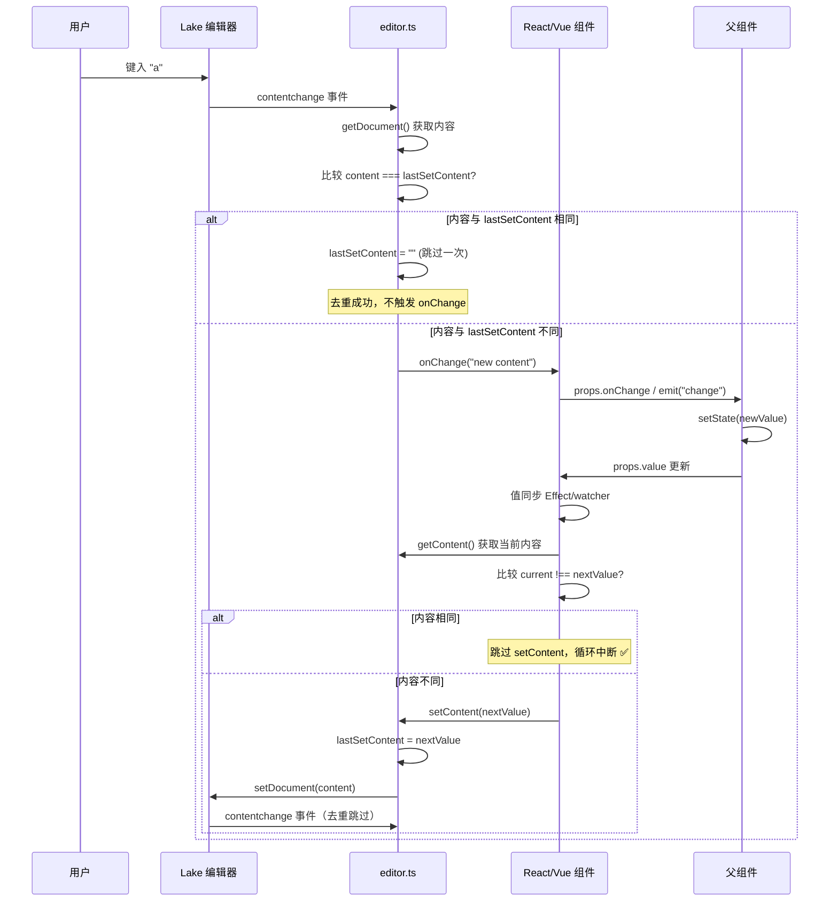

# 03 - 框架封装

> 将一个异步的、有状态的第三方编辑器，安全地"装进"React 和 Vue 的组件模型里——这就是本章要解决的问题。

> 📌 **文档状态（2026-09 代码已重构，本文行号均为旧快照）**：
> - 现规模：`react.tsx` + `vue.ts` + **`controlled.ts`（受控值同步器）** + **`lake-dom.ts`（Lake DOM 布局修正与渲染检测，React/Vue 共用）**。受控值去重逻辑（原四处散落的 ref / `lastApplied`）已收敛为框架无关的 `ValueSyncer`，本文 2.6 / 3.7 / 5.2 的描述以 `ValueSyncer` 为准
> - Vue 组件的 `emits` 已从 3 个扩展为 8 个（change/load/error/focus/blur/selectionchange/focusstatuschange/beforedestroy）
> - `applyEditorLayout` 与 `hasRenderedContent` 已提取到 `src/lake-dom.ts`，React/Vue 封装共用（Vue 的 `ValueSyncer` 同样挂了 `isRendered` / `beforeSync` 钩子）
> - Vue 封装同样采用了 `pendingOnLoad` 拦截机制（见 3.4 节的旧描述已过时）
> - 两个组件新增 `instanceKey` prop（函数型配置无法触发重建时的逃生舱）
> - props 新增 `toolbarItems`（白名单）与 `disabledToolbarItems`（从默认列表剔除，见 `editor.ts` 的 `DEFAULT_TOOLBAR_ITEMS`）

## 1. 概述

在上一篇（02 - 核心引擎）中，我们拆解了 `createYuqueEditor` 的完整实现——它是一个 **异步工厂函数**，接收配置、加载资源、创建 Lake 实例，最终返回一个 `YuqueEditorRef` 对象。一切看起来很完美，直到你要在 React 或 Vue 里使用它。

框架封装层（`react.tsx` 147 行 + `vue.ts` 222 行，共 369 行）要解决的 **4 个核心问题**：

| # | 问题 | 为什么难 | 解决方案 |
|---|------|---------|---------|
| 1 | **React StrictMode / Vue 组件更新的竞态** | StrictMode 下 mount → unmount → mount 双重渲染；Vue 的 watch 可能在 init 完成前再次触发 | React 用标记对象 `{ current: true }`，Vue 用版本号 `initSeq` + `destroyed` |
| 2 | **异步初始化与同步 ref 的矛盾** | `createYuqueEditor` 是 async 的，但 `useImperativeHandle` / `expose` 必须同步返回 | React 返回代理对象 + `checkReady()` 延迟检查；Vue 用可选链 `api?.` |
| 3 | **受控模式（value/onChange 同步）** | 编辑器内部触发 `contentchange` → 组件 onChange → 父组件 setState → props.value 变化 → setContent → 又触发 `contentchange` → 无限循环 | `lastSetContent` 去重 + 值同步 Effect 中的 `getContent !== nextValue` 比较 |
| 4 | **配置变化时的实例重建控制** | 父组件每次渲染可能产生新的 `onChange` 函数引用，不应该因此重建编辑器 | `shallowEqual` 浅比较（函数直接返回 true）+ `extractConfig` 分离配置与回调 |

这 4 个问题看似独立，实际上彼此关联。本章将带你逐行阅读 `react.tsx` 和 `vue.ts` 的完整实现，理解每一行代码背后的"为什么"。

---

## 2. React 组件封装（react.tsx, 147 行）

React 组件是两个文件中更短的那个，但信息密度极高。我们先看整体骨架，再逐段深入。

### 2.1 Props 设计

```typescript
// react.tsx:5-13
export interface YuqueRichTextProps extends Omit<
  YuqueEditorOptions,
  "container" | "onChange" | "onLoad" | "onError" | "value"
> {
  value: string                    // 必选！React 受控组件必须有值
  onChange?: (value: string) => void  // 编辑器内容变化时触发
  onLoad?: () => void              // 编辑器初始化完成时触发
  onError?: (error: Error) => void // 初始化或运行时错误
}
```

**为什么用 `Omit` 排除 5 个字段？**

回看 `YuqueEditorOptions`（editor.ts:32-48）的定义，它包含 `container`、`onChange`、`onLoad`、`onError`、`value` 这 5 个字段。React 组件必须接管这 5 个字段的管理权：

- **`container`**：由组件内部的 `containerRef` 提供，用户不需要也不能指定
- **`onChange`**：React 的命名惯例是 `onChange`（且语义与 `YuqueEditorOptions.onChange` 一致），但 React 组件会在内部做竞态检查后再传递
- **`onLoad`**：React 组件需要拦截 `onLoad`（pendingOnLoad 机制，2.5 节详解），不能直接传给 `createYuqueEditor`
- **`onError`**：同上，需要通过 `propsRef.current` 获取最新引用
- **`value`**：在 `YuqueEditorOptions` 中是可选的，但在 React 受控组件中必须是必选的

通过 `extends Omit<...>` 的方式，Props 类型**继承了其余所有配置项**（scheme、readOnly、assets、uploadImage 等），同时**重新定义了被排除的字段**，既保证了类型完整性，又避免了字段冲突。

**value 为什么是必选的？**

这是 React 受控组件的核心约定。一个受控组件意味着：
- 组件的显示值由 `props.value` 决定
- 用户编辑时通过 `onChange` 通知父组件
- 父组件更新 `value` 后，组件反映新值

如果 `value` 是可选的，组件就无法区分"用户还没有输入"和"值确实为空字符串"，导致受控模式无法正常工作。

### 2.2 extractConfig 函数

```typescript
// react.tsx:16-29
/** 从 props 中提取影响编辑器实例重建的配置项 */
function extractConfig(props: YuqueRichTextProps) {
  return {
    scheme: props.scheme,           // 文档格式：text/html | text/markdown
    readOnly: props.readOnly,       // 是否只读
    assets: props.assets,           // 离线资源路径映射
    uploadImage: props.uploadImage, // 图片上传处理器（函数）
    uploadVideo: props.uploadVideo, // 视频上传处理器（函数）
    showToolbar: props.showToolbar, // 是否显示工具栏
    showToc: props.showToc,         // 是否显示目录
    paragraphSpacing: props.paragraphSpacing, // 段间距（relax）
    defaultFontSize: props.defaultFontSize,   // 默认字号
    darkMode: props.darkMode        // 深色模式
  }
}
```

**为什么要把配置从 props 中单独提取？**

这里有三个关键原因：

1. **排除频繁变化的属性**：`value` 在每次用户输入时都会变化，`onChange` 在父组件每次渲染时可能产生新引用。如果这些也参与配置比较，编辑器会被无意义地反复销毁和重建。

2. **明确配置边界**：`extractConfig` 提取的 10 个字段都有一个共同特征——它们的变化意味着需要**销毁旧实例、创建新实例**。比如 `scheme` 从 `"text/html"` 变成 `"text/markdown"`，编辑器必须重建才能切换格式。

3. **与 useEffect 依赖数组对齐**：React 的 `useEffect` 通过依赖数组决定是否重新执行。`extractConfig` 的 10 个字段与 useEffect 依赖数组中的 10 项一一对应（react.tsx:130），确保"配置比较"和"Effect 触发"使用完全相同的判断标准。

### 2.3 组件内部状态

```typescript
// react.tsx:36-42
const containerRef = useRef<HTMLDivElement | null>(null)  // 容器 DOM 引用
const editorRef = useRef<YuqueEditorRef | null>(null)      // 编辑器实例引用
const propsRef = useRef(props)                              // 始终持有最新的 props
propsRef.current = props                                    // 每次渲染都更新

// 稳定化配置引用：只在配置语义变化时才触发重建
const configRef = useRef(extractConfig(props))
```

四个 `useRef`，各司其职：

**`containerRef`**：指向渲染的 `<div>` DOM 元素。`createYuqueEditor` 需要一个 DOM 容器来挂载编辑器，这个 ref 就是桥梁。

**`editorRef`**：持有 `createYuqueEditor` 返回的 API 对象。它会在编辑器创建成功后被赋值，在销毁时被置空。

**`propsRef`**：这是最值得深入理解的一个。为什么需要它？

```typescript
// 问题场景：
useEffect(() => {
  void (async () => {
    const api = await createYuqueEditor({
      onChange: (v) => {
        // ⚠️ 这个闭包捕获的是 effect 创建时的 props
        // 如果在 await 期间 props 发生了变化，这里拿到的还是旧的 props！
        props.onChange?.(v)  // ← 这里的 props 可能已过期
      }
    })
  })()
}, [deps])
```

React 函数组件每次渲染都会创建新的闭包。当 `useEffect` 内部的异步操作（`await createYuqueEditor`）跨越多次渲染时，闭包中捕获的 `props` 引用可能已经过期。

**解决方案**：`propsRef` 是一个 `useRef`，它的 `.current` 属性在每次渲染时都被更新为最新的 props。异步回调中通过 `propsRef.current.onChange?.(v)` 访问的始终是最新值。

```
渲染 1：propsRef.current = props_v1
  → useEffect 启动 async IIFE
  → await createYuqueEditor（耗时 500ms）
渲染 2：propsRef.current = props_v2  ← 用户已输入新内容
  → useEffect 的 cleanup 执行，active.current = false
  → 新的 useEffect 启动
  → 第一次的 async IIFE 中：propsRef.current 已经是 props_v2 ✅
  → 但 active.current = false，所以回调不会执行 ✅
```

**`configRef`**：保存上一次的配置快照。每次 Effect 执行时，先用 `extractConfig` 获取当前配置，再与 `configRef.current` 逐项比较，判断是否真的发生了变化。只有变化时才重建编辑器。

### 2.4 useImperativeHandle 代理模式

```typescript
// react.tsx:44-64
useImperativeHandle(ref, () => {
  // 返回代理对象，延迟检查编辑器是否初始化完成
  // 避免 React StrictMode 双重渲染导致的"编辑器尚未初始化完成"错误
  const checkReady = () => {
    if (!editorRef.current) {
      throw new Error("YuqueRichText：编辑器尚未初始化完成")
    }
    return editorRef.current
  }
  return {
    appendContent: (html: string, breakLine?: boolean) => checkReady().appendContent(html, breakLine),
    setContent: (content: string, type?: any) => checkReady().setContent(content, type),
    getContent: (type?: any) => checkReady().getContent(type),
    isEmpty: () => checkReady().isEmpty(),
    getSummaryContent: () => checkReady().getSummaryContent(),
    wordCount: () => checkReady().wordCount(),
    focusToStart: (offset?: number) => checkReady().focusToStart(offset),
    insertBreakLine: () => checkReady().insertBreakLine(),
    destroy: () => checkReady().destroy()
  } satisfies YuqueEditorRef
})
```

**核心问题**：`createYuqueEditor` 是异步的（需要加载 CSS/JS 资源），但 `useImperativeHandle` 必须同步返回一个对象。

```typescript
// 用户代码：
const editorRef = useRef<YuqueEditorRef>(null)
useEffect(() => {
  // 此时 useEffect 已执行，但 createYuqueEditor 可能还在 await
  editorRef.current?.getContent()  // ← editorRef.current 可能还是 null！
}, [])
```

**解决方案：代理模式（Proxy Pattern）**

不直接暴露编辑器实例，而是返回一个**代理对象**。代理对象上的每个方法在**被调用时**才检查 `editorRef.current` 是否存在：

```
用户调用 ref.current.getContent()
  → 代理对象.getContent()
    → checkReady()  ← 此时检查 editorRef.current
      → 如果 null，抛出明确的错误信息
      → 如果存在，返回真实的 api.getContent()
```

**`satisfies YuqueEditorRef` 的作用**：

`satisfies` 是 TypeScript 4.9+ 的运算符，它确保返回的对象满足 `YuqueEditorRef` 接口的所有字段，同时不丢失字面量类型信息。如果将来 `YuqueEditorRef` 新增了方法，而代理对象忘记添加，TypeScript 会在编译时报错——这是一个"编译时安全网"。

**为什么不用 `undefined` 返回而是抛异常？**

```typescript
// 方案 A：返回 undefined
getContent: () => editorRef.current?.getContent()
// 问题：调用方拿到的可能是 undefined，类型不一致，容易引发更难追踪的 bug

// 方案 B：抛异常 ✅（当前方案）
getContent: () => checkReady().getContent()
// 优势：错误信息明确，能在控制台精确定位问题
```

抛异常的策略遵循了 "Fail Fast" 原则——在问题发生的第一时间暴露，而不是让一个 `undefined` 在调用链中传播。

### 2.5 主 Effect：编辑器创建与竞态控制

这是 React 组件最核心的部分（react.tsx:66-130），值得逐行拆解。

#### 第一步：配置浅比较

```typescript
// react.tsx:67-76
const nextConfig = extractConfig(props)

// 逐项浅比较，只在配置真正变化时才重建实例
const keys = Object.keys(configRef.current) as (keyof typeof nextConfig)[]
const changed = keys.some(
  (k) => !shallowEqual(configRef.current[k], nextConfig[k])
)
if (!changed && editorRef.current) return

configRef.current = nextConfig
```

这段代码做了什么？

1. 从当前 props 中提取配置快照 `nextConfig`
2. 取出 `configRef.current` 的所有 key（共 10 个）
3. 逐项调用 `shallowEqual` 比较
4. 如果没有任何变化 **且** 编辑器实例存在（`editorRef.current` 非空），直接 return，不做任何事
5. 否则更新 `configRef` 并继续执行后续的创建逻辑

**为什么不用 useEffect 的依赖数组自动比较？**

React 的 `useEffect` 依赖数组使用 `Object.is` 做比较。对于函数类型，`Object.is(() => {}, () => {})` 永远返回 `false`——即使两个函数的行为完全相同。

```typescript
// 父组件每次渲染都会创建新的 onChange 函数：
<YuqueRichText
  value={value}
  onChange={(v) => setValue(v)}  // ← 每次渲染都是新的函数引用
/>

// 如果 onChange 在依赖数组中，useEffect 每次渲染都会执行！
useEffect(() => { /* 重建编辑器 */ }, [props.onChange])  // ← 灾难
```

这就是为什么 `onChange` 被排除在依赖数组之外，而是通过 `propsRef.current` 在回调中获取最新值。

**`shallowEqual` 的浅比较逻辑**（editor.ts:155-167）：

```typescript
export function shallowEqual(a: unknown, b: unknown): boolean {
  if (a === b) return true              // 引用相同，直接相等
  if (a == null || b == null) return false  // null/undefined 处理
  if (typeof a !== typeof b) return false   // 类型不同
  if (typeof a === "function") return true  // ⭐ 函数直接返回 true！
  if (typeof a === "object") {
    // 对象：逐项比较所有键值
    const ka = Object.keys(a as object)
    const kb = Object.keys(b as object)
    if (ka.length !== kb.length) return false
    return ka.every((k) => (a as Record<string, unknown>)[k] === (b as Record<string, unknown>)[k])
  }
  return false
}
```

最关键的是 `if (typeof a === "function") return true` 这一行。它意味着：

- `uploadImage` 是函数 → 浅比较永远返回 true → 不会因为函数引用变化而重建
- `assets` 是对象 → 逐键比较 → 只有当路径真的变了才重建
- `scheme` 是字符串 → `Object.is` 直接比较 → 值不同才重建

这个设计隐含一个假设：**函数类型 props 的语义不会因为引用变化而改变**。这在实际使用中是合理的——父组件传入的 `onChange` 无论如何都是调用 `setState`，新引用和旧引用的行为完全一致。

#### 第二步：标记对象竞态控制

```typescript
// react.tsx:79
// 使用标记对象代替版本号，避免 StrictMode 下快异步竞态问题
const active = { current: true }
```

**为什么用对象不用 boolean？**

```typescript
// ❌ 方案 A：用 boolean
let active = true
void (async () => {
  await createYuqueEditor(...)
  if (!active) return  // ← 这里的 active 是闭包捕获的副本！
  // 外部 cleanup 函数修改的是外部变量 active = false
  // 但闭包里的 active 仍然是 true！
})()
// cleanup: active = false  ← 修改了外部变量，但闭包里的副本不受影响

// ✅ 方案 B：用对象
const active = { current: true }
void (async () => {
  await createYuqueEditor(...)
  if (!active.current) return  // ← 通过引用访问，能读到最新值
  // 外部 cleanup 函数修改的是 active.current = false
  // 闭包里通过 active.current 访问，能读到修改后的值
})()
// cleanup: active.current = false  ← 修改对象的属性，所有引用都能感知
```

关键区别：JavaScript 闭包捕获的是变量的**绑定**，不是**值**。对于基本类型（boolean），闭包拿到的是值的副本；对于对象，闭包拿到的是引用，通过引用可以读取到最新的属性值。

**React StrictMode 双重渲染场景**：

在 React 18 的 StrictMode 下，开发环境会执行这样的序列：

```
1. 组件 mount → useEffect 执行
   → active = { current: true }  （标记对象 A）
   → async IIFE 启动，await createYuqueEditor

2. StrictMode 强制 unmount → cleanup 函数执行
   → active.current = false  （标记对象 A 失效）
   → editorRef.current?.destroy()

3. 组件重新 mount → useEffect 再次执行
   → active = { current: true }  （标记对象 B，全新的对象）
   → async IIFE 启动

4. 第一次的 async IIFE 完成（createYuqueEditor 返回）
   → 检查 active.current → 这是标记对象 A，current 已经是 false
   → api.destroy() → 销毁多余的实例 ✅
   → return → 不做任何赋值

5. 第二次的 async IIFE 完成
   → 检查 active.current → 这是标记对象 B，current 仍然是 true
   → editorRef.current = api ✅
```

通过标记对象，第一次创建的编辑器实例被正确地识别为"已失效"并销毁，只有第二次的实例才会被保留。

#### 第三步：异步创建编辑器

```typescript
// react.tsx:81-121
const el = containerRef.current
if (!el) return  // 容器不存在则不执行

void (async () => {
  try {
    // 拦截 onLoad：不在 createYuqueEditor 内部调用，等 api 返回后再调用
    // 因为 createYuqueEditor 在 onLoad 回调时还未返回 api 对象
    let pendingOnLoad = false
    
    const api = await createYuqueEditor({
      ...nextConfig,           // 展开配置（不含 value/onChange/onLoad/onError/container）
      container: el,           // DOM 容器
      value: props.value,      // 初始内容（注意：这里直接用闭包中的 props.value）
      onLoad: () => {
        if (!active.current) return     // 竞态检查
        pendingOnLoad = true            // ⭐ 只设置标志，不调用 props.onLoad
      },
      onError: (error) => {
        if (!active.current) return     // 竞态检查
        propsRef.current.onError?.(error)  // 通过 propsRef 获取最新引用
      },
      onChange: (v) => {
        if (!active.current) return     // 竞态检查
        propsRef.current.onChange?.(v)  // 通过 propsRef 获取最新引用
      }
    })

    // ⭐ 竞态检查：如果 active 已经失效，销毁新创建的实例
    if (!active.current) {
      api.destroy()
      return
    }
    // 先赋值 ref，再触发 onLoad，确保用户在 onLoad 里可以访问 ref
    editorRef.current = api
    if (pendingOnLoad) {
      propsRef.current.onLoad?.()
    }
  } catch (error) {
    if (!active.current) return
    propsRef.current.onError?.(normalizeError(error))
  }
})()
```

**onLoad 拦截机制详解——这是整个 React 组件中最精妙的设计之一。**

**问题**：`createYuqueEditor` 内部会在编辑器创建完成时调用 `options.onLoad()`（editor.ts:440），但此时 `createYuqueEditor` 的 `await` 还没返回，`api` 对象还没有赋值给 `editorRef.current`。

```typescript
// createYuqueEditor 内部（editor.ts:439-445）：
try {
  options.onLoad?.()  // ← 此时 api 虽然已经构造完成（const api = {...} 在 447 行）
} catch (e) {         //    但 createYuqueEditor 还没 return，所以 React 组件里
  //                   //    editorRef.current 还是 null！
}
// ...
return api  // ← 要到这里才返回
```

等等，再仔细看 editor.ts 的代码——`onLoad` 调用在 440 行，`api` 定义在 447 行。也就是说 `onLoad` 回调在 `api` 对象被创建**之前**就执行了！这意味着即使用户在 onLoad 中不依赖 `editorRef.current`，时序上也是不安全的。

**后果**：如果用户在 `onLoad` 中调用 `ref.current.getContent()`：

```typescript
const editorRef = useRef<YuqueEditorRef>(null)

<YuqueRichText
  ref={editorRef}
  onLoad={() => {
    // editorRef.current 此时还是 null！
    // useImperativeHandle 返回的是代理对象，checkReady() 会抛异常
    editorRef.current?.getContent()  // 💥 throw Error("编辑器尚未初始化完成")
  }}
/>
```

**解决方案**：设置 `pendingOnLoad` 标志，等 `api` 返回并赋值给 `editorRef.current` 之后再调用 `propsRef.current.onLoad()`。

```
时序图：

createYuqueEditor 开始
  │
  ├─ await ensureAssets()          ← 加载 CSS/JS 资源
  │
  ├─ doc.createOpenEditor(...)     ← 创建 Lake 编辑器实例
  │
  ├─ editor.on("contentchange"...) ← 注册事件监听
  │
  ├─ editor.setDocument(...)       ← 设置初始内容
  │
  ├─ options.onLoad()              ← ⚠️ 此时触发！
  │   └─ React 组件的 onLoad 拦截器：
  │       └─ pendingOnLoad = true  ← 只设标志，不调用用户回调
  │
  ├─ const api = { ... }           ← 构造 API 对象
  │
  └─ return api                    ← createYuqueEditor 返回
      │
      ├─ if (!active.current) api.destroy()  ← 竞态检查
      │
      ├─ editorRef.current = api   ← ⭐ 先赋值 ref
      │
      └─ if (pendingOnLoad)
          └─ propsRef.current.onLoad()  ← ⭐ 再调用用户的 onLoad
              │
              └─ 用户代码：editorRef.current.getContent()  ← ✅ 现在安全了！
```

这个设计确保了一个严格的顺序：**先有编辑器实例（ref 赋值），再通知外部（onLoad 触发）**。

#### 竞态清理

```typescript
// react.tsx:123-127
return () => {
  active.current = false             // 标记当前 Effect 为失效
  editorRef.current?.destroy()       // 销毁编辑器实例
  editorRef.current = null           // 清空引用
}
```

这是 `useEffect` 的 cleanup 函数，在以下时机执行：
- 组件 unmount
- Effect 重新执行之前（依赖变化导致）
- StrictMode 的强制 unmount

三行代码各有作用：
1. `active.current = false`：让正在进行的异步创建流程在完成后自行销毁
2. `editorRef.current?.destroy()`：如果有编辑器实例，立即销毁
3. `editorRef.current = null`：清空引用，防止 `useImperativeHandle` 的代理访问到已销毁的实例

### 2.6 值同步 Effect

```typescript
// react.tsx:132-140
useEffect(() => {
  const api = editorRef.current
  if (!api) return                     // 编辑器未就绪，跳过
  const next = props.value ?? ""       // 目标值（props.value 应该始终存在，?? "" 是防御性编程）
  const current = api.getContent(props.scheme as YuqueDocScheme)  // 当前编辑器内容
  if (current !== next) {              // 只在内容不同时才设置
    api.setContent(next, props.scheme as YuqueDocScheme)
  }
}, [props.value, props.scheme])        // 仅在 value 或 scheme 变化时执行
```

这个 Effect 的职责是**外部值同步到编辑器**——当父组件通过 props 传入新的 `value` 时，编辑器内容需要跟着更新。

**循环更新防护——完整的防御链条**：

受控组件最怕的就是循环更新：

```
用户输入 "a"
  → 编辑器 contentchange 事件
    → editor.ts onChange 回调
      → lastSetContent 去重检查（editor.ts:422-425）
        → 如果 content === lastSetContent → 跳过，不触发 onChange ✅
        → 如果 content !== lastSetContent → 触发 onChange
          → React 组件的 onChange
            → propsRef.current.onChange?.(v)
              → 父组件 setState(newValue)
                → props.value 变化
                  → 值同步 Effect 执行
                    → getContent() 获取当前内容
                    → 与 props.value 比较
                      → 如果相同 → 不调用 setContent → 循环中断 ✅
                      → 如果不同 → setContent → 触发 contentchange → 回到顶部
```

这个链条中有**两个去重点**：

1. **editor.ts 层**：`lastSetContent` 机制。当 `setContent` 被调用后，紧接着的 `contentchange` 事件中的内容会与 `lastSetContent` 比较，相同则跳过（只跳过一次，然后清空 `lastSetContent`）。

2. **react.tsx 层**：`getContent() !== props.value` 比较。即使 editor.ts 的去重因为某种原因失效，值同步 Effect 也会在 `getContent` 返回值与 `props.value` 相同时跳过 `setContent`。

双重保险，确保循环更新不会发生。

### 2.7 渲染输出

```typescript
// react.tsx:142
return <div ref={containerRef} />
```

整个 React 组件只渲染一个空 `<div>`。编辑器的所有 UI（工具栏、内容区域、目录等）都由 `createYuqueEditor` 在这个 `<div>` 内部创建。

为什么不需要任何可见的 UI？因为 Lake 编辑器接管了整个容器的渲染——它会在容器内创建自己的 DOM 结构，包括工具栏、编辑区域、侧边栏等。

---

## 3. Vue 组件封装（vue.ts, 222 行）

Vue 组件比 React 多了 75 行，但结构更清晰——Vue 的 Composition API（setup 函数）天然适合管理这种有状态的组件逻辑。

### 3.1 Props 定义（defineComponent 方式）

```typescript
// vue.ts:6-56
export const YuqueRichText = defineComponent({
  name: "YuqueRichText",
  props: {
    value: {
      type: String,       // Vue 运行时类型校验
      required: true       // 必选，与 React 版本一致
    },
    scheme: {
      type: String as PropType<YuqueDocScheme>,  // PropType 将 TS 类型桥接到 Vue 运行时
      required: false,
      default: "text/html"  // 默认 HTML 格式
    },
    readOnly: {
      type: Boolean,
      required: false,
      default: false
    },
    assets: {
      type: Object as PropType<YuqueEditorOptions["assets"]>,
      required: false       // 可选，不传则使用默认的 localAssets
    },
    uploadImage: {
      type: Function as PropType<YuqueEditorOptions["uploadImage"]>,
      required: false       // 可选，不传则禁用图片上传
    },
    uploadVideo: {
      type: Function as PropType<YuqueEditorOptions["uploadVideo"]>,
      required: false
    },
    showToolbar: {
      type: Boolean,
      required: false,
      default: true         // 默认显示工具栏
    },
    showToc: {
      type: Boolean,
      required: false       // 默认不显示目录
    },
    paragraphSpacing: {
      type: Boolean,
      required: false       // 默认不启用宽松段间距
    },
    defaultFontSize: {
      type: Number,
      required: false       // 默认 15（在 editor.ts 中设定）
    },
    darkMode: {
      type: Boolean,
      required: false       // 默认浅色模式
    }
  },
  // ...
})
```

**为什么用 `defineComponent` 而不是 `<script setup>`？**

`react.tsx` 和 `vue.ts` 是作为 npm 包的源码分发的，不是 `.vue` 单文件组件（SFC）。`defineComponent` + `setup` 函数是"纯 JS/TS 文件中定义 Vue 组件"的标准方式。

如果将来需要提供 `.vue` SFC 版本，可以用 `<script setup>` 重写，逻辑完全相同。

**`PropType` 的作用**：

```typescript
type: String as PropType<YuqueDocScheme>
```

Vue 的 `props` 定义中的 `type` 只支持 Vue 内置的构造函数（`String`、`Number`、`Boolean`、`Object`、`Array`、`Function`）。`PropType<T>` 是一个类型断言工具，它告诉 TypeScript："这个 prop 的实际类型是 `YuqueDocScheme`（即 `"text/html" | "text/markdown"`）"，虽然运行时校验仍然使用 `String`。

**11 个 prop 的设计考量**：

| Prop | 类型 | 必选 | 默认值 | 说明 |
|------|------|------|--------|------|
| `value` | `String` | ✅ | - | 受控值，必选 |
| `scheme` | `String` | ❌ | `"text/html"` | 文档格式 |
| `readOnly` | `Boolean` | ❌ | `false` | 只读模式 |
| `assets` | `Object` | ❌ | - | 资源路径映射 |
| `uploadImage` | `Function` | ❌ | - | 图片上传 |
| `uploadVideo` | `Function` | ❌ | - | 视频上传 |
| `showToolbar` | `Boolean` | ❌ | `true` | 工具栏（默认显示） |
| `showToc` | `Boolean` | ❌ | - | 目录（默认隐藏） |
| `paragraphSpacing` | `Boolean` | ❌ | - | 段间距 |
| `defaultFontSize` | `Number` | ❌ | - | 字号 |
| `darkMode` | `Boolean` | ❌ | - | 深色模式 |

与 React 版本对比，Vue 版本的 Props 多了运行时校验（`type`、`required`、`default`），这是 Vue 框架提供的额外安全层。React 中同样的校验需要手动实现或使用 PropTypes 库。

### 3.2 Emits 定义

```typescript
// vue.ts:57
emits: ["change", "load", "error"],
```

对应 React 的 `onChange`、`onLoad`、`onError`。Vue 使用事件（emits）而非回调 props 来传递子组件到父组件的消息。

```typescript
// React 风格：回调 props
<YuqueRichText onChange={(v) => setValue(v)} />

// Vue 风格：事件
<YuqueRichText @change="(v) => value = v" />
```

### 3.3 setup 内部状态

```typescript
// vue.ts:58-79
setup(props, { emit, expose }) {
  const container = ref<HTMLElement | null>(null)  // 模板 ref，指向 div 容器
  let api: YuqueEditorRef | null = null             // 编辑器实例（普通变量，非 ref）
  let destroyed = false                             // 组件是否已卸载
  let initSeq = 0                                   // 初始化版本号，用于竞态检测
  let lastApplied = { value: props.value, scheme: props.scheme }  // 上次应用的值

  // 缓存上一轮配置，用于浅比较判断是否真正变化
  let lastConfig = {
    scheme: props.scheme,
    readOnly: props.readOnly,
    assets: props.assets,
    uploadImage: props.uploadImage,
    uploadVideo: props.uploadVideo,
    showToolbar: props.showToolbar,
    showToc: props.showToc,
    paragraphSpacing: props.paragraphSpacing,
    defaultFontSize: props.defaultFontSize,
    darkMode: props.darkMode
  }

  const configKeys = Object.keys(lastConfig) as (keyof typeof lastConfig)[]
  // ...
}
```

**`api` 为什么是普通变量不是 `ref`？**

在 Vue 的 Composition API 中，`ref()` 会创建一个响应式引用。每当 `.value` 变化时，依赖它的计算属性和 watcher 都会重新执行。但 `api`（编辑器实例）的变化**不需要**触发任何响应式更新——它的赋值和清空只是内部状态管理，不需要让模板重新渲染。

使用普通变量（`let api`）而非 `ref(api)` 的好处：
- 避免 Vue 的 Proxy 包装开销
- 赋值/清空操作不触发不必要的响应式依赖追踪
- 语义更明确：这是一个"内部可变状态"，不是"响应式数据"

**`initSeq`：版本号竞态检测**

```typescript
let initSeq = 0

const init = async () => {
  const seq = ++initSeq  // 递增版本号
  // ... await createYuqueEditor
  if (seq !== initSeq) { // 如果版本号不匹配，说明有新的 init 已经启动
    nextApi.destroy()    // 销毁过时的实例
    return
  }
}
```

Vue 的方案是**版本号**，而 React 用的是**标记对象**。两者本质上解决同一个问题，但选择了各自框架更自然的表达方式。版本号的好处是更直观——每次 init 递增，过时的 init 自然失效。

**`lastApplied`：记录上次应用的值**

用于避免在值同步 watcher 中产生不必要的 `setContent` 调用。当编辑器初始化或配置变化导致重建时，`lastApplied` 会被更新为当前使用的值和 scheme。

### 3.4 init() 方法

```typescript
// vue.ts:81-120
const init = async () => {
  if (!container.value) return   // 容器不存在则不执行

  const seq = ++initSeq           // ⭐ 获取当前版本号
  const nextValue = props.value   // 快照当前值
  const nextScheme = props.scheme // 快照当前 scheme

  api?.destroy()                  // 销毁旧实例（如果存在）
  api = null

  try {
    const nextApi = await createYuqueEditor({
      container: container.value, // DOM 容器
      value: nextValue,           // 初始内容
      scheme: nextScheme,         // 文档格式
      readOnly: props.readOnly,
      assets: props.assets,
      uploadImage: props.uploadImage,
      uploadVideo: props.uploadVideo,
      showToolbar: props.showToolbar,
      showToc: props.showToc,
      paragraphSpacing: props.paragraphSpacing,
      defaultFontSize: props.defaultFontSize,
      darkMode: props.darkMode,
      onLoad: () => emit("load"),           // ⭐ 直接传递 emit
      onError: (error) => emit("error", error),
      onChange: (v) => emit("change", v)
    })

    // 竞态检查：版本号或 destroyed 标志不匹配则销毁
    if (destroyed || seq !== initSeq) {
      nextApi.destroy()
      return
    }

    api = nextApi                  // 赋值实例
    lastApplied = { value: nextValue, scheme: nextScheme }  // 更新记录
  } catch (error) {
    if (destroyed || seq !== initSeq) return
    emit("error", normalizeError(error))
  }
}
```

**与 React 的关键区别——onLoad 处理（历史版本，现已对齐）**：

> 📌 2026-09 更新：Vue 封装已改为与 React 一致的 `pendingOnLoad` 拦截机制——`onLoad` 只设置标志，等 `api` 赋值、同步器就绪、强制校验完成后再 `emit("load")`。旧版直接 `emit("load")` 的做法有一个实际缺陷：`createYuqueEditor` 在 return 前同步调用 `onLoad`，此时 `api` 还是 null，宿主在 `@load` 里调用 `ref.value.wordCount()` 之类的 expose 方法会静默拿到默认值（`App.vue` 的初始字数统计一直是 0）。下面保留旧版分析作为设计背景。

旧版 Vue 直接传递的原因（当时的设计权衡）：

**React 需要拦截的原因**：
- `useImperativeHandle` 在编辑器创建前就已返回代理对象
- 但 `editorRef.current` 要等 async 完成才赋值
- 如果 `onLoad` 在 `editorRef.current = api` 之前触发，用户在 onLoad 中通过 `ref.current` 访问编辑器会失败

**Vue 不需要拦截的原因**：
- Vue 的 `expose` 方法返回的对象也是代理（可选链 `api?.`）
- 但更重要的是：Vue 的 `emit` 函数引用是**稳定的**——它由 Vue 框架创建，在整个组件生命周期内保持不变
- 即使在 `api` 赋值之前触发 `emit("load")`，用户在 `@load` 回调中通过 `ref` 访问编辑器时：
  - 如果使用 `ref.value.getContent()` → 因为 `api` 还是 null，返回 `""`（安全默认值）
  - 这不会抛异常，只是暂时拿不到内容——但这种情况极少发生，因为 `createYuqueEditor` 内部的 `onLoad` 是同步调用（在 return api 之前），而 `api` 的赋值紧随其后

简单来说：React 的代理模式（`checkReady()` 抛异常）需要精确控制时序；Vue 的可选链模式（`api?.` 返回默认值）天然容忍时序差异。

**快照 props 值**：

```typescript
const nextValue = props.value    // ← 快照
const nextScheme = props.scheme  // ← 快照
```

在 `init()` 开始时立即快照 `props.value` 和 `props.scheme`。因为 `createYuqueEditor` 是异步的，在 `await` 期间 props 可能已经变化。使用快照确保传给编辑器的是**同一时刻**的一致状态。

### 3.5 生命周期钩子

```typescript
// vue.ts:122-131
onMounted(() => {
  void init()   // 组件挂载后初始化编辑器
})

onBeforeUnmount(() => {
  destroyed = true     // 标记组件已卸载
  initSeq++            // 让正在进行的 init 失效
  api?.destroy()       // 销毁编辑器实例
  api = null           // 清空引用
})
```

`onMounted` 中的 `void init()` 与 React 的 `void (async () => { ... })()` 模式相同——显式标记"我们有意忽略这个 Promise"。

`onBeforeUnmount` 执行了三步清理：
1. `destroyed = true`：标记组件已卸载，后续所有异步回调都会检查这个标志
2. `initSeq++`：让正在进行的 `init` 在 `await` 返回后发现版本号不匹配，自行销毁新实例
3. `api?.destroy()`：立即销毁当前编辑器实例

**为什么用 `onBeforeUnmount` 而不是 `onUnmounted`？**

`onBeforeUnmount` 在组件 DOM 卸载之前触发，此时 `container.value` 仍然指向有效的 DOM 元素。这确保了 `destroy()` 调用时编辑器内部的 DOM 清理操作是安全的。

### 3.6 配置变化 watcher

```typescript
// vue.ts:133-171
watch(
  () => [
    props.scheme,
    props.readOnly,
    props.assets,
    props.uploadImage,
    props.uploadVideo,
    props.showToolbar,
    props.showToc,
    props.paragraphSpacing,
    props.defaultFontSize,
    props.darkMode
  ] as const,
  async () => {
    if (!container.value) return  // 容器不存在则跳过

    // 浅比较：只有配置真正变化时才重建实例
    const nextConfig = {
      scheme: props.scheme,
      readOnly: props.readOnly,
      assets: props.assets,
      uploadImage: props.uploadImage,
      uploadVideo: props.uploadVideo,
      showToolbar: props.showToolbar,
      showToc: props.showToc,
      paragraphSpacing: props.paragraphSpacing,
      defaultFontSize: props.defaultFontSize,
      darkMode: props.darkMode
    }
    const changed = configKeys.some(
      (k) => !shallowEqual(lastConfig[k], nextConfig[k])
    )
    if (!changed && api) return   // 配置未变化且实例存在，跳过

    lastConfig = nextConfig       // 更新配置快照
    await init()                  // 重建编辑器
  },
  { flush: "post" }              // ⭐ 在 DOM 更新后执行
)
```

**`flush: "post"` 的必要性**：

Vue 的 watcher 有三种刷新时机：
- `'pre'`（默认）：在组件更新之前执行
- `'post'`：在组件更新之后执行
- `'sync'`：同步执行

为什么这里必须用 `'post'`？因为如果用默认的 `'pre'`，watcher 可能在 DOM 更新之前触发，此时 `container.value` 对应的 DOM 元素可能已经被 Vue 的虚拟 DOM diff 标记为"待移除"。在 `init()` 中使用一个即将被移除的容器创建编辑器，会导致编辑器渲染到错误的 DOM 位置。

```typescript
// flush: "pre" 的问题场景：
// 1. props.scheme 变化
// 2. watcher 触发（flush: "pre"，DOM 还没更新）
// 3. init() 读取 container.value → 这是旧的 DOM 元素
// 4. Vue 更新 DOM → 旧的 div 被移除，新的 div 被创建
// 5. init() 的 createYuqueEditor 在已移除的 div 中创建编辑器 → 💥

// flush: "post" 的正确行为：
// 1. props.scheme 变化
// 2. Vue 更新 DOM → 新的 div 已就绪
// 3. watcher 触发（flush: "post"，DOM 已更新）
// 4. init() 读取 container.value → 这是新的 DOM 元素 ✅
```

**双重配置提取**：

你可能注意到配置被提取了两次——一次在 `lastConfig` 的初始化（vue.ts:66-77），一次在 watcher 回调内部（vue.ts:150-161）。这是因为 Vue 的 watcher 需要在**回调执行时**读取最新的 props 值（通过 `props.scheme` 等），而 `lastConfig` 保存的是**上一次**的快照。

### 3.7 值变化 watcher

```typescript
// vue.ts:173-184
watch(
  () => props.value,          // 监听 value 的变化
  (nextValue) => {
    if (!api) return          // 编辑器未就绪，跳过
    const current = api.getContent(props.scheme)
    if (current !== nextValue) {      // 只在内容不同时才更新
      api.setContent(nextValue, props.scheme)
    }
    lastApplied = { value: nextValue, scheme: props.scheme }
  },
  { flush: "post" }           // 同样需要 DOM 更新后执行
)
```

这与 React 的值同步 Effect（react.tsx:132-140）逻辑完全相同：
1. 获取编辑器当前内容
2. 与新的 props.value 比较
3. 不同则调用 setContent 更新
4. 更新 lastApplied 记录

`flush: "post"` 在这里也同样重要——确保编辑器实例已就绪后再执行内容同步。

### 3.8 expose 方法

```typescript
// vue.ts:186-215
expose({
  appendContent(html: string, breakLine?: boolean) {
    api?.appendContent(html, breakLine)   // 可选链：api 为 null 时静默跳过
  },
  setContent(content: string, type?: YuqueDocScheme) {
    api?.setContent(content, type)
  },
  getContent(type?: YuqueDocScheme) {
    return api?.getContent(type) ?? ""    // 可选链 + 空字符串默认值
  },
  isEmpty() {
    return api?.isEmpty() ?? true         // 可选链 + true 默认值
  },
  getSummaryContent() {
    return api?.getSummaryContent() ?? ""
  },
  wordCount() {
    return api?.wordCount() ?? 0          // 可选链 + 0 默认值
  },
  focusToStart(offset?: number) {
    api?.focusToStart(offset)
  },
  insertBreakLine() {
    api?.insertBreakLine()
  },
  destroy() {
    api?.destroy()
    api = null                            // destroy 后清空引用
  }
})
```

**与 React `useImperativeHandle` 的关键区别**：

| 维度 | React `checkReady()` | Vue `api?.` |
|------|---------------------|-------------|
| 未初始化时 | 抛出 `Error("编辑器尚未初始化完成")` | 静默跳过 / 返回默认值 |
| 返回类型 | 与 `YuqueEditorRef` 完全一致 | `string` 方法可能返回 `""`，`boolean` 返回 `true`，`number` 返回 `0` |
| 设计哲学 | Fail Fast——尽早暴露问题 | Graceful Degradation——优雅降级 |

这两种风格反映了框架社区的惯例：
- React 社区倾向于"合约式编程"——如果前置条件不满足，就抛异常
- Vue 社区倾向于"防御式编程"——尽量返回安全的默认值，避免崩溃

**返回值的默认值选择**：

- `getContent` → `""`：空内容
- `isEmpty` → `true`：未初始化视为空
- `getSummaryContent` → `""`：空摘要
- `wordCount` → `0`：零字数

这些默认值在编辑器未初始化时都是语义合理的。

### 3.9 render 函数

```typescript
// vue.ts:217
return () => h("div", { ref: container })
```

`h()` 是 Vue 的渲染函数，等价于 React 的 JSX `<div ref={containerRef} />`。返回一个函数是因为 `defineComponent` 的 `setup` 可以返回渲染函数（函数式组件风格），也可以返回一个对象（通过 `template` 或 `render` 选项渲染）。

这里选择返回渲染函数，因为组件只有一个根元素，不需要额外的模板。

---

## 4. React vs Vue 实现对比

下表对两个框架的实现进行了**逐维度深度对比**：

| 维度 | React | Vue | 原因 |
|------|-------|-----|------|
| **组件定义** | `forwardRef` + 函数组件 | `defineComponent` + `setup` | 框架 API 设计差异。React 用 HOC（forwardRef）转发 ref；Vue 的 setup 第二个参数直接提供 expose |
| **Ref 暴露** | `useImperativeHandle(ref, ...)` | `expose({ ... })` | React 的 ref 转发需要显式的 forwardRef 包装；Vue 的 expose 是 setup 的内置能力 |
| **竞态检测** | 标记对象 `{ current: true }` | 版本号 `initSeq` + `destroyed` 布尔 | React Effect cleanup 通过闭包引用标记对象；Vue 用递增版本号更直观。本质相同：都是"让过时的异步操作自行失效" |
| **onLoad 拦截** | `pendingOnLoad` 标志 + 延迟调用 | 同左（已对齐） | 两侧都需要精确时序控制（先赋值 ref，再触发 onLoad）；旧版 Vue 直接传递会导致 `@load` 时 expose 方法尚不可用 |
| **错误处理** | 未初始化时抛 `Error` | 可选链 `api?.` + 安全默认值 | React 社区偏好 Fail Fast；Vue 社区偏好 Graceful Degradation |
| **配置变化响应** | `useEffect` + 依赖数组 | `watch` + `flush: "post"` | React 的 Effect 模型在依赖变化时执行 cleanup + re-run；Vue 的 watch 更精确地只关注特定数据 |
| **Props 引用稳定性** | `propsRef` 持有最新值 | Vue 响应式自动追踪 | React 函数组件每次渲染创建新闭包，闭包中的 props 可能过期；Vue 的 props 是 Proxy 对象，始终反映最新值 |
| **值同步** | `useEffect` 依赖 `[props.value, props.scheme]` | `watch(() => props.value, ...)` | 不同的响应式原语，效果相同 |
| **渲染输出** | JSX `<div ref={containerRef} />` | `h("div", { ref: container })` | JSX 语法糖 vs 显式渲染函数，编译后结构相同 |
| **代码行数** | 147 行 | 222 行 | Vue 需要 props 声明（运行时校验）+ emits 声明 + 更详细的 watcher 配置 |

### 为什么 React 需要 `propsRef` 但 Vue 不需要？

这是两个框架**响应式模型差异**的核心体现：

```
React 函数组件模型：
  渲染 1 → 创建闭包 A（props_v1）
    → useEffect 执行 → async IIFE 启动
      渲染 2 → 创建闭包 B（props_v2）  ← 新的渲染，新的闭包
        → useEffect cleanup → async IIFE A 中的 props 是 props_v1（过期！）
          → 需要 propsRef.current 来访问 props_v2

Vue setup 模型：
  setup 执行一次 → 创建闭包（props 是 Proxy）
    → watch / onMounted 中访问 props → 始终通过 Proxy 获取最新值
      → 不需要额外的 ref 来持有最新值
```

React 的"每次渲染都是新的函数调用"模型导致闭包捕获问题；Vue 的"setup 只执行一次"模型天然避免了这个问题。

### 为什么 React 需要 onLoad 拦截但 Vue 不需要？

```
React 时序问题：
  useImperativeHandle 同步返回代理 → ref.current 指向代理对象
    → 用户可能在 onLoad 回调中调用 ref.current.getContent()
      → 代理对象的 getContent() 调用 checkReady()
        → checkReady() 检查 editorRef.current
          → 如果 onLoad 在 editorRef.current = api 之前触发 → 💥 throw Error

Vue 没有时序问题：
  expose 返回的对象使用可选链
    → 用户在 @load 回调中调用 ref.value.getContent()
      → api?.getContent() → 如果 api 为 null → 返回 ""
        → 不会抛异常，只是暂时返回空字符串
```

React 的代理模式要求"引用必须可用"，因此需要精确控制时序；Vue 的可选链模式容忍"引用暂时不可用"，因此不需要额外的拦截机制。

---

## 5. 受控组件模式详解

### 5.1 完整数据流

受控组件模式（Controlled Component）是 React/Vue 表单组件的标准模式。编辑器作为"受控组件"意味着：

- **单一数据源**：编辑器的显示内容由 `props.value` 决定
- **单向数据流**：用户编辑 → 编辑器触发事件 → 组件通知父组件 → 父组件更新 value → 组件反映新值
- **循环防护**：上述流程中任何一环都可能产生反馈循环，需要多层防护



### 5.2 循环更新的三层防护

整个防护链条中有**三个独立的去重点**，确保循环更新不可能发生：

| 层级 | 位置 | 机制 | 防护场景 |
|------|------|------|---------|
| 第 1 层 | `editor.ts:422-425` | `lastSetContent` 去重 | `setContent` 触发的 `contentchange` 被跳过 |
| 第 2 层 | `react.tsx:137` / `vue.ts:178` | `getContent() !== nextValue` 比较 | 父组件传入的 value 与编辑器内容相同时跳过 |
| 第 3 层 | `react.tsx:72-74` / `vue.ts:162-165` | `shallowEqual` 配置比较 | 函数引用变化不触发编辑器重建 |

**第 1 层**是最核心的——它直接在编辑器引擎层面拦截了"自己设置的内容又触发自己的 onChange"这一最常见的循环场景：

```typescript
// editor.ts:410-425
let lastSetContent = ""  // 记录最后一次主动设置的内容

const off = editor.on("contentchange", () => {
  if (disposed) return
  const v = safeCall(
    () => editor.getDocument(currentScheme, { includeMeta: true }),
    ""
  )
  // ⭐ 关键去重：如果内容与最后一次主动设置的一致，跳过
  if (v === lastSetContent) {
    lastSetContent = ""  // 只跳过一次！
    return
  }
  options.onChange?.(v)
})
```

注意 `lastSetContent = ""` 这行——它意味着去重只生效**一次**。这是为了处理一种边界情况：用户手动在编辑器中输入了与之前 `setContent` 相同的内容，此时应该正常触发 `onChange`。

### 5.3 什么时候会触发不必要的重建？为什么 shallowEqual 很重要？

考虑这个真实的场景：

```typescript
function App() {
  const [value, setValue] = useState("<p>Hello</p>")

  // ⚠️ 每次渲染都创建新的函数引用
  const handleImageUpload = async ({ data }) => {
    const formData = new FormData()
    formData.append("file", data)
    const res = await fetch("/api/upload", { method: "POST", body: formData })
    return res.json()
  }

  return (
    <YuqueRichText
      value={value}
      onChange={(v) => setValue(v)}  // ⚠️ 每次渲染都是新函数
      uploadImage={handleImageUpload}  // ⚠️ 每次渲染都是新函数
    />
  )
}
```

每次用户输入一个字符，`setValue` 触发重新渲染，`handleImageUpload` 和 `onChange` 都会产生新的函数引用。

**如果没有 `shallowEqual`（使用默认的 `Object.is` 比较）**：

```
用户输入 "a" → setValue → 重新渲染
  → useEffect 依赖数组检查：
    - props.uploadImage: 新函数引用 → !== 旧引用 → Effect 重新执行
    → 编辑器被销毁并重建！
    → 用户的光标位置丢失！
    → 编辑器的撤销历史清空！
  → 用户输入 "b" → 又重建... 又重建... 又重建...
```

编辑器会在每次用户输入时被销毁和重建，这是一个灾难性的性能和行为问题。

**有了 `shallowEqual`**：

```
用户输入 "a" → setValue → 重新渲染
  → extractConfig 获取 nextConfig
  → shallowEqual(oldConfig.uploadImage, newConfig.uploadImage)
    → typeof uploadImage === "function" → return true ✅
  → 所有配置项浅比较通过 → changed = false
  → editorRef.current 存在 → 直接 return
  → 编辑器不被重建！用户的光标和撤销历史完好 ✅
```

`shallowEqual` 对函数类型的特殊处理（`return true`）是整个实例稳定性策略的关键。它隐含了一个设计决策：**我们假设函数 props 的语义不会因为引用变化而改变**。在绝大多数实际场景中，这个假设是成立的。

> **导师提示**：如果你确实需要因为函数行为变化而重建编辑器（比如切换了不同的上传后端），可以通过改变 `scheme` 或其他非函数配置项来间接触发重建。当前的 `shallowEqual` 策略在"稳定性"和"灵活性"之间选择了前者——这是一个正确的默认行为。

---

## 6. 本章学到的知识点

通过深入拆解 `react.tsx`（147 行）和 `vue.ts`（222 行），我们掌握了以下关键知识点：

### 6.1 异步生命周期管理

- **React**：`useEffect` + cleanup + 标记对象 `{ current: true }` 管理异步操作的竞态
- **Vue**：`onMounted` / `onBeforeUnmount` + 版本号 `initSeq` + `destroyed` 标志
- **核心原则**：任何异步操作在完成后都必须检查"当前执行环境是否还有效"

### 6.2 闭包与引用稳定性

- React 函数组件每次渲染创建新闭包，需要 `propsRef` 持有最新 props
- Vue 的 setup 只执行一次，props 通过 Proxy 自动保持最新
- `shallowEqual` 对函数返回 `true`，避免因引用变化导致不必要的重建

### 6.3 代理模式（Proxy Pattern）

- React 的 `useImperativeHandle` 返回代理对象，延迟检查编辑器可用性
- Vue 的 `expose` 使用可选链 `api?.`，提供安全的默认值
- 两种风格各有优势：Fail Fast vs Graceful Degradation

### 6.4 时序控制

- React 的 `pendingOnLoad` 机制解决了"onLoad 回调先于 ref 赋值"的时序问题
- Vue 不需要类似机制，因为可选链天然容忍时序差异
- 原则：在涉及异步操作 + 回调时序的场景中，需要显式控制"谁先谁后"

### 6.5 受控组件的循环防护

- 三层防护：`lastSetContent` 去重 + `getContent !== nextValue` 比较 + `shallowEqual` 配置比较
- 每一层独立工作，即使某一层失效，其他层仍然能阻止循环更新
- `lastSetContent` 的"只跳过一次"策略平衡了去重和响应性

### 6.6 框架差异的本质

| 差异点 | 根本原因 |
|--------|---------|
| React 需要 propsRef / Vue 不需要 | 函数组件每次渲染新闭包 vs setup 执行一次 |
| React 需要 onLoad 拦截 / Vue 不需要 | 代理模式要求精确时序 vs 可选链容忍时序差异 |
| React 用标记对象 / Vue 用版本号 | 各自框架更自然的竞态检测方式 |
| React useEffect / Vue watch | 声明式副作用 vs 精确数据监听 |

理解这些差异的**根本原因**比记住"React 这样写、Vue 那样写"更重要。当你面对其他需要框架封装的第三方库时，这些原则可以直接复用。
