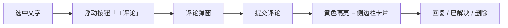
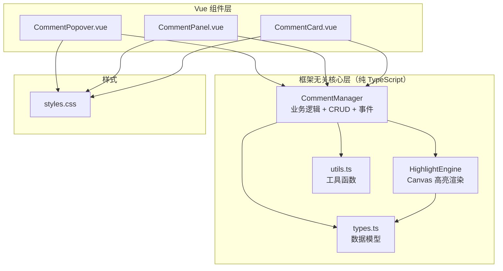
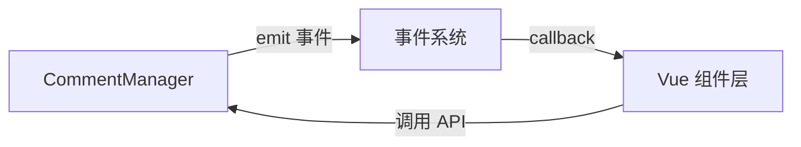
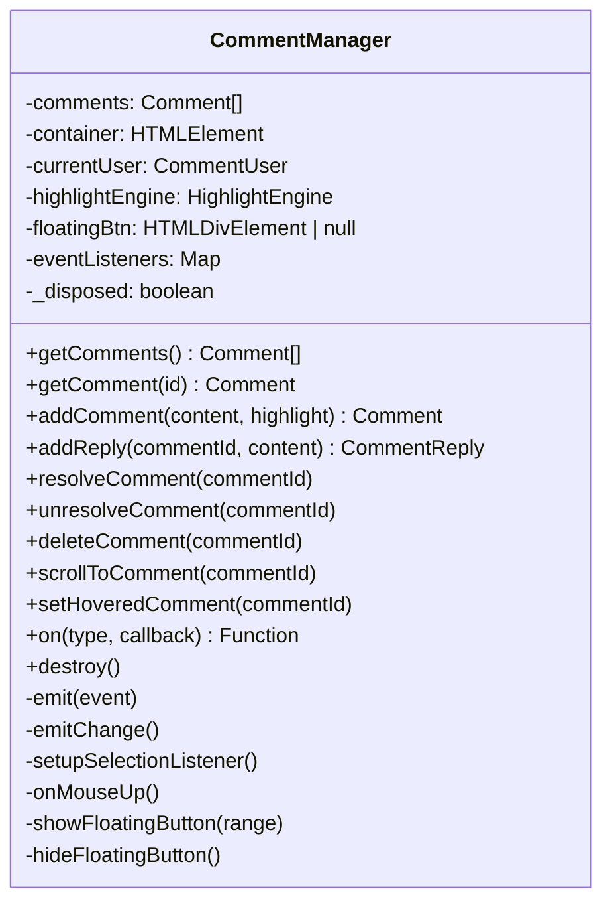
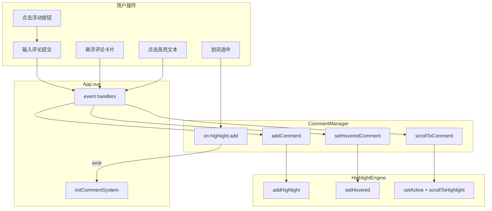

# 04 - 评论系统

> 这章我们来拆解一个完整的功能模块——**评论系统**。它不是一个简单的"你发一句、我回一句"，而是包含划词高亮、浮动按钮、弹窗输入、侧边栏面板、状态联动的一整套交互闭环。
>
> 我们会看到如何将**框架无关的核心逻辑**和 **Vue 组件层**解耦，以及如何用 **Canvas 覆盖层**实现零侵入的高亮渲染。

> 📌 **文档状态（2026-09 代码已修复）**：
> - **高亮跟随内容**：高亮位置用 childIndices 路径序列化，内容一经编辑即错位。现在由宿主在编辑器 `@change` 里调用 `CommentManager.refreshHighlights()`（内部经 rAF 节流）驱动重绘；旧版 `setupScroll` 中定义了 `requestAnimationFrame` 死循环却从未调用，导致高亮漂移
> - **监听释放**：scroll 监听改用 `AbortController`，`HighlightEngine.destroy()` 会统一取消（旧版匿名函数无法移除，滚动造成闭包泄漏）；`redraw` 在尺寸未变时不再重建 canvas backing store
> - **滚动容器判定**：`findScrollContainer` 按轴分别判断并校验内容溢出，不再用 `overflow + overflowY` 字符串拼接误判 `overflow:hidden` 父级
> - **定时器**：`scrollToComment` 的 3 秒激活定时器随 `destroy()` 清理
> - **异常可见**：事件监听器回调异常改为 `console.error` 暴露

---

## 1. 概述

### 1.1 功能描述

评论系统的用户交互流程是一条清晰的链路：



具体来说：

1. **划词** → 用户在编辑器中选中一段文字，松开鼠标后出现「💬 评论」浮动按钮
2. **浮动按钮** → 点击后弹出评论输入弹窗（Popover），同时清除文本选区
3. **评论弹窗** → 用户输入评论内容，按 Ctrl+Enter 或点击按钮提交
4. **高亮标记** → 提交后，被评论的文字上叠加黄色高亮（Canvas 绘制）
5. **侧边栏面板** → 右侧面板展示所有评论，支持筛选（全部 / 待解决 / 已解决）
6. **联动交互** → 鼠标悬浮评论卡片 → 对应高亮变亮；点击高亮文本 → 滚动到对应位置

### 1.2 架构分层

整个评论系统分为两层，这非常重要：



- **核心层**：`CommentManager`、`HighlightEngine`、`types.ts`、`utils.ts` —— 全是纯 TypeScript，零 Vue 依赖
- **组件层**：`CommentPopover.vue`、`CommentPanel.vue`、`CommentCard.vue` —— 纯 UI 渲染和交互

### 1.3 为什么核心逻辑不依赖 Vue？

这是一个很好的架构问题。核心逻辑之所以写成框架无关的纯 TypeScript，有三个原因：

| 原因 | 说明 |
|------|------|
| **可复用性** | 同一套评论管理器 + 高亮引擎，可以无缝用于 React、Angular 甚至原生 JS 项目 |
| **可测试性** | 纯类不需要挂载 Vue 组件，直接 `new CommentManager(...)` 就能做单元测试 |
| **关注点分离** | 业务逻辑（何时高亮、如何 CRUD）和 UI 渲染（弹窗长什么样）是两件事，分开写更容易维护 |

> 💡 **导师提示**：在真实项目中，如果你发现一段逻辑既可以在 Vue 中使用，也可以在 React 中使用，那就把它抽成框架无关的模块。这是"一次编写、到处使用"的精髓。

---

## 2. 数据模型（types.ts）

数据模型是整个评论系统的"骨架"。先看代码，再逐个分析。

```typescript
/**
 * 评论系统数据模型
 */

/** 评论用户（Demo 模式下使用模拟数据） */
export interface CommentUser {
  id: string
  name: string
  avatar: string
}

/** 高亮选区信息（XPath-like 路径序列化，不保存 DOM 引用） */
export interface HighlightSelection {
  /** 从根容器到 start 节点的 childIndices 路径 */
  startPath: number[]
  startOffset: number
  /** 从根容器到 end 节点的 childIndices 路径 */
  endPath: number[]
  endOffset: number
  /** 被选中的纯文本，用于展示和匹配校验 */
  text: string
}

/** 评论回复 */
export interface CommentReply {
  id: string
  content: string
  user: CommentUser
  createdAt: number
}

/** 单条评论 */
export interface Comment {
  id: string
  content: string
  user: CommentUser
  highlight?: HighlightSelection
  replies: CommentReply[]
  resolved: boolean
  createdAt: number
}

/** 评论系统配置 */
export interface CommentSystemOptions {
  /** 评论内容所在的可编辑容器（需要划词的 DOM 元素） */
  container: HTMLElement
  /** 当前用户 */
  currentUser: CommentUser
  /** 评论变更回调 */
  onChange?: (comments: Comment[]) => void
}

/** 评论系统事件类型 */
export type CommentEventType =
  | 'select'
  | 'highlight:add'
  | 'highlight:remove'
  | 'comment:add'
  | 'comment:resolve'
  | 'comment:unresolve'
  | 'comment:delete'
  | 'reply:add'

/** 评论系统事件 */
export interface CommentEvent {
  type: CommentEventType
  data?: unknown
}
```

### 2.1 CommentUser —— 评论用户

```typescript
export interface CommentUser {
  id: string      // 用户唯一 ID
  name: string    // 显示名称
  avatar: string  // 头像 URL（Demo 模式下为空字符串）
}
```

目前是 Demo 模式，使用 `DEFAULT_USER` 模拟数据：

```typescript
// utils.ts
export const DEFAULT_USER: CommentUser = {
  id: 'demo_user',
  name: 'Demo 用户',
  avatar: ''
}
```

> 💡 生产环境中，`avatar` 应该是一个真实的图片 URL，组件层会根据它是否有值来决定显示图片还是首字母头像。

### 2.2 HighlightSelection —— 为什么用 childIndices 路径而非 DOM 引用？

这是整个评论系统中最精妙的数据结构设计：

```typescript
export interface HighlightSelection {
  startPath: number[]   // 从根容器到 start 节点的路径
  startOffset: number   // 文本起始偏移
  endPath: number[]     // 从根容器到 end 节点的路径
  endOffset: number     // 文本结束偏移
  text: string          // 被选中的纯文本
}
```

**为什么不用 DOM Range 引用？**

| 方案 | 问题 |
|------|------|
| 保存 `Range` 对象 | Range 绑定的 DOM 节点可能被编辑器修改或销毁，引用会失效 |
| 保存 `Node` 引用 | 同上，DOM 是易变的，编辑器随时可能重组 DOM 树 |
| **保存 childIndices 路径** | ✅ 只是一组数字，不依赖 DOM 生命周期，可以序列化为 JSON 持久化 |

举个例子，假设 DOM 结构如下：

```html
<div id="root">           <!-- 第 0 层 -->
  <p>                     <!-- childIndex = 0 -->
    Hello <strong>world</strong>  <!-- text "Hello " 的 childIndex = 0, <strong> 的 childIndex = 1 -->
  </p>
</div>
```

选中 "world" 时，路径序列化结果：

```
startPath: [0, 1, 0]   // root → p(0) → strong(1) → textNode(0)
startOffset: 0
endPath: [0, 1, 0]
endOffset: 5
text: "world"
```

后续需要重新定位时，只需沿路径走一遍：

```typescript
// getNodeByPath: root.childNodes[0].childNodes[1].childNodes[0] → textNode
```

> 💡 **导师提示**：这种 XPath-like 的路径序列化技术在富文本编辑器中非常常见。Google Docs、Notion 都用类似方案来持久化选区位置。核心思想是：**用纯数据描述 DOM 位置，而非直接引用 DOM 节点**。

### 2.3 Comment、CommentReply、CommentSystemOptions

```typescript
/** 评论回复 —— 嵌套在 Comment 内 */
export interface CommentReply {
  id: string           // 回复唯一 ID
  content: string      // 回复内容
  user: CommentUser    // 回复者
  createdAt: number    // 创建时间戳
}

/** 单条评论 */
export interface Comment {
  id: string                    // 评论唯一 ID
  content: string               // 评论正文
  user: CommentUser             // 评论者
  highlight?: HighlightSelection // 可选：关联的高亮选区
  replies: CommentReply[]       // 回复列表（一对多）
  resolved: boolean             // 是否已解决
  createdAt: number             // 创建时间戳
}

/** 评论系统配置 —— 初始化时传入 */
export interface CommentSystemOptions {
  container: HTMLElement          // 需要划词的 DOM 容器
  currentUser: CommentUser        // 当前登录用户
  onChange?: (comments: Comment[]) => void  // 数据变更回调
}
```

注意 `highlight` 是可选的（`?`）—— 这意味着评论可以不关联文本高亮（比如针对整篇文档的全局评论）。

### 2.4 八种事件类型

```typescript
export type CommentEventType =
  | 'select'            // 选中文本
  | 'highlight:add'     // 添加高亮
  | 'highlight:remove'  // 移除高亮
  | 'comment:add'       // 添加评论
  | 'comment:resolve'   // 标记已解决
  | 'comment:unresolve' // 取消已解决
  | 'comment:delete'    // 删除评论
  | 'reply:add'         // 添加回复
```

事件系统采用**发布-订阅模式**（Pub/Sub），Vue 组件层通过监听这些事件来驱动 UI 更新：



---

## 3. Canvas 高亮引擎（highlight-engine.ts）

### 3.1 方案选型对比

在实现文本高亮时，有三种主流方案。我们逐一对比：

| 方案 | 原理 | 优点 | 缺点 |
|------|------|------|------|
| **DOM 修改** | 在选区文本外包裹 `<mark>` 标签 | 简单直接 | ⚠️ 会破坏编辑器 DOM 结构，导致 undo/redo 异常、编辑器内部状态不一致 |
| **CSS ::highlight** | 使用 CSS 高亮 API | 不修改 DOM | ⚠️ 浏览器兼容性差（2026 年仍未完全支持），无法控制样式细节 |
| **Canvas 覆盖层** ✅ | 在编辑器上方叠加 Canvas，绘制半透明矩形 | 零 DOM 侵入、样式可控、兼容性好 | 需要处理滚动同步、DPI 适配、位置计算 |

我们选择了 **Canvas 覆盖层** 方案。核心原因：**绝不破坏编辑器的 DOM 结构**。

> 💡 **导师提示**：在富文本编辑器上做"覆盖层"，这是一个通用策略。Google Docs 的评论高亮、Grammarly 的语法检查下划线，都是类似思路——在编辑器上方叠加一层独立的渲染层。

### 3.2 Canvas 覆盖层原理

```
┌─────────────────────────────┐
│  Canvas (pointer-events:none)│  ← 高亮矩形绘制在这里
├─────────────────────────────┤
│  编辑器 DOM 内容             │  ← 用户实际编辑的区域
│  <p>Hello <b>world</b></p>  │
└─────────────────────────────┘
```

关键 CSS：

```css
canvas {
  position: absolute;
  top: 0;
  left: 0;
  pointer-events: none;  /* ← 最关键：不阻挡底层鼠标事件 */
  z-index: 1;
}
```

`pointer-events: none` 意味着鼠标事件会"穿透" Canvas，直接到达下方的编辑器 DOM。用户选中文本、点击、输入完全不受影响。

### 3.3 路径序列化工具函数

这三个函数是高亮引擎的基石：

```typescript
/**
 * 从根容器到目标节点的 childIndices 路径
 * 
 * 原理：从目标节点向上遍历到根节点，每一步记录"我是父节点的第几个子节点"
 * 例如：<div><p><span>text</span></p></div>
 * text 的路径 = [0, 0, 0]（div的第0个 → p的第0个 → span的第0个）
 */
export function getNodePath(root: Node, target: Node): number[] | null {
  const path: number[] = []          // 存储路径
  let current = target               // 从目标节点开始

  while (current && current !== root) {
    const parent = current.parentNode // 获取父节点
    if (!parent) return null          // 没有父节点，不在树中
    // 当前节点在父节点的 childNodes 中的索引
    const index = Array.from(parent.childNodes).indexOf(current as ChildNode)
    if (index === -1) return null     // 不在 childNodes 中（理论上不会发生）
    path.unshift(index)               // 头部插入（因为是从底向上遍历）
    current = parent                  // 继续向上
  }

  if (current !== root) return null   // 遍历完没到根节点，说明 target 不在 root 下
  return path
}
```

```typescript
/**
 * 根据路径从根容器找到目标节点
 * 
 * 是 getNodePath 的逆操作：沿着路径一步步深入
 */
export function getNodeByPath(root: Node, path: number[]): Node | null {
  let current = root
  for (const index of path) {
    if (!current || !current.childNodes[index]) return null // 路径失效
    current = current.childNodes[index]
  }
  return current
}
```

```typescript
/**
 * 从浏览器 Selection 创建 HighlightSelection 数据
 * 
 * 这是两个工具函数的组合应用：
 * 1. 取出 Selection 的 startContainer / endContainer
 * 2. 用 getNodePath 序列化为路径数组
 * 3. 附上 offset 和文本内容
 */
export function selectionToHighlight(
  root: HTMLElement,
  selection: Selection
): HighlightSelection | null {
  // 空选区或折叠选区（光标闪烁但没有选中文本），直接返回
  if (selection.rangeCount === 0 || selection.isCollapsed) return null

  const range = selection.getRangeAt(0)       // 取第一个 range
  const startPath = getNodePath(root, range.startContainer)
  const endPath = getNodePath(root, range.endContainer)

  // 路径为 null 说明选区不在容器内
  if (!startPath || !endPath) return null
  // 两个路径都是空数组说明选区就在根节点上（不太可能但有防御）
  if (startPath.length === 0 && endPath.length === 0) return null

  return {
    startPath,
    startOffset: range.startOffset,  // 文本起始偏移
    endPath,
    endOffset: range.endOffset,      // 文本结束偏移
    text: selection.toString().trim() // 纯文本，用于展示和校验
  }
}
```

> 💡 **导师提示**：`selectionToHighlight` 是一个**纯函数**——给它相同的 Selection 和 root，永远返回相同的结果。纯函数的好处是可预测、可测试、无副作用。

### 3.4 HighlightEngine 类

这是高亮引擎的核心类，管理 Canvas 的整个生命周期：

```typescript
export class HighlightEngine {
  private canvas: HTMLCanvasElement                    // Canvas DOM 元素
  private container: HTMLElement                       // 编辑器容器
  private scrollContainer: HTMLElement                 // 可滚动父容器
  private entries = new Map<string, HighlightEntry>()  // 所有高亮条目
  private activeId: string | null = null               // 当前激活的高亮 ID
  private hoveredId: string | null = null              // 当前悬浮的高亮 ID
  private _resizeObserver: ResizeObserver | null = null // 尺寸监听器
  private _scrollBound = false                         // 是否已绑定滚动
}
```

#### constructor —— 初始化

```typescript
constructor(options: HighlightEngineOptions) {
  this.container = options.container
  // 如果没有指定滚动容器，默认用编辑器容器本身
  this.scrollContainer = options.scrollContainer ?? options.container

  // 创建 Canvas 覆盖层
  this.canvas = document.createElement('canvas')
  // 关键样式：absolute 定位 + pointer-events: none + 高 z-index
  this.canvas.style.cssText = `
    position: absolute;
    top: 0;
    left: 0;
    pointer-events: none;
    z-index: 1;
  `

  // 确保容器是定位上下文（Canvas 的 absolute 需要相对于容器定位）
  const containerStyle = getComputedStyle(this.container)
  if (containerStyle.position === 'static') {
    this.container.style.position = 'relative'  // 强制改为 relative
  }
  this.container.appendChild(this.canvas)  // 将 Canvas 插入容器

  this.setupResize()   // 监听容器尺寸变化
  this.setupScroll()   // 监听滚动
  this.redraw()        // 初始绘制
}
```

> 💡 **为什么检查 `position: static`？** CSS 的 `position: absolute` 会相对于最近的非 `static` 定位祖先元素定位。如果容器是 `static`，Canvas 会"逃逸"到更外层的定位上下文中，导致位置完全错乱。

#### resizeCanvas —— 同步 Canvas 尺寸

```typescript
/**
 * 同步 Canvas 尺寸与容器
 * 
 * 这里有一个关键的 DPI 适配问题：
 * Canvas 的 width/height 属性是"像素缓冲区"大小，
 * 而 style.width/height 是"CSS 显示"大小。
 * 在高 DPI 屏幕上（如 Retina），如果不乘 devicePixelRatio，
 * Canvas 会模糊。
 */
resizeCanvas() {
  const rect = this.container.getBoundingClientRect()
  const dpr = window.devicePixelRatio || 1  // 获取设备像素比（Retina 通常是 2）

  // 像素缓冲区 = CSS 尺寸 × DPI
  this.canvas.width = rect.width * dpr
  this.canvas.height = rect.height * dpr

  // CSS 显示尺寸保持不变
  this.canvas.style.width = `${rect.width}px`
  this.canvas.style.height = `${rect.height}px`

  // 缩放绘图上下文，这样后续的 fillRect 使用 CSS 像素即可
  const ctx = this.canvas.getContext('2d')
  if (ctx) ctx.scale(dpr, dpr)
}
```

#### getHighlightRects —— 计算高亮矩形

```typescript
/**
 * 根据 HighlightSelection 计算容器内的矩形列表
 * 
 * 核心思路：
 * 1. 用路径找到 startNode 和 endNode
 * 2. 创建 Range，设置 start 和 end
 * 3. 调用 range.getClientRects() 获取所有行的矩形
 * 4. 转换为相对于容器的坐标
 * 5. 合并同一行的矩形
 */
getHighlightRects(selection: HighlightSelection): DOMRect[] {
  // 沿路径找到 DOM 节点
  const startNode = getNodeByPath(this.container, selection.startPath)
  const endNode = getNodeByPath(this.container, selection.endPath)
  if (!startNode || !endNode) return []  // 路径失效，返回空

  try {
    const range = document.createRange()
    range.setStart(startNode, selection.startOffset)  // 设置起始位置
    range.setEnd(endNode, selection.endOffset)          // 设置结束位置

    const rects: DOMRect[] = []
    const containerRect = this.container.getBoundingClientRect()

    // getClientRects() 返回选区覆盖的所有行的矩形
    for (const rect of range.getClientRects()) {
      if (rect.width === 0 && rect.height === 0) continue // 跳过空矩形

      // 将视口坐标转换为容器内坐标
      rects.push(new DOMRect(
        rect.left - containerRect.left,   // X = 视口左边距 - 容器左边距
        rect.top - containerRect.top,     // Y = 视口上边距 - 容器上边距
        rect.width,                       // 宽度不变
        rect.height                       // 高度不变
      ))
    }

    // 合并同一行的矩形（浏览器可能把一行拆成多个矩形）
    return mergeRects(rects)
  } catch {
    return []  // Range 操作可能抛异常（比如跨 Shadow DOM），静默处理
  }
}
```

#### mergeRects —— 合并同行矩形

```typescript
/**
 * 合并同行矩形（Y 坐标接近的合并为一个）
 * 
 * 为什么需要合并？
 * 浏览器的 getClientRects() 可能因为行内元素（如 <strong>、<span>）
 * 把同一行文本拆成多个矩形。合并后绘制更简洁。
 */
function mergeRects(rects: DOMRect[]): DOMRect[] {
  if (rects.length <= 1) return rects

  // 按 Y 坐标排序，Y 相同的按 X 排序
  const sorted = [...rects].sort((a, b) => a.top - b.top || a.left - b.left)
  const merged: DOMRect[] = [DOMRect.fromRect(sorted[0])]

  for (let i = 1; i < sorted.length; i++) {
    const current = sorted[i]
    const last = merged[merged.length - 1]

    // Y 坐标差 < 5px 视为同一行
    if (Math.abs(current.top - last.top) < 5) {
      // 合并：取最左的 left、最右的 right、较大的 height
      merged[merged.length - 1] = new DOMRect(
        Math.min(last.left, current.left),
        last.top,
        Math.max(last.right, current.right) - Math.min(last.left, current.left),
        Math.max(last.height, current.height)
      )
    } else {
      merged.push(DOMRect.fromRect(current))  // 不同行，直接加入
    }
  }

  return merged
}
```

#### redraw —— 重绘所有高亮

```typescript
/**
 * 重绘所有高亮
 * 
 * 每次调用都会清空画布并重新绘制所有条目。
 * 这是一个"暴力但安全"的策略——不维护增量状态，避免复杂的状态同步。
 */
redraw() {
  const ctx = this.canvas.getContext('2d')
  if (!ctx) return

  this.resizeCanvas()  // 每次重绘前同步尺寸（容器可能 resize 了）
  const containerRect = this.container.getBoundingClientRect()

  // 清空画布
  ctx.clearRect(0, 0, containerRect.width, containerRect.height)

  // 遍历所有高亮条目
  for (const [id, entry] of this.entries) {
    const rects = this.getHighlightRects(entry.selection)
    const isActive = id === this.activeId     // 是否被激活（点击评论卡片）
    const isHovered = id === this.hoveredId   // 是否被悬浮

    // 根据状态选择颜色
    let color = entry.resolved ? HIGHLIGHT_RESOLVED_COLOR : HIGHLIGHT_COLOR
    if (isActive || isHovered) {
      color = HIGHLIGHT_ACTIVE_COLOR  // 激活/悬浮用更醒目的橙色
    }

    for (const rect of rects) {
      const padding = 1  // 内缩 1px，避免高亮紧贴文字边缘

      // 绘制高亮矩形
      ctx.fillStyle = color
      ctx.fillRect(
        rect.left + padding,
        rect.top + padding,
        rect.width - padding * 2,
        rect.height - padding * 2
      )

      // 已解决的评论：添加删除线效果
      if (entry.resolved && !isActive && !isHovered) {
        ctx.strokeStyle = 'rgba(120, 180, 120, 0.6)'
        ctx.lineWidth = 1
        ctx.beginPath()
        const midY = rect.top + rect.height / 2
        ctx.moveTo(rect.left + 2, midY)    // 删除线起点
        ctx.lineTo(rect.right - 2, midY)   // 删除线终点
        ctx.stroke()
      }
    }
  }
}
```

三种高亮颜色的含义：

| 状态 | 颜色 | 用途 |
|------|------|------|
| 正常 | `rgba(255, 224, 60, 0.4)` | 半透明黄色 |
| 激活/悬浮 | `rgba(255, 180, 0, 0.6)` | 更深的橙色，引起注意 |
| 已解决 | `rgba(160, 220, 160, 0.35)` | 半透明绿色，+ 删除线 |

#### scrollToHighlight —— 滚动到高亮位置

```typescript
/**
 * 滚动容器使指定高亮可见
 * 
 * 当用户在侧边栏点击评论卡片上的高亮文本时调用。
 * 计算高亮在滚动容器中的位置，然后平滑滚动到那里。
 */
scrollToHighlight(id: string) {
  const entry = this.entries.get(id)
  if (!entry) return

  const rects = this.getHighlightRects(entry.selection)
  if (rects.length === 0) return

  const firstRect = rects[0]
  const containerRect = this.container.getBoundingClientRect()
  const scrollContainerRect = this.scrollContainer.getBoundingClientRect()

  // 计算高亮在 scrollContainer 中的绝对 Y 位置
  const absTop = containerRect.top - scrollContainerRect.top + firstRect.top

  // 滚动到高亮上方 1/3 的位置（而不是正中间），留出上下文
  const targetScroll = this.scrollContainer.scrollTop + absTop - scrollContainerRect.height / 3

  this.scrollContainer.scrollTo({
    top: Math.max(0, targetScroll),  // 不允许负数
    behavior: 'smooth'               // 平滑滚动
  })
}
```

> 💡 **为什么滚动到 1/3 而不是正中间？** 因为用户是从右侧面板点击过来的，视线自然在屏幕上半部分。把高亮放在 1/3 的位置，用户不用大幅移动视线就能看到高亮和它的上下文。

### 3.5 高 DPI 适配

高 DPI（Retina）适配的核心在于 `resizeCanvas()` 中的三行代码：

```typescript
const dpr = window.devicePixelRatio || 1
this.canvas.width = rect.width * dpr     // 物理像素
this.canvas.height = rect.height * dpr
this.canvas.style.width = `${rect.width}px`   // CSS 像素
this.canvas.style.height = `${rect.height}px`
ctx.scale(dpr, dpr)                       // 缩放绘图上下文
```

原理：

```
Canvas 物理尺寸 = CSS 尺寸 × devicePixelRatio

普通屏幕 (dpr=1):  100px CSS → 100px 物理像素 → 1:1 清晰
Retina 屏幕 (dpr=2): 100px CSS → 200px 物理像素 → 2:1 清晰
```

如果不做这个处理，Canvas 在 Retina 屏幕上会看起来"糊"——因为 1 个 CSS 像素对应 2 个物理像素，Canvas 没有足够的物理像素来填充。

### 3.6 滚动容器查找

```typescript
/**
 * 查找最近的滚动容器
 * 
 * 从编辑器容器向上遍历 DOM 树，找到第一个有 overflow: auto/scroll 的祖先元素。
 * 如果找不到，使用 document.documentElement 作为兜底。
 */
private findScrollContainer(el: HTMLElement): HTMLElement {
  let current = el.parentElement
  while (current) {
    const style = getComputedStyle(current)
    // 检查水平和垂直 overflow
    const overflow = style.overflow + style.overflowY
    if (overflow.includes('auto') || overflow.includes('scroll')) {
      return current  // 找到了
    }
    current = current.parentElement  // 继续向上
  }
  return document.documentElement  // 兜底到 <html>
}
```

> 💡 **为什么需要找到滚动容器？** 因为用户滚动时，高亮的位置会变。我们需要在 `scroll` 事件中调用 `redraw()` 来更新 Canvas 上的高亮位置。如果监听错误的容器，就不会触发重绘。

---

## 4. 评论管理器（comment-manager.ts）

CommentManager 是整个评论系统的"大脑"——它协调高亮引擎、管理 CRUD、处理选区监听、发射事件。

### 4.1 类设计和私有属性

```typescript
export class CommentManager {
  // --- 核心状态 ---
  private comments: Comment[] = []               // 所有评论数据
  private container: HTMLElement                  // 划词容器
  private currentUser: CommentUser                // 当前用户
  private highlightEngine: HighlightEngine        // 高亮引擎

  // --- 选区浮动按钮 ---
  private floatingBtn: HTMLDivElement | null = null // 浮动按钮 DOM（懒创建）
  private _selectionListenerActive = false          // 防止重复绑定

  // --- 事件系统 ---
  private eventListeners = new Map<CommentEventType, Set<EventCallback>>()  // 事件监听器
  private onChangeCallback?: (comments: Comment[]) => void                  // 数据变更回调

  // --- 生命周期 ---
  private _disposed = false  // 是否已销毁
}
```

整体架构：



### 4.2 CRUD API 逐个方法详解

#### getComments / getComment —— 查询

```typescript
/** 获取所有评论（返回副本，防止外部修改内部数据） */
getComments(): Comment[] {
  return [...this.comments]  // 展开运算符创建浅拷贝
}

/** 获取指定 ID 的评论 */
getComment(id: string): Comment | undefined {
  return this.comments.find(c => c.id === id)
}
```

> 💡 **为什么 `getComments()` 返回副本？** 如果返回引用，外部代码可以直接 `comments[0].content = 'hacked'`，绕过管理器的控制。返回副本是一种**防御性编程**策略。

#### addComment —— 添加评论

```typescript
/**
 * 添加评论
 * 
 * 流程：
 * 1. 创建 Comment 对象（自动生成 ID、时间戳）
 * 2. 加入 comments 数组
 * 3. 如果有关联高亮，通知引擎绘制
 * 4. 触发变更回调 + 事件通知
 */
addComment(content: string, highlight?: HighlightSelection): Comment {
  const comment: Comment = {
    id: genId(),                  // 唯一 ID：时间戳 + 自增序号
    content,                      // 评论内容
    user: this.currentUser,       // 当前用户
    highlight,                    // 可选的高亮选区
    replies: [],                  // 初始无回复
    resolved: false,              // 初始未解决
    createdAt: Date.now()         // 当前时间戳
  }

  this.comments.push(comment)     // 加入列表

  // 如果有高亮选区，通知引擎绘制
  if (highlight) {
    this.highlightEngine.addHighlight(comment.id, highlight)
  }

  this.emitChange()  // 通知 Vue 组件更新列表
  this.emit({ type: 'comment:add', data: { comment } })  // 发射事件
  return comment     // 返回创建的评论（调用者可能需要 ID）
}
```

ID 生成策略：

```typescript
let _nextId = 1
function genId(): string {
  return `c_${Date.now()}_${_nextId++}`
  // 例如: c_1714567890123_1, c_1714567890124_2
}
```

> 💡 用时间戳 + 自增序号的组合 ID，在 Demo 场景下够用。生产环境建议用 UUID。

#### addReply —— 添加回复

```typescript
/**
 * 添加回复
 * 
 * 回复是嵌套在评论下的子条目，使用相同的 ID 生成策略。
 */
addReply(commentId: string, content: string): CommentReply | null {
  const comment = this.comments.find(c => c.id === commentId)
  if (!comment) return null  // 评论不存在，静默返回 null

  const reply: CommentReply = {
    id: genId(),
    content,
    user: this.currentUser,
    createdAt: Date.now()
  }

  comment.replies.push(reply)  // 加入回复列表
  this.emitChange()
  this.emit({ type: 'reply:add', data: { commentId, reply } })
  return reply
}
```

#### resolveComment / unresolveComment —— 状态切换

```typescript
/** 标记为已解决 */
resolveComment(commentId: string) {
  const comment = this.comments.find(c => c.id === commentId)
  if (!comment) return

  comment.resolved = true                           // 更新数据
  this.highlightEngine.updateResolved(commentId, true) // 更新高亮样式
  this.emitChange()
  this.emit({ type: 'comment:resolve', data: { commentId } })
}

/** 取消已解决 */
unresolveComment(commentId: string) {
  const comment = this.comments.find(c => c.id === commentId)
  if (!comment) return

  comment.resolved = false
  this.highlightEngine.updateResolved(commentId, false) // 恢复黄色高亮
  this.emitChange()
  this.emit({ type: 'comment:unresolve', data: { commentId } })
}
```

注意这两个方法同时更新了**数据层**（`comment.resolved`）和**渲染层**（`highlightEngine.updateResolved`）。

#### deleteComment —— 删除评论

```typescript
/** 删除评论 */
deleteComment(commentId: string) {
  const index = this.comments.findIndex(c => c.id === commentId)
  if (index === -1) return  // 不存在

  this.comments.splice(index, 1)                     // 从数组中移除
  this.highlightEngine.removeHighlight(commentId)    // 清除高亮
  this.emitChange()
  this.emit({ type: 'comment:delete', data: { commentId } })
}
```

#### scrollToComment —— 滚动联动

```typescript
/**
 * 滚动到指定评论的高亮位置
 * 
 * 流程：激活高亮（变橙色）→ 滚动 → 3 秒后取消激活
 */
scrollToComment(commentId: string) {
  this.highlightEngine.setActive(commentId)       // 高亮变橙色
  this.highlightEngine.scrollToHighlight(commentId) // 平滑滚动

  // 3 秒后取消激活状态，恢复原来的颜色
  setTimeout(() => {
    this.highlightEngine.setActive(null)
  }, 3000)
}
```

### 4.3 事件系统

```typescript
/**
 * 监听事件
 * 
 * 使用 Map<CommentEventType, Set<EventCallback>> 存储，
 * 同一事件类型可以有多个监听器。
 * 
 * 返回取消监听函数，方便在 Vue 组件的 onBeforeUnmount 中调用。
 */
on(type: CommentEventType, callback: EventCallback): () => void {
  if (!this.eventListeners.has(type)) {
    this.eventListeners.set(type, new Set())
  }
  this.eventListeners.get(type)!.add(callback)

  // 返回取消监听函数（闭包）
  return () => {
    this.eventListeners.get(type)?.delete(callback)
  }
}
```

```typescript
/** 内部方法：发射事件 */
private emit(event: CommentEvent) {
  const listeners = this.eventListeners.get(event.type)
  if (listeners) {
    for (const cb of listeners) {
      try { cb(event) } catch { /* 静默——回调报错不应影响管理器 */ }
    }
  }
}

/** 内部方法：通知数据变更 */
private emitChange() {
  this.onChangeCallback?.([...this.comments])  // 传递副本
}
```

> 💡 **为什么用 Map + Set 而不是普通对象 + 数组？**
> - `Map` 支持任意类型的 key（虽然这里用 string 就够了，但 Map 更规范）
> - `Set` 自动去重，同一个 callback 不会注册两次
> - 删除操作 `Set.delete()` 是 O(1)，而 `Array.splice()` 是 O(n)

### 4.4 选区浮动按钮

选区浮动按钮是用户接触评论系统的第一步——选中文字后出现的那个小按钮。

```typescript
/**
 * 初始化文本选区监听
 * 
 * 绑定三个事件：
 * - mouseup：鼠标松开时检查选区
 * - keyup：键盘松开时检查选区（支持 Shift+方向键选中文本）
 * - document.click：点击空白处时隐藏浮动按钮
 */
private setupSelectionListener() {
  if (this._selectionListenerActive) return  // 防止重复绑定
  this._selectionListenerActive = true

  this.container.addEventListener('mouseup', this.onMouseUp)
  this.container.addEventListener('keyup', this.onMouseUp)
  document.addEventListener('click', this.onDocumentClick)
}
```

```typescript
/**
 * mouseup / keyup 处理
 * 
 * 用 requestAnimationFrame 延迟一帧，确保浏览器的 Selection 已经更新。
 * 这是必要的，因为 mouseup 事件触发时，Selection 可能还没有完成更新。
 */
private onMouseUp = () => {
  if (this._disposed) return

  requestAnimationFrame(() => {
    const selection = window.getSelection()
    // 空选区或折叠选区，隐藏按钮
    if (!selection || selection.isCollapsed || selection.rangeCount === 0) {
      this.hideFloatingButton()
      return
    }

    // 检查选区是否在容器内（防止选中页面其他区域的文字也弹出按钮）
    const range = selection.getRangeAt(0)
    if (!this.container.contains(range.commonAncestorContainer)) {
      this.hideFloatingButton()
      return
    }

    const text = selection.toString().trim()
    if (text.length === 0) {  // 选中的只有空白字符
      this.hideFloatingButton()
      return
    }

    this.showFloatingButton(range)  // 所有检查通过，显示浮动按钮
  })
}
```

```typescript
/**
 * 显示浮动按钮（懒创建）
 * 
 * 懒创建的好处：如果用户从不划词，就永远不会创建这个 DOM 元素。
 */
private showFloatingButton(range: Range) {
  const rect = range.getBoundingClientRect()

  // 第一次创建（懒创建）
  if (!this.floatingBtn) {
    this.floatingBtn = document.createElement('div')
    this.floatingBtn.className = 'yuque-comment-float-btn'
    this.floatingBtn.innerHTML = '💬 评论'
    this.floatingBtn.addEventListener('click', (e) => {
      e.preventDefault()       // 阻止默认行为
      e.stopPropagation()      // 阻止冒泡到 document
      this.onFloatingBtnClick()
    })
    document.body.appendChild(this.floatingBtn)  // 挂到 body（不受容器 overflow 裁剪）
  }

  // 定位：选区右上方
  const top = rect.top + window.scrollY - 40     // 选区上方 40px
  const left = rect.left + window.scrollX + rect.width / 2 - 40  // 选区中心偏左

  this.floatingBtn.style.top = `${top}px`
  this.floatingBtn.style.left = `${left}px`
  this.floatingBtn.style.display = 'flex'
}
```

```typescript
/**
 * 浮动按钮点击处理
 * 
 * 这是划词流程的关键一步：将浏览器 Selection 转换为 HighlightSelection 数据。
 */
private onFloatingBtnClick() {
  const selection = window.getSelection()
  if (!selection || selection.isCollapsed) return

  const range = selection.getRangeAt(0)
  if (!this.container.contains(range.commonAncestorContainer)) return

  // ★ 核心操作：将 DOM Selection 序列化为路径数据
  const highlight = selectionToHighlight(this.container, selection)

  // 清除选区 + 隐藏按钮
  selection.removeAllRanges()
  this.hideFloatingButton()

  // 发射事件，让 UI 层显示评论弹窗
  // 注意：这里不直接创建弹窗——管理器不知道 Vue 的存在
  this.emit({
    type: 'highlight:add',
    data: { highlight, rangeRect: range.getBoundingClientRect() }
  })
}
```

### 4.5 destroy 方法

```typescript
/**
 * 销毁管理器，清理所有资源
 * 
 * 清理清单：
 * 1. 移除所有 DOM 事件监听
 * 2. 移除浮动按钮 DOM
 * 3. 销毁高亮引擎（含 Canvas、ResizeObserver）
 * 4. 清空事件监听器
 */
destroy() {
  this._disposed = true  // 标记为已销毁，防止回调中误操作

  // 移除事件监听
  this.container.removeEventListener('mouseup', this.onMouseUp)
  this.container.removeEventListener('keyup', this.onMouseUp)
  document.removeEventListener('click', this.onDocumentClick)

  // 移除浮动按钮
  if (this.floatingBtn) {
    this.floatingBtn.remove()
    this.floatingBtn = null
  }

  // 销毁高亮引擎
  this.highlightEngine.destroy()

  // 清空事件监听器
  this.eventListeners.clear()
}
```

> 💡 **导师提示**：`destroy()` 是类组件的生命周期终结方法。在 Vue 中，应该在 `onBeforeUnmount` 中调用它，否则会造成内存泄漏（事件监听器没移除、DOM 没清理）。

---

## 5. Vue 组件层

核心逻辑在 `CommentManager` 中，Vue 组件只负责**渲染和用户交互**。

### 5.1 CommentPopover.vue —— 评论输入弹窗

这是用户点击"💬 评论"浮动按钮后弹出的输入框。

```vue
<script setup lang="ts">
import { ref, onMounted, onBeforeUnmount, watch, computed, nextTick } from 'vue'
import type { HighlightSelection } from './types'

const props = defineProps<{
  visible: boolean           // 是否显示
  anchorRect?: DOMRect | null // 锚点位置（浮动按钮的位置）
  highlight?: HighlightSelection | null // 关联的高亮
}>()

const emit = defineEmits<{
  (e: 'submit', content: string): void  // 提交评论
  (e: 'cancel'): void                   // 取消
}>()

const text = ref('')                    // 评论输入内容
const popoverEl = ref<HTMLDivElement | null>(null)  // 弹窗 DOM 引用
const canSubmit = computed(() => text.value.trim().length > 0)  // 是否可提交

function handleSubmit() {
  if (!canSubmit.value) return
  emit('submit', text.value.trim())  // 发射提交事件
  text.value = ''                    // 清空输入
}

function handleKeyDown(e: KeyboardEvent) {
  // Ctrl+Enter / Cmd+Enter 提交（跨平台）
  if (e.key === 'Enter' && (e.ctrlKey || e.metaKey)) {
    e.preventDefault()
    handleSubmit()
  }
  // Escape 取消
  if (e.key === 'Escape') {
    emit('cancel')
  }
}

/**
 * 根据锚点位置计算弹窗位置
 * 
 * 弹窗默认显示在锚点上方。
 * 如果上方空间不足（距顶部 < 8px），翻转到下方。
 * 左右边界修正，不超出视口。
 */
function updatePosition() {
  if (!popoverEl.value || !props.anchorRect || !props.visible) return

  const popover = popoverEl.value
  const rect = props.anchorRect
  const popW = 340    // 弹窗宽度
  const gap = 10      // 与锚点的间距

  let top = rect.top - gap              // 默认在上方
  let left = rect.left + rect.width / 2 - popW / 2  // 水平居中

  // 边界修正：不超出视口左右边缘
  if (left < 8) left = 8
  if (left + popW > window.innerWidth - 8) left = window.innerWidth - popW - 8

  // 如果上方空间不足，显示在下方
  if (top < 8) {
    top = rect.bottom + gap
  }

  popover.style.top = `${top}px`
  popover.style.left = `${left}px`
}

// 监听 visible 变化，显示时计算位置
watch(() => props.visible, (v) => {
  if (v) {
    nextTick(() => updatePosition())  // 等 DOM 更新后再计算位置
  }
})

// 监听锚点位置变化（窗口 resize 等场景）
watch(() => props.anchorRect, () => {
  nextTick(() => updatePosition())
})

// 点击弹窗外区域时关闭
function handleClickOutside(e: MouseEvent) {
  if (popoverEl.value && !popoverEl.value.contains(e.target as Node)) {
    if (props.visible) {
      emit('cancel')
    }
  }
}

onMounted(() => {
  document.addEventListener('mousedown', handleClickOutside)
})

onBeforeUnmount(() => {
  document.removeEventListener('mousedown', handleClickOutside)
})
</script>

<template>
  <Teleport to="body">
    <!-- Teleport 将弹窗传送到 body，避免被父容器的 overflow 裁剪 -->
    <div
      v-if="visible"
      ref="popoverEl"
      class="yuque-comment-popover"
      style="position: fixed;"
    >
      <div class="yuque-comment-popover-header">
        <span>添加评论</span>
        <button class="yuque-comment-popover-close" @click="emit('cancel')">✕</button>
      </div>

      <!-- 高亮文本预览：让用户确认自己评论的是哪段文字 -->
      <div v-if="highlight" class="yuque-comment-popover-highlight">
        「{{ highlight.text }}」
      </div>

      <div class="yuque-comment-popover-body">
        <textarea
          v-model="text"
          placeholder="写下你的评论... (Ctrl+Enter 发送)"
          @keydown="handleKeyDown"
          autofocus
        />
      </div>

      <div class="yuque-comment-popover-footer">
        <button class="yuque-comment-popover-cancel" @click="emit('cancel')">取消</button>
        <button
          class="yuque-comment-popover-submit"
          :disabled="!canSubmit"
          @click="handleSubmit"
        >
          评论
        </button>
      </div>
    </div>
  </Teleport>
</template>
```

**关键技术点**：

| 技术 | 原因 |
|------|------|
| `Teleport to="body"` | 弹窗传送到 body，避免被编辑器容器的 `overflow: hidden` 裁剪 |
| `position: fixed` | 基于视口定位，不受滚动影响 |
| `nextTick + updatePosition` | DOM 更新是异步的，必须在下一帧才能读取正确尺寸 |
| `handleClickOutside` | 点击弹窗外关闭，但需要在 `mousedown` 而非 `click` 时判断 |

### 5.2 CommentPanel.vue —— 侧边栏评论面板

```vue
<script setup lang="ts">
import { ref, computed } from 'vue'
import type { Comment } from './types'
import CommentCard from './CommentCard.vue'

const props = defineProps<{
  comments: Comment[]  // 所有评论数据（由 App.vue 通过 CommentManager 获取）
}>()

const emit = defineEmits<{
  (e: 'reply', commentId: string, content: string): void
  (e: 'resolve', commentId: string): void
  (e: 'unresolve', commentId: string): void
  (e: 'delete', commentId: string): void
  (e: 'scroll-to', commentId: string): void
  (e: 'hover', commentId: string): void
  (e: 'leave'): void
  (e: 'close'): void
}>()

type FilterType = 'all' | 'unresolved' | 'resolved'
const currentFilter = ref<FilterType>('all')  // 当前筛选状态

// 根据 currentFilter 计算过滤后的评论列表
const filteredComments = computed(() => {
  switch (currentFilter.value) {
    case 'unresolved':
      return props.comments.filter(c => !c.resolved)
    case 'resolved':
      return props.comments.filter(c => c.resolved)
    default:
      return [...props.comments]
  }
})

// 计数
const unresolvedCount = computed(() => props.comments.filter(c => !c.resolved).length)
const totalCount = computed(() => props.comments.length)

function setFilter(type: FilterType) {
  currentFilter.value = type
}
</script>

<template>
  <Teleport to="body">
    <div class="yuque-comment-panel">
      <!-- 头部：标题 + 总数 + 关闭按钮 -->
      <div class="yuque-comment-panel-header">
        <div style="display: flex; align-items: center;">
          <span class="yuque-comment-panel-title">评论</span>
          <span class="yuque-comment-panel-count">{{ totalCount }}</span>
        </div>
        <button class="yuque-comment-panel-close" @click="emit('close')">✕</button>
      </div>

      <!-- 三种筛选：全部 / 待解决 / 已解决 -->
      <div class="yuque-comment-panel-filters">
        <button
          class="yuque-comment-filter-btn"
          :class="{ active: currentFilter === 'all' }"
          @click="setFilter('all')"
        >
          全部 {{ totalCount }}
        </button>
        <button
          class="yuque-comment-filter-btn"
          :class="{ active: currentFilter === 'unresolved' }"
          @click="setFilter('unresolved')"
        >
          待解决 {{ unresolvedCount }}
        </button>
        <button
          class="yuque-comment-filter-btn"
          :class="{ active: currentFilter === 'resolved' }"
          @click="setFilter('resolved')"
        >
          已解决 {{ totalCount - unresolvedCount }}
        </button>
      </div>

      <!-- 评论列表 -->
      <div class="yuque-comment-panel-body">
        <!-- 空状态：不同筛选下的不同提示文案 -->
        <div v-if="filteredComments.length === 0" class="yuque-comment-panel-empty">
          <div class="yuque-comment-panel-empty-icon">💬</div>
          <div>
            {{ currentFilter === 'all' ? '暂无评论' : currentFilter === 'unresolved' ? '没有待解决的评论' : '没有已解决的评论' }}
          </div>
        </div>

        <!-- 评论卡片列表 -->
        <CommentCard
          v-for="comment in filteredComments"
          :key="comment.id"
          :comment="comment"
          @reply="(content) => emit('reply', comment.id, content)"
          @resolve="emit('resolve', comment.id)"
          @unresolve="emit('unresolve', comment.id)"
          @delete="emit('delete', comment.id)"
          @scroll-to="emit('scroll-to', comment.id)"
          @hover="emit('hover', comment.id)"
          @leave="emit('leave')"
        />
      </div>
    </div>
  </Teleport>
</template>
```

**设计要点**：

1. **三种筛选**：`all`、`unresolved`、`resolved`，使用 `computed` 响应式计算
2. **事件透传**：CommentPanel 本身不处理业务逻辑，所有操作通过 `emit` 传递给 App.vue
3. **空状态**：根据当前筛选类型显示不同的提示文案

### 5.3 CommentCard.vue —— 单条评论卡片

```vue
<script setup lang="ts">
import { ref, computed, nextTick } from 'vue'
import type { Comment } from './types'
import { formatRelativeTime, getUserInitial } from './utils'

defineProps<{
  comment: Comment  // 单条评论数据
}>()

const emit = defineEmits<{
  (e: 'reply', content: string): void
  (e: 'resolve'): void
  (e: 'unresolve'): void
  (e: 'delete'): void
  (e: 'hover'): void
  (e: 'leave'): void
  (e: 'scroll-to'): void
}>()

const showReplyInput = ref(false)          // 是否显示回复输入框
const replyText = ref('')                  // 回复输入内容
const replyInputRef = ref<HTMLTextAreaElement | null>(null)

const canSubmitReply = computed(() => replyText.value.trim().length > 0)

function handleReply() {
  if (!canSubmitReply.value) return
  emit('reply', replyText.value.trim())
  replyText.value = ''
  showReplyInput.value = false
}

function toggleReply() {
  showReplyInput.value = !showReplyInput.value
  if (showReplyInput.value) {
    nextTick(() => {
      replyInputRef.value?.focus()  // 展开后自动聚焦
    })
  }
}

// Ctrl+Enter 提交回复
function onSubmitReply(e: Event) {
  if (e instanceof KeyboardEvent && e.key === 'Enter' && (e.ctrlKey || e.metaKey)) {
    e.preventDefault()
    handleReply()
  }
}

// 点击卡片上的高亮文本 → 滚动到对应位置
function handleCardClick() {
  emit('scroll-to')
}
</script>

<template>
  <div
    class="yuque-comment-card"
    :class="{ resolved: comment.resolved }"
    @mouseenter="emit('hover')"
    @mouseleave="emit('leave')"
  >
    <!-- 头部：渐变头像 + 用户名 + 相对时间 + 状态标签 -->
    <div class="yuque-comment-card-header">
      <div class="yuque-comment-avatar">{{ getUserInitial(comment.user) }}</div>
      <div class="yuque-comment-meta">
        <div class="yuque-comment-author">{{ comment.user.name }}</div>
        <div class="yuque-comment-time">{{ formatRelativeTime(comment.createdAt) }}</div>
      </div>
      <span v-if="comment.resolved" class="yuque-comment-status resolved">已解决</span>
    </div>

    <!-- 高亮文本预览（可点击 → 滚动到对应位置） -->
    <div
      v-if="comment.highlight"
      class="yuque-comment-highlight-text"
      @click="handleCardClick"
      :title="comment.highlight.text"
    >
      「{{ comment.highlight.text }}」
    </div>

    <!-- 评论正文 -->
    <div class="yuque-comment-content">{{ comment.content }}</div>

    <!-- 操作按钮：回复 / 已解决 / 删除 -->
    <div class="yuque-comment-actions">
      <button class="yuque-comment-action-btn" @click="toggleReply">
        {{ comment.replies.length > 0 ? `回复 (${comment.replies.length})` : '回复' }}
      </button>
      <button
        v-if="!comment.resolved"
        class="yuque-comment-action-btn resolve"
        @click="emit('resolve')"
      >
        标记已解决
      </button>
      <button
        v-else
        class="yuque-comment-action-btn resolve"
        @click="emit('unresolve')"
      >
        取消已解决
      </button>
      <button class="yuque-comment-action-btn delete" @click="emit('delete')">
        删除
      </button>
    </div>

    <!-- 回复列表 -->
    <div v-if="comment.replies.length > 0" class="yuque-comment-replies">
      <div v-for="reply in comment.replies" :key="reply.id" class="yuque-comment-reply">
        <div class="yuque-comment-reply-avatar">{{ getUserInitial(reply.user) }}</div>
        <div class="yuque-comment-reply-content">
          <div class="yuque-comment-reply-author">{{ reply.user.name }}</div>
          <div class="yuque-comment-reply-text">{{ reply.content }}</div>
          <div class="yuque-comment-reply-time">{{ formatRelativeTime(reply.createdAt) }}</div>
        </div>
      </div>
    </div>

    <!-- 回复输入框（内嵌在卡片底部） -->
    <div v-if="showReplyInput" class="yuque-comment-reply-input">
      <textarea
        ref="replyInputRef"
        v-model="replyText"
        placeholder="写下回复... (Ctrl+Enter 发送)"
        rows="2"
        @keydown="onSubmitReply"
      />
      <button
        class="yuque-comment-reply-submit"
        :disabled="!canSubmitReply"
        @click="handleReply"
      >
        发送
      </button>
    </div>
  </div>
</template>
```

**CommentCard 的三个亮点**：

1. **渐变头像**：没有真实头像时，用 CSS 渐变 + 首字母作为 fallback：
   ```css
   .yuque-comment-avatar {
     background: linear-gradient(135deg, #667eea 0%, #764ba2 100%);
     /* 紫蓝渐变 */
   }
   ```

2. **相对时间**：`formatRelativeTime` 将时间戳转为"刚刚"、"3 分钟前"等人性化格式（详见 utils.ts）

3. **内嵌回复**：回复输入框直接在卡片底部展开，而非弹窗，交互更轻量

---

## 6. 集成到 App.vue

### 6.1 initCommentSystem —— 多选择器回退策略

```typescript
/**
 * 初始化评论系统
 * 
 * 核心难点：找到编辑器内部的文档容器。
 * 语雀编辑器的 DOM 结构可能变化，所以用多选择器回退策略。
 */
function initCommentSystem() {
  // 等待编辑器 DOM 渲染完成（编辑器加载是异步的）
  nextTick(() => {
    if (!editorContainerRef.value) return

    // 多选择器回退策略：依次尝试，找到第一个存在的
    const docContainer =
      editorContainerRef.value.querySelector('.doc-container') as HTMLElement    // 首选
      || editorContainerRef.value.querySelector('[class*="lake-core"]') as HTMLElement  // 次选
      || editorContainerRef.value.querySelector('.editor-wrapper') as HTMLElement // 第三选
      || editorContainerRef.value                                              // 兜底：用整个容器

    // 创建评论管理器
    commentManager = new CommentManager({
      container: docContainer,
      currentUser: DEFAULT_USER,
      onChange: (updatedComments) => {
        comments.value = updatedComments  // 自动同步到响应式状态
      }
    })

    // 监听划词事件 → 显示评论弹窗
    commentManager.on('highlight:add', (event: any) => {
      popoverHighlight.value = event.data.highlight
      popoverAnchor.value = event.data.rangeRect
      showPopover.value = true
    })
  })
}
```

> 💡 **为什么用 `nextTick`？** 语雀编辑器的初始化是异步的——它要加载 JS、创建 DOM、渲染内容。在 `handleLoad` 回调触发时，虽然编辑器已经"加载完成"，但 Vue 的 DOM 更新可能还没完成。`nextTick` 确保我们在 Vue 的下一帧执行查询。

### 6.2 事件处理函数

App.vue 是所有事件的中转站——它接收子组件的事件，调用 CommentManager 的 API：

```typescript
/** 提交评论（来自弹窗） */
function handleSubmitComment(content: string) {
  if (!commentManager) return
  commentManager.addComment(content, popoverHighlight.value ?? undefined)
  showPopover.value = false
  popoverHighlight.value = null
}

/** 回复评论 */
function handleReply(commentId: string, replyContent: string) {
  commentManager?.addReply(commentId, replyContent)
}

/** 标记已解决 */
function handleResolve(commentId: string) {
  commentManager?.resolveComment(commentId)
}

/** 取消已解决 */
function handleUnresolve(commentId: string) {
  commentManager?.unresolveComment(commentId)
}

/** 删除评论 */
function handleDelete(commentId: string) {
  if (confirm('确定要删除这条评论吗？')) {
    commentManager?.deleteComment(commentId)
  }
}

/** 滚动到评论对应的高亮 */
function handleScrollTo(commentId: string) {
  commentManager?.scrollToComment(commentId)
}

/** 评论卡片悬浮联动 */
function handleCommentHover(commentId: string) {
  commentManager?.setHoveredComment(commentId)
}

function handleCommentLeave() {
  commentManager?.setHoveredComment(null)
}

// 清理：组件卸载时销毁评论管理器
onBeforeUnmount(() => {
  commentManager?.destroy()
  commentManager = null
})
```

数据流总结：



---

## 7. 样式设计（styles.css）

### 7.1 命名规范

所有评论系统样式统一使用 `.yuque-comment-` 前缀：

```
.yuque-comment-float-btn      ← 划词浮动按钮
.yuque-comment-popover         ← 评论弹窗
.yuque-comment-popover-*       ← 弹窗子元素
.yuque-comment-panel           ← 侧边栏面板
.yuque-comment-panel-*         ← 面板子元素
.yuque-comment-card            ← 评论卡片
.yuque-comment-card-*          ← 卡片子元素
.yuque-comment-avatar          ← 头像
.yuque-comment-reply-*         ← 回复相关
.yuque-comment-toggle-btn      ← 工具栏切换按钮
.yuque-comment-badge           ← 未读数角标
.yuque-comment-filter-btn      ← 筛选按钮
```

> 💡 **为什么不 scoped？** 评论系统的组件使用 `Teleport to="body"`，将 DOM 传送到 body 下。Vue 的 `<style scoped>` 通过添加 `data-v-xxx` 属性来实现样式隔离，但 Teleport 后的 DOM 不在组件内部，scoped 样式会失效。所以使用 BEM 风格的命名前缀来避免样式冲突。

### 7.2 动画

#### 评论弹窗入场动画

```css
@keyframes yuque-popover-in {
  from {
    opacity: 0;
    transform: translateY(-6px) scale(0.96);  // 从上方略微缩小滑入
  }
  to {
    opacity: 1;
    transform: translateY(0) scale(1);
  }
}

.yuque-comment-popover {
  animation: yuque-popover-in 0.18s ease-out;  /* 0.18 秒，快速但自然 */
}
```

#### 侧边栏滑入动画

```css
@keyframes yuque-panel-slide-in {
  from {
    transform: translateX(100%);  /* 从右侧完全滑出 */
  }
  to {
    transform: translateX(0);     /* 滑到原位 */
  }
}

.yuque-comment-panel {
  animation: yuque-panel-slide-in 0.25s ease-out;  /* 0.25 秒，比弹窗稍慢 */
}
```

#### 渐变头像

```css
/* 主评论头像：紫蓝渐变 */
.yuque-comment-avatar {
  background: linear-gradient(135deg, #667eea 0%, #764ba2 100%);
}

/* 回复头像：粉红渐变（与主评论区分） */
.yuque-comment-reply-avatar {
  background: linear-gradient(135deg, #f093fb 0%, #f5576c 100%);
}
```

### 7.3 状态样式

```css
/* 已解决的评论卡片：半透明 */
.yuque-comment-card.resolved {
  opacity: 0.7;
}

/* 按钮悬浮效果 */
.yuque-comment-action-btn.resolve:hover {
  color: #52c41a;  /* 绿色 —— "已解决"的含义 */
}

.yuque-comment-action-btn.delete:hover {
  color: #ff4d4f;  /* 红色 —— "删除"的危险感 */
}

/* 筛选按钮激活状态 */
.yuque-comment-filter-btn.active {
  background: #1677ff;
  color: #fff;
  border-color: #1677ff;
}
```

---

## 8. 本章学到的知识点

### 架构设计

| 知识点 | 说明 |
|--------|------|
| **框架无关核心层** | 将业务逻辑写成纯 TypeScript，不依赖任何框架。好处：可复用、可测试、可跨框架 |
| **发布-订阅事件系统** | `Map<CommentEventType, Set<Callback>>` 实现，支持多监听器、安全取消 |
| **防御性返回副本** | `getComments()` 返回 `[...this.comments]`，防止外部直接修改内部数据 |
| **懒创建 DOM** | 浮动按钮在第一次需要时才创建，减少不必要的 DOM 操作 |

### DOM 与渲染

| 知识点 | 说明 |
|--------|------|
| **Canvas 覆盖层** | `pointer-events: none` 实现零侵入的高亮渲染，不破坏编辑器 DOM |
| **高 DPI 适配** | `canvas.width = cssWidth * devicePixelRatio` + `ctx.scale(dpr, dpr)` |
| **XPath-like 路径序列化** | 用 `childIndices` 数组描述 DOM 位置，不保存 DOM 引用，支持持久化 |
| **ResizeObserver** | 监听容器尺寸变化，自动同步 Canvas 尺寸 |
| **滚动同步** | 监听 `scroll` 事件（`passive: true`），实时重绘高亮位置 |

### Vue 技巧

| 知识点 | 说明 |
|--------|------|
| **Teleport** | 将弹窗/面板传送到 `body`，避免被 `overflow: hidden` 裁剪 |
| **nextTick 定位** | DOM 更新后才能读取正确尺寸，用 `nextTick` 延迟计算 |
| **可选链调用** | `commentManager?.addComment(...)` 安全调用，避免 null 报错 |
| **多选择器回退** | `querySelector A || querySelector B || el` 逐级兜底 |
| **computed 过滤** | `filteredComments = computed(() => ...)` 响应式筛选，自动缓存 |

### 交互设计

| 知识点 | 说明 |
|--------|------|
| **requestAnimationFrame 延迟** | mouseup 后等一帧再读 Selection，确保浏览器已完成更新 |
| **Ctrl/Cmd+Enter 跨平台** | `e.ctrlKey \|\| e.metaKey` 同时支持 Windows 和 Mac |
| **点击外部关闭** | 在 `document` 上监听 `mousedown`，检查点击目标是否在弹窗内 |
| **3 秒自动取消激活** | `setTimeout(() => setActive(null), 3000)` 避免高亮一直保持橙色 |
| **边界修正** | 弹窗定位时检查是否超出视口，自动翻转方向 |

> 🎯 **总结一句话**：好的架构不是"用了什么框架"，而是"**在正确的地方做正确的事**"——核心逻辑放纯 TypeScript，UI 渲染放 Vue 组件，数据用事件系统串联。每一层只做自己的事，改起来才不会牵一发动全身。
