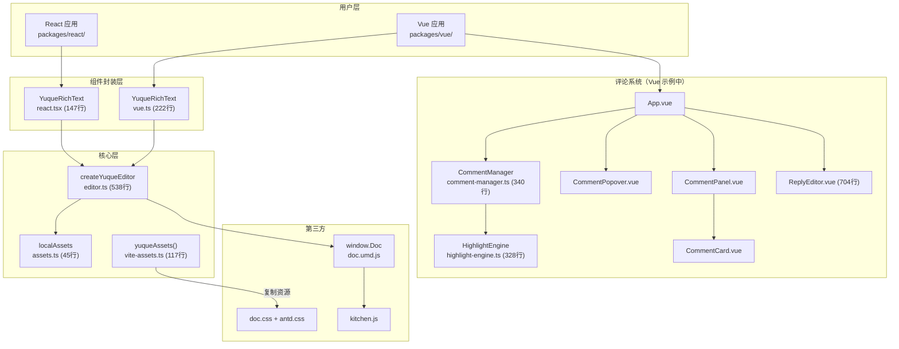

# yuque-editor 开发过程文档

> **适用读者**：有一定编程基础，但这个项目主要由 AI 辅助完成，现在想搞清楚每一步是怎么做的开发者。
>
> **项目仓库**：[github.com/zhangzhengyang27/yuque-editor-core](https://github.com/zhangzhengyang27/yuque-editor-core)
>
> **技术栈**：pnpm monorepo · TypeScript 5.x · React 18 · Vue 3 · Vite 6

---

## 文档导航

本系列文档共 5 篇，建议按顺序阅读，每读完一篇就对照源码查看：

| 篇 | 文档 | 核心内容 | 涉及文件 |
|---|------|----------|----------|
| **01** | [项目架构与工程化](./01-architecture.md) | 整体设计思路、monorepo 搭建、构建发布流程、Vite 插件 | 根配置、`package.json`、tsconfig、`postbuild.cjs`、`vite-assets.ts` |
| **02** | [核心引擎](./02-core-engine.md) | 资源加载策略、编辑器初始化、API 设计、安全兜底 | `editor.ts`（760行）、`assets.ts` |
| **03** | [框架封装](./03-framework-wrappers.md) | React / Vue 组件封装、竞态处理、受控模式、对比分析 | `react.tsx`（337行）、`vue.ts`（298行）、`controlled.ts`（新增） |
| **04** | [评论系统](./04-comment-system.md) | Canvas 高亮引擎、评论管理器、划词选区、Vue 组件层 | `highlight-engine.ts`、`comment-manager.ts`、3 个 Vue 组件 |
| **05** | [回复编辑器](./05-reply-editor.md) | contenteditable 富文本、工具栏、自定义指令、表情选择器 | `ReplyEditor.vue`（704行）、`EmojiPicker.vue`、`ReplyEditorPanel.vue` |

---

## 项目总览

### 这是什么项目？

把**语雀（Yuque）的 Lake Editor**封装成一个独立的 npm 包（`yuque-editor-core`），支持离线资源、提供 React 18 和 Vue 3 组件，并在 Vue 示例中实现了完整的**评论系统**和**富文本回复编辑器**。

### 整体架构

### 代码量统计

| 模块 | 文件数 | 代码行数 | 说明 |
|------|--------|----------|------|
| 核心包 | 6 | ~1,090 | 编辑器引擎 + 框架封装 |
| React 示例 | 3 | ~130 | 最小化演示 |
| Vue 示例（基础） | 4 | ~370 | 编辑器 + 基础功能 |
| 评论系统 | 10 | ~2,100 | 高亮引擎 + 管理器 + Vue 组件 |
| **总计** | **23** | **~3,700** | |

### 关键设计决策速览

| 决策 | 原因 |
|------|------|
| pnpm monorepo | 核心包和示例项目在同一个仓库，改完核心包立即在示例中验证 |
| Canvas 覆盖层高亮 | 不破坏编辑器 DOM，同时实现文字高亮效果 |
| 分层并行加载 | CSS → 无依赖 JS → 有依赖 JS，最大化并行度 |
| 框架无关核心层 | CommentManager 和 HighlightEngine 不依赖 Vue/React |
| tsc 三套输出 + postbuild | 支持子路径导入，同时提供 CJS/ESM/types |
| 竞态控制 | React 用标记对象，Vue 用序列号，各自适配框架特性 |

---

> 📝 **文档生成时间**：2026-04-02
>
> 📖 **阅读建议**：建议按编号顺序阅读，每读完一篇就对照源码看对应文件。遇到不理解的地方，试着修改代码看效果变化，是最好的学习方式。
