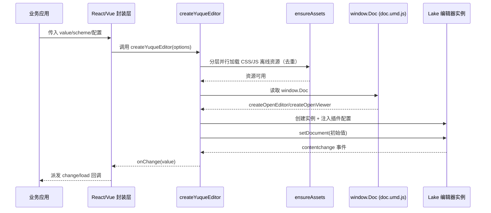

# @zhangzhengyang27/yuque-editor-core

语雀（Lake）编辑器的核心封装，默认使用离线资源，不依赖运行时联网。

支持 React 18、Vue 3 和原生 DOM 三种接入方式，同时提供 CJS + ESM + 类型声明双格式输出。

## 特性

- 📦 **开箱即用** — 内置离线资源，零配置启动
- ⚡ **双格式输出** — CJS + ESM，Tree-shaking 友好
- 🔗 **多框架支持** — React 18 / Vue 3 / 原生 DOM
- 🛡️ **实例稳定** — 浅比较策略，避免不必要的实例重建
- 🔧 **Vite 插件** — 开发和构建时自动拷贝离线资源
- 🐛 **调试模式** — `YUQUE_EDITOR_DEBUG=1` 查看内部错误详情

## 安装

包发布在 GitHub Packages 私有源（不发布到公共 npm），安装前需要配置 `.npmrc` 的 registry 映射与 token，见下文「发布到 GitHub Packages（私有分发）」的消费方接入一节。

```bash
# 装最新版
pnpm add @zhangzhengyang27/yuque-editor-core

# 锁定版本（推荐，私有源解析 latest 同样需要 token）
pnpm add @zhangzhengyang27/yuque-editor-core@0.2.0
```

> React 和 Vue 为可选 peer dependency，按需安装即可。
> 下文 import 路径统一使用发布名 `@zhangzhengyang27/yuque-editor-core`；如果想保留短路径写法，可以用 npm alias 把包映射成 `yuque-editor-core`（见消费方接入一节）。

## 资源（离线）

本项目已内置离线资源文件，构建后会把 `assets/yuque-assets` 拷贝到 `dist/yuque-assets`。

浏览器运行时需要把这些静态文件以 `/yuque-assets/*` 的路径提供出来（例如放到站点的 `public` 目录）。

## 使用

### 原生（DOM）

```ts
import { createYuqueEditor } from "@zhangzhengyang27/yuque-editor-core/editor"

const ref = await createYuqueEditor({
  container: document.getElementById("app")!,
  value: "<p>Hello</p>",
})
```

### React

```tsx
import { YuqueRichText } from "@zhangzhengyang27/yuque-editor-core/react"
import type { YuqueEditorRef } from "@zhangzhengyang27/yuque-editor-core/editor"

export default function App() {
  const [value, setValue] = React.useState("<p>Hello</p>")
  const editorRef = React.useRef<YuqueEditorRef>(null)

  return <YuqueRichText ref={editorRef} value={value} onChange={setValue} />
}
```

### Vue 3

```vue
<template>
  <YuqueRichText ref="editorRef" :value="value" @change="onChange" />
</template>

<script setup lang="ts">
import { ref } from "vue"
import { YuqueRichText } from "@zhangzhengyang27/yuque-editor-core/vue"
import type { YuqueEditorRef } from "@zhangzhengyang27/yuque-editor-core/editor"

const editorRef = ref<YuqueEditorRef | null>(null)
const value = ref("<p>Hello</p>")

function onChange(next: string) {
  value.value = next
}
</script>
```

### 受控用法（重要）

`YuqueRichText` 是受控组件：**必须把 `onChange` 收到的值回写到 `value`**，形成
`onChange → setState / ref 更新 → value` 的闭环。回声抑制与重试同步（`ValueSyncer`）
依赖这个闭环来取消未决的写入重试——如果不回写 `value`（非受控用法），重试定时器
可能用旧值覆盖用户的最新输入。

### 错误处理

React：通过 `onError` 回调监听初始化失败或内部异常。

```tsx
<YuqueRichText
  value={value}
  onChange={setValue}
  onError={(error) => {
    console.error("[YuqueRichText] 初始化/运行异常:", error)
  }}
/>
```

Vue 3：通过 `@error` 事件监听。

```vue
<YuqueRichText :value="value" @change="onChange" @error="onError" />
```

### 媒体上传（图片 / 视频 / 附件 / 音频）

四个钩子接入自定义上传逻辑，**宿主侧契约完全一致**（`EditorUploadHandler`，入参 `{ type, data }`，支持 `url`、`file`、`base64` 三类输入）；内核与 Lake 对接的差异（请求对象 vs 原始 File）已在内核内适配完毕，详见 [docs/06-upload-channels.md](../../docs/06-upload-channels.md)：

```tsx
<YuqueRichText
  value={value}
  onChange={setValue}
  uploadImage={async ({ type, data }) => {
    // type: "url" | "file" | "base64"
    const formData = new FormData()
    if (type === "file") {
      formData.append("file", data as File)
    } else {
      // base64 string 需要自行转换或上传
    }
    const res = await fetch("/api/your-upload", { method: "POST", body: formData })
    const json = await res.json()
    // 返回 url（必填）、size（必填）、filename（可选）、cover（视频封面，可选）
    return { url: json.url, size: json.size, filename: json.filename }
  }}
  uploadVideo={uploadToOss} // slash 菜单「本地视频」
  uploadFile={uploadToOss} // slash 菜单「附件」「本地文件」
  uploadAudio={uploadToOss} // slash 菜单「本地音频」
/>
```

⚠️ **不配置钩子的通道会走 Lake 内置默认上传端点（`/api/upload*`）**——宿主后端几乎必然没有这个路由，插入即 404、卡片停在错误态。只读查看器不受影响；编辑场景要么四个钩子都配齐，要么明确接受对应卡片不可用。

### 调试模式

设置环境变量 `YUQUE_EDITOR_DEBUG=1`，可在控制台查看被 `safeCall` 兜底吞掉的内部错误，便于排查问题：

```bash
YUQUE_EDITOR_DEBUG=1 pnpm dev
```

### Vite 插件

按需向应用提供编辑器离线资源——**dev 通过静态中间件实时提供，build 通过 `emitFile` 打进产物目录**，不写入源码 `public/`：

```ts
import { yuqueAssets } from "@zhangzhengyang27/yuque-editor-core/vite-assets"

export default {
  plugins: [yuqueAssets()],
}
```

- dev：访问 `/yuque-assets/*`（默认前缀）即命中资源目录，实时生效
- build：资源输出到 `dist/yuque-assets/*`，与 dev URL 一致，宿主无需区分环境

高级配置：

```ts
yuqueAssets({
  // 自定义 URL 前缀与产物子目录，默认 "/yuque-assets"
  baseUrl: "/static/editor-assets",
  // 显式指定本地资源目录，跳过自动搜索（也可用环境变量 YUQUE_ASSETS_DIR）
  assetsDir: "./local-assets/yuque-assets",
})
```

## 实例 API

通过 `ref`（React）或模板引用（Vue）获取编辑器实例：

```tsx
const editorRef = useRef<YuqueEditorRef>(null)

// 写入内容
editorRef.current?.setContent("<p>New content</p>", "text/html")

// 读取内容
const html = editorRef.current?.getContent("text/html")

// 字数统计（中文 + 英文混合计数）
const count = editorRef.current?.wordCount()

// 销毁实例
editorRef.current?.destroy()
```

完整 API 列表：

| 方法                              | 说明                                                                              |
| --------------------------------- | --------------------------------------------------------------------------------- |
| `appendContent(html, breakLine?)` | 在选区插入内容，`breakLine` 为 `true` 时先插入空行                                |
| `setContent(content, scheme?)`    | 写入内容并同步文档格式                                                            |
| `getContent(scheme?)`             | 按指定格式读取当前文档                                                            |
| `isEmpty()`                       | 判断文档是否为空                                                                  |
| `getSummaryContent()`             | 获取纯文本摘要                                                                    |
| `wordCount()`                     | 字数统计（中文按字符、英文按单词计数）                                            |
| `focusToStart(offset?)`           | 光标移至文档起始位置                                                              |
| `insertBreakLine()`               | 插入空行                                                                          |
| `destroy()`                       | 销毁实例、解绑事件并清理 DOM                                                      |
| `undo()`                          | 撤销上一个命令                                                                    |
| `redo()`                          | 重做上一个撤销的命令                                                              |
| `insertText(text)`                | 在当前选区插入普通文本                                                            |
| `setBold(value?)`                 | 切换选中文本的加粗状态                                                            |
| `setItalic(value?)`               | 切换选中文本的斜体状态                                                            |
| `setUnderline(value?)`            | 切换选中文本的下划线状态                                                          |
| `setStrikethrough(value?)`        | 切换选中文本的中划线状态                                                          |
| `setColor(color)`                 | 设置选中文本的颜色（支持渐变色）                                                  |
| `setBgColor(color)`               | 设置选中文本的背景颜色                                                            |
| `clearColor()`                    | 清除文本前景色                                                                    |
| `clearBgColor()`                  | 清除文本背景颜色                                                                  |
| `setAlignment(value)`             | 设置段落对齐方式，可选值：`left` / `right` / `center` / `justify` / `distributed` |
| `setParagraphStyle(style)`        | 设置段落样式，可选值：`p` / `h1` ~ `h6`                                           |
| `setFontsize(size)`               | 设置字号，可选值：`12, 13, 14, 15, 16, 19, 22, 24, 29, 32, 40`                    |
| `indent()`                        | 增加缩进                                                                          |
| `outdent()`                       | 减少缩进                                                                          |
| `clearFormat()`                   | 清除选区的格式                                                                    |
| `selectAll()`                     | 全选当前文档                                                                      |
| `getWordCount()`                  | `wordCount()` 的别名                                                              |

> `destroy()` 仅移除编辑器自身的 DOM 节点，不会清空宿主容器的其他内容。

### 事件回调

| 事件                  | 触发时机                                                   |
| --------------------- | ---------------------------------------------------------- |
| `onChange`            | 文档内容变化（已内置去重，不会因自身 setContent 重复触发） |
| `onLoad`              | 编辑器初始化完成                                           |
| `onError`             | 初始化失败或内部异常                                       |
| `onFocus`             | 编辑器获得焦点                                             |
| `onBlur`              | 编辑器失去焦点                                             |
| `onSelectionChange`   | 选区发生变化                                               |
| `onFocusStatusChange` | 焦点状态变化，`focused` 参数指示是否获得焦点               |
| `onBeforeDestroy`     | 编辑器销毁前触发                                           |

## 工具函数导出

除了编辑器组件，还导出了一些内部工具函数，可在特殊场景下使用：

```ts
import {
  shallowEqual,
  normalizeError,
  resetAssetLoaders,
} from "@zhangzhengyang27/yuque-editor-core/editor"

// 浅比较 — 用于判断对象/函数是否语义相等
shallowEqual({ a: 1 }, { a: 1 }) // true

// 错误标准化 — 将任意值转为 Error 实例
normalizeError("string error") // Error: string error

// 重置资源加载器 — 适用于 SSR 多请求隔离或单元测试清理
resetAssetLoaders()
```

## 项目接手指南

这一节面向后续维护者，帮助快速建立对仓库结构、运行时链路和常见问题的整体认知。

### 目录与职责

| 文件                    | 职责                                                                            |
| ----------------------- | ------------------------------------------------------------------------------- |
| `src/editor.ts`         | 核心能力：资源加载、编辑器初始化、实例 API 封装                                 |
| `src/react.tsx`         | React 18 组件封装（`forwardRef` 暴露底层实例）                                  |
| `src/vue.ts`            | Vue 3 组件封装（`expose` 暴露底层实例）                                         |
| `src/controlled.ts`     | 受控值同步器 `ValueSyncer`（React/Vue 共用，回声过滤 + 重试同步）               |
| `src/lake-dom.ts`       | Lake DOM 布局修正与渲染检测（React/Vue 共用）                                   |
| `src/assets.ts`         | 离线资源文件名定义与 URL 解析工具                                               |
| `src/vite-assets.ts`    | Vite 插件：dev 静态中间件 + build `emitFile` 按需提供资源                       |
| `assets/yuque-assets/*` | 内置离线资源源文件                                                              |
| `scripts/postbuild.cjs` | 构建后整理 `dist`：从入口自动扫描相对导入、复制模块并重写扩展名，再复制离线资源 |

### 调用时序图（初始化）



### 关键配置说明

| 配置项                 | 类型                         | 说明                                                                                                                 |
| ---------------------- | ---------------------------- | -------------------------------------------------------------------------------------------------------------------- |
| `value`                | `string`                     | 编辑器内容初始值和受控值                                                                                             |
| `scheme`               | `YuqueDocScheme`             | 文档格式，可选：`text/html` / `text/markdown` / `text/plain` / `text/lake` / `json`                                  |
| `readOnly`             | `boolean`                    | 只读模式，底层走 `createOpenViewer`                                                                                  |
| `assets`               | `Partial<YuqueEditorAssets>` | 覆盖默认离线资源地址                                                                                                 |
| `onChange`             | `(value: string) => void`    | 内容变更回调                                                                                                         |
| `onLoad`               | `() => void`                 | 编辑器初始化完成回调                                                                                                 |
| `onError`              | `(error: Error) => void`     | 错误回调                                                                                                             |
| `onFocus`              | `() => void`                 | 编辑器获得焦点时触发                                                                                                 |
| `onBlur`               | `() => void`                 | 编辑器失去焦点时触发                                                                                                 |
| `onSelectionChange`    | `() => void`                 | 选区变化时触发                                                                                                       |
| `onFocusStatusChange`  | `(focused: boolean) => void` | 焦点状态变化时触发                                                                                                   |
| `onBeforeDestroy`      | `() => void`                 | 编辑器销毁前触发                                                                                                     |
| `uploadImage`          | `EditorUploadHandler`        | 图片上传钩子，入参 `{ type, data }`                                                                                  |
| `uploadVideo`          | `EditorUploadHandler`        | 视频上传钩子（slash「本地视频」），入参 `{ type, data }`                                                             |
| `uploadFile`           | `EditorUploadHandler`        | 附件上传钩子（slash「附件」「本地文件」），入参 `{ type, data }`                                                     |
| `uploadAudio`          | `EditorUploadHandler`        | 音频上传钩子（slash「本地音频」），入参 `{ type, data }`                                                             |
| `showToolbar`          | `boolean`                    | 控制工具栏显示，默认 `true`                                                                                          |
| `showToc`              | `boolean`                    | 控制目录（大纲）显示；开启后自动注入样式，大纲展开时为正文让出右侧空间（`lake-dom.ts` 的 `ensureTocAvoidanceStyle`） |
| `paragraphSpacing`     | `boolean`                    | 段落间距（经典排版）                                                                                                 |
| `defaultFontSize`      | `number`                     | 默认字号，默认 `15`                                                                                                  |
| `darkMode`             | `boolean`                    | 暗黑模式                                                                                                             |
| `disabledToolbarItems` | `string[]`                   | 从默认工具栏列表剔除指定的按钮（与 `toolbarItems` 互斥）                                                             |
| `toolbarItems`         | `string[]`                   | 完全自定义工具栏按钮列表（白名单，优先级高于 `disabledToolbarItems`）                                                |
| `instanceKey`          | `string \| number`           | 强制重建编辑器的逃生舱：函数型配置变化不会触发重建，改变此值即可                                                     |

### 常见坑位与排查

- **静态资源 404**：确认站点可访问 `/yuque-assets/*`（未用 `vite-assets` 插件时需自行托管），并包含 `doc.umd.js`、`kitchen.js` 等核心脚本。
- **`window.Doc` 未定义**：通常是 `doc.umd.js` 未加载成功，或资源加载顺序被外部脚本打断。
- **受控模式循环更新**：核心的 `lastSetContent` 比对 + 封装层的 `ValueSyncer`（`src/controlled.ts`）会抑制回声，正常使用即可。如仍有问题，检查 `onChange` 回调中是否直接回写了相同值。
- **切换 `scheme` 后内容异常**：切换格式会重建编辑器实例，确保上层同时更新了对应格式的 `value`。
- **上传失败**：检查四个上传钩子（`uploadImage` / `uploadVideo` / `uploadFile` / `uploadAudio`）返回值是否包含 `url` 和 `size` 字段。未配置钩子的媒体通道会走 Lake 内置默认端点 `/api/upload*`（见「媒体上传」一节的警告）；音频卡另有 `queryAudioUrl` 换播放地址的机制，见 [docs/06-upload-channels.md](../../docs/06-upload-channels.md)。
- **多实例样式冲突**：资源加载器内置去重机制，同名资源只加载一次。
- **实例重建抖动**：React/Vue 组件使用 `shallowEqual` 浅比较配置项，只有真正变化时才重建实例。如果函数引用频繁变化，考虑用 `useCallback` / `computed` 稳定化；函数实现真正变了（如切换上传后端）需重建时，改变 `instanceKey` 即可。

### 本地开发与发布

```bash
# 构建
pnpm run build

# 验证发布产物
npm pack --dry-run
```

构建后会产出：

- `dist/*.cjs` — CommonJS 格式
- `dist/*.mjs` — ES Module 格式
- `dist/*.d.ts` — TypeScript 类型声明
- `dist/yuque-assets/*` — 离线静态资源目录

### 发布到 GitHub Packages（私有分发）

包内含语雀专有编译产物（`dist/yuque-assets/doc.umd.js` 等），**只走私有渠道分发，不发布到公共 npm**。发布目标为 GitHub Packages（`publishConfig.registry` 已配置）。

一次性准备（发布者本机）：

```bash
# 1. 创建 classic PAT（勾选 write:packages、read:packages）：
#    https://github.com/settings/tokens/new?scopes=write:packages,read:packages
# 2. 写入用户级 ~/.npmrc（不要提交进任何仓库）：
#    //npm.pkg.github.com/:_authToken=<你的TOKEN>
```

每次发布（完整流程见仓库根 [README.md](../../README.md) 的「发布指南」）：

```bash
# 1. 发布前守门（与 CI 一致）
pnpm lint && pnpm format:check && pnpm test && pnpm build && node scripts/verify-dist.mjs

# 2. 升版本（用 --no-git-tag-version，理由见下方坑位 1）
cd packages/core
npm version patch --no-git-tag-version   # 或 minor / major

# 3. 提交版本号并打 tag
cd ../..
git add packages/core/package.json
git commit -m "chore(release): core v0.2.1"
git tag v0.2.1

# 4. 发布（prepack 会自动执行 pnpm run build，无需手动构建）
cd packages/core
npm publish          # registry 已由 publishConfig 指向 npm.pkg.github.com
cd ../..

# 5. 推送主干与 tag
git push origin main && git push origin v0.2.1
```

> **两个实测坑**：
>
> 1. `npm version patch` 在本仓库（npm 11 + pnpm workspace）只改 `package.json` 的 version 就退出，既不 commit 也不 tag（`git-tag-version=true` 也一样），所以第 3 步必须手动做。
> 2. `git push --follow-tags` 推不上本次 tag：`git tag` 建的是轻量 tag，而 `--follow-tags` 只推 annotated tag。用显式的 `git push origin v0.2.1`。

消费方接入：

```jsonc
// 方式一（推荐）：直接装发布名，import 时用带 scope 的全名
"@zhangzhengyang27/yuque-editor-core": "^0.2.0"

// 方式二：npm alias 成短名，保留 yuque-editor-core/xxx 的 import 路径
"yuque-editor-core": "npm:@zhangzhengyang27/yuque-editor-core@^0.2.0"
```

```ini
# .npmrc（用户级放 authToken；项目级放 registry 映射，可提交）
@zhangzhengyang27:registry=https://npm.pkg.github.com
```

> 缺项目级 registry 映射时，包管理器会去公共源找 `@zhangzhengyang27/*` 并报 404；缺 token（`read:packages` 权限的 classic PAT）则报 401/ENOTFOUND。

**注意**：包所在仓库是公开的，首次 publish 后包可见性会继承为 public——发布后需到 GitHub 包页面（Package settings → Change visibility）改为 **Private**，避免语雀资产公开可下载。

### 技术实现要点

**资源加载策略** — `ensureAssets` 采用分层并行加载，减少 RTT 等待：

1. 第一层：CSS 全部并行
2. 第二层：React 依赖链 + 无依赖脚本并行
3. 第三层：有严格顺序依赖的脚本串行（kitchen → docUmd）

**实例稳定性** — React/Vue 组件对配置项逐项浅比较（`shallowEqual`），只在配置语义真正变化时才重建编辑器实例，避免因函数引用不稳定导致的不必要重建。

**DOM 隔离** — 编辑器创建独立的 `editorRoot` 容器挂载到宿主 `container` 内，`destroy()` 时只移除 `editorRoot`，不会清空宿主容器的其他子节点。

**错误兜底** — `safeCall` 统一捕获编辑器内部回调中的异常（如销毁时的 TypeError），避免冒泡到宿主应用。可通过 `YUQUE_EDITOR_DEBUG=1` 查看被兜底的错误详情。

**Lake 缺失场景的样式补丁** — `lake-dom.ts` 会按需向文档注入少量修正样式（全文档去重）：开启大纲时为正文让出右侧空间（Lake 原生规则依赖直接挂载场景不存在的祖先类），以及修复深色模式下选区文字发白不可读的问题。

## License

[MIT](./LICENSE)
